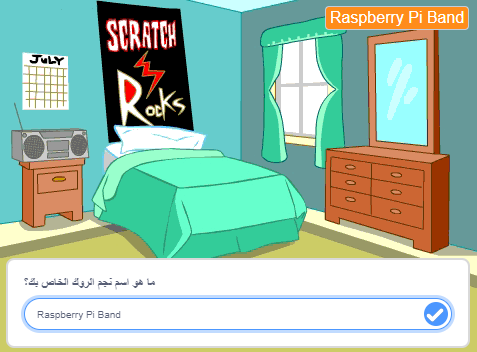
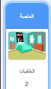
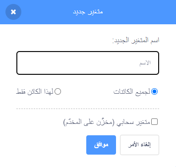
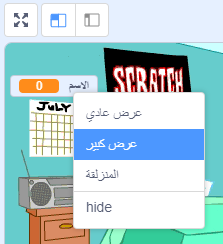

## جهز المنصة

<div style="display: flex; flex-wrap: wrap">
<div style="flex-basis: 200px; flex-grow: 1; margin-right: 15px;">
في هذه الخطوة ، سوف تختار المنصة لاولى حفلة وتختار اسم نجم موسيقى الروك.
gig هيرالأداء الموسيقي للفرقة 
</div>
<div>
{:width="300px"}
</div>
</div>

--- task ---

أفتح [مشروع البدء لنجم الطبل](https://scratch.mit.edu/projects/535783147/editor){:target="_blank"}. سيتم فتح Scratch في علامة تبويب متصفح أخرى.

[[[working-offline]]]

--- /task ---

<p style="border-left: solid; border-width:10px; border-color: #0faeb0; background-color: aliceblue; padding: 10px;">
دعا الموسيقيون <span style="color: #0faeb0">** فنانيين محليين **</span> إلى بدء تسجيل الموسيقى من غرف نومهم. ينتجون الأغاني الخاصة بهم بأنفسهم ثم يطلقونها على الإنترنت ليسمعها الجميع. 
</p>

تبدأ اللعبة في غرفة نوم مثل الفنان المحلي.

--- task ---

انقر فوق **اختر خلفية** وابحث عن ` bedroom `.

**اختر:** حدد غرفة نوم وأضفها إلى مشروعك. اخترنا `غرفة نوم 3`.


--- /task ---

--- task ---

في Scratch ، يمكنك إضافة رمز إلى للخلفية لتكون متميزة عن غيرها.

انقر فوق خلفية غرفة نومك من جزء المرحلة وأضف هذا الرمز:



```blocks3
when flag clicked
switch backdrop to (Bedroom 3 v) //your backdrop name
```

--- /task ---

يحتاج كل موسيقي إلى اختيار اسم نجم موسيقى لعبة الروك.

** المتغير ** هو وسيلة لتخزين الأرقام و / أو النصوص. سيتم خزن اسم نجم الروك الخاص بك في `متغير`{: class = "block3variables"} حتى يمكن استخدامه في أي وقت.

--- task ---

من المقاطع البرمجية انقر على `متغيرات`{: class = "block3variables"} و ثم انقر على زر**انشاء متغير**.

قم باستدعاء المتغير الجديد الخاص بك `الاسم`:



**ملاحظة:** يظهر المتغير الجديد `الاسم` على المسرح ويمكن استخدامه الآن في المقاطع البرمجية `المتغيرات`{: class = "block3variables"}.

--- /task ---

--- task ---

في بداية المشروع ، اسم نجم  موسيقى الروك الخاص بك يكون غير معروف

قم باضافة مقطع برمجي `اجعل الاسم`{: class = "block3variables"} `؟؟؟`:


```blocks3
when flag clicked
switch backdrop to (Bedroom 3 v) //your backdrop name
+ set [name v] to [???] //your variable
```

--- /task ---

يمكنك اضافة مقطع برمجي`اسال`{: class = "block3sensing"} في Scratch ، ثم استخدم ` متغير `{: class = "block3variables"} لتخزين `إجابة`{: class = "block3sensing"}.

--- task ---

انقر على المقاطع البرمجية `الاستشعارات`{: class = "block3sensing"} وأضف المقطع البرمجي `اسال وانتظر`{: class = "block3sensing"} إلى المقطع البرمجي الخاص بك:


```blocks3
when flag clicked
switch backdrop to (Bedroom 3 v) //your backdrop name
set [name v] to [???] //your variable
+ ask [What's your rock star name?] and wait //your question
```

--- /task ---

--- task ---

عيّن `متغير`{: class = "block3variables"} `الاسم`{: class = "block3variables"} على`إجابة`{: class = "block3sensing"}:


```blocks3
when flag clicked
switch backdrop to (Bedroom 3 v) //your backdrop name
set [name v] to [???] //your variable
ask [What's your rock star name?] and wait //your question
+ set [name v] to (answer)
```

--- /task ---

غيّر طريقة ظهور `المتغير`{: class = "block3variables"} على المنصة.

--- task ---

انقر بزر الماوس الأيمن فوق ` المتغير`{: class = "block3variables"} على المنصة واختر **عرض كبير**:



--- /task ---

--- task ---

اسحب ` المتغير `الخاص بك{: class = "block3variables"} لوضعه في أعلى يمين المنصة:


--- /task ---

--- task ---

**اختبار:** قم بتشغيل مشروعك للتأكد من أن ` المتغير `{: class = "block3variables"} يبدأ كـ `؟؟؟` ثم يتحدث حسب اجابتك `إجابتك`{: class = "block3sensing"}.

--- /task ---

--- task ---

الآن بعد أن اختبرت أن ` المتغير`{: class = "block3variables"} يتغير حسب `إجابة`{: class = "block3sensing"} ، يمكنك سحب آخر مقطعين من التعليمات البرمجية بعيدًا عن بقية المقطع البرمجي الرئيسي. هذا يعني أنه ليس عليك كتابة `إجابة`{: class = "block3sensing"} في كل مرة تختبر فيها مشروعك:


```blocks3
when flag clicked
switch backdrop to (Bedroom 3 v) //your backdrop name
set [name v] to [???] //your variable
```

```blocks3
ask [What's your rock star name?] and wait //your question
set [name v] to (answer)
```

--- /task ---

--- save ---
