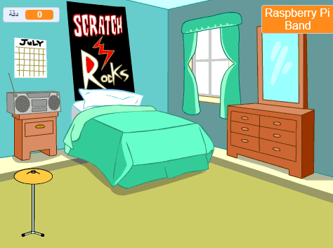
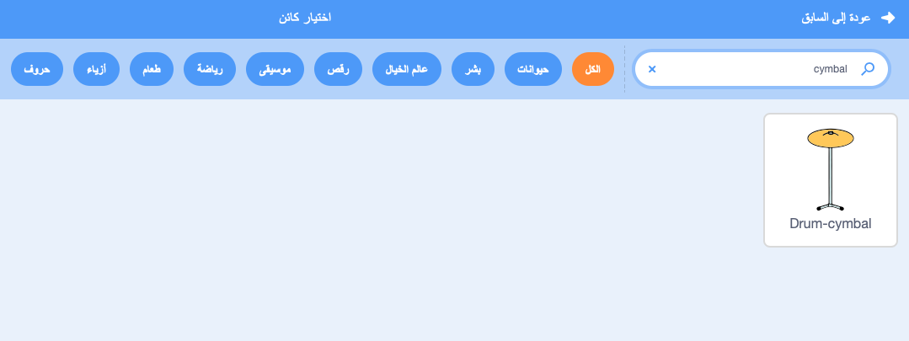
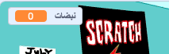

## بداية  مرحلة الطبل

<div style="display: flex; flex-wrap: wrap">
<div style="flex-basis: 200px; flex-grow: 1; margin-right: 15px;">
ستضيف كائن ** cymbal ** الذي يمكنك النقر فوقه لكسب الإيقاعات وتشغيل الصوت.
</div>
<div>
{:width="300px"}
</div>
</div>

--- task ---

Click **Choose a Sprite** and search `cymbal`.



--- /task ---

--- task ---

Add the **Drum-cymbal** sprite and position it on the Stage:


--- /task ---

--- task ---

أضف ملحق **الموسيقى**:

[[[generic-scratch3-add-music-extension]]]

--- /task ---

--- task ---

أضف مقطع برمجي  `غير مظهر` الــ cymbal{: class = "block3looks"} و `يقوم بتشغيل صوت طبل`{: class = "block3extensions"}:


```blocks3
when this sprite clicked
switch costume to [drum-cymbal-b v] // hit costume
play drum [(5) Open High-Hat v] for [0.25] beats // drum sound
switch costume to [drum-cymbal-a v]  // not hit costume
```

--- /task ---

--- task ---

**اختبار:** اختبر cymbal الخاص بك بالضغط عليه.

You should hear a sound and see the costume change.

--- /task ---

سوف يكسبك كائن**Drum-cymbal** نبضة واحدة في كل مرة تنقر عليه.

--- task ---

Create a `variable`{:class="block3variables"} (for all sprites) called `beats`:



--- /task ---

--- task ---

أضف مقطع برمجي إلى `إغير النبضة بمقدار ١`{: class = "block3variables"} عند النقر على كائن **Drum-cymbal** sprite:

```blocks3
when this sprite clicked
+change [beats v] by [1]
switch costume to [drum-cymbal-b v]
play drum [(5) Open High-Hat v] for [0.25] beats 
switch costume to [drum-cymbal-a v]
```

--- /task ---

--- task ---

**Test:** Test the **Drum-cymbal** by clicking on it.

You should see the `beats`{:class="block3variables"} increase.

--- /task ---

يجب أن يبدأ المتغير `نبضة`{: class = "block3variables"}  بالـــ`0` عند بدء لعبة جديدة.

--- task ---

Click on the Stage pane and then the **Code** tab.

أضف مقطع برمجي إلى `اجعل نبضة مساوياً` الى{: class = "block3variables"} `0`:


```blocks3
when flag clicked
switch backdrop to (Bedroom 3 v) 
set [name v] to [???] 
+ set [beats v] to [0]
```
--- /task ---

--- task ---

**اختبار:** انقر فوق العلم الأخضر وتأكد من أن المتغير `نبضات`{: class = "block3variables"} يبدأ عند `0`.

--- /task ---

--- save ---
