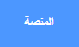

## التطوير الاول

<div style="display: flex; flex-wrap: wrap">
<div style="flex-basis: 200px; flex-grow: 1; margin-right: 15px;">
سوف تضيف الترقية او التطوير الأول الخاصة بك. سيظهر زر **الحصول على snare** في البداية ، حتى يعرف اللاعب الطبلة التي يعمل عليها.
snare نوع من انواع الطبل.
</div>
<div>
{:width="300px"}
</div>
</div>

--- task ---

أضف الكائن **Drum-snare** إلى مشروعك وقم بوضعه على المنصة:


--- /task ---

--- task ---

اسحب المقطع البرمجي `عند النقر على هذا الكائن`ن{:class="block3events"} من **Drum-cymbal** sprite إلى كائن **Drum-snare**.

[[[scratch3-copy-code]]]

--- /task ---

--- task ---

تغيير المظاهر وصوت الطبل.

قم بتغيير عدد الدقات التي حصلت عليه إلى `2`:


```blocks3
when this sprite clicked
+change [دقة v] by [2] // دقتان لكل نقرة
+switch costume to [drum-snare-b v] //المظهر التالي
+play drum [(1) Snare Drum v] for [0.25] beats //صوت الطبل
+switch costume to [drum-snare-a v] //مظهر آخر بدون تغيير
```

--- /task ---

--- task ---

**اختبار:** قم بتجربة مشروعك. تأكد من حصولك على دقاتين عند النقر على طبلة snare.

--- /task ---

الترقيات غير متوفرة عند بدء المشروع. يجب أن يكتسبوا بالضربات الى الطبل.

--- task ---

أضف مقطع برمجي لإخفاء هذا الكائن **drum** في بداية المشروع:


```blocks3
when flag clicked
hide
```

--- /task ---

سيظهر الزر أي طبل هي من الخيارات التالية للترقية وعدد الإيقاعات التي ستكلفها.

--- task ---

**مضاعفة** ، **، احصل على** مظهر:


قم بتغيير حالة الاظهار إلى **اظهار** وقم بتغيير اسمه إلى `Get snare`. وقم بوضعه في الركن الأيمن السفلي من المنصة:


--- /task ---

--- task ---

انقر فوق كائن **Drum-snare** وانتقل إلى علامة التبويب **المظاهر**. استخدم أداة **تحديد** (السهم) لتحديد الكائن بالكامل. انقر على أيقونة **تجمع** ثم أيقونة **نسخ**:


--- /task ---

--- task ---

انقر على **الحصول على snare** و **لصق** مظهر الــ snare  . قد تحتاج إلى تغيير حجمه وl,rui ليلائم الزر الخاص بك:


--- /task ---

--- task ---

انقر فوق علامة التبويب **المقطاع البرمجية** وأضف مقطع برمجي لاظهار الكائن **Get snare** في بداية المشروع:


```blocks3
when flag clicked
show
```

--- /task ---

يمكن شراء الترقية فقط إذا كان لدى المستخدم `10` نبضة أو أكثر. في مشروع[نمو اليعسوبب](https://projects.raspberrypi.org/ar-SA/projects/grow-a-dragonfly){:target="_blank"} ، تعلمت كيفية اتخاذ القرارات باستخدام المقطع البرمجي `اذا`{:class="block3control"}.

يتم استخدام المقطع البرمجي `اذا ... والا`{:class="block3control"} لاتخاذ قرار وستقوم بأشياء مختلفة إذا كان الشرط `صحيحًا` أو `خطأ`.

<p style="border-left: solid; border-width:10px; border-color: #0faeb0; background-color: aliceblue; padding: 10px;">
نستخدم <span style="color: #0faeb0">**اذا ... والا**</span> طوال الوقت لاتخاذ القرارات. عندما تستيقظ ، تتحقق من `اذا`{:class="block3control"} هذا الصباح. استيقظ ، أو `والا`{:class="block3control"} تعود للنوم. هل يمكنك التفكير في أي قرارات تتخذها بشأن "اذا ... else"{:والا="block3control"}؟ 
</p>

--- task ---

أضف هذا النقطع البرمجي للحصول على الترقية `إذا`{:class="block3control"} لدى اللاعب عدد كافٍ من النبضات ، أو `قل`{:class="block3looks"} `لا توجد نبضات كافية!` إذا لم يتمكنوا من الترقية:


```blocks3
when this sprite clicked
if <(دقة)>  [9]> then //إذا كان 10 دقات أو أكثر
hide
change [دقة v] by [-10] //تكلفة التطوير
else
say [عدد غير كافي من الدقات] for [2] seconds 
end
```

--- /task ---

دع الكائنات المتحركة الأخرى والمسرح يعلمان أنه تم شراء ترقية snare.

--- task ---

أضف المقطع البرمجي `بث`{:class="block3events"} لإرسال `snare` رسالة جديدة:


```blocks3
when this sprite clicked
if <(دقة)>  [9]> then // إذا كان 10 دقات أو أكثر
hide
change [دقة v] by [-10] // تكلفة التطوير
+ broadcast [snare v] // اسم الطبلة الخاصة بك
else
say [عدد غير كافي من الدقات] for [2] seconds 
end
```

--- /task ---

--- task ---

انقر فوق كائن **Drum-snare**. أضف هذا المقطع البرمجي:


```blocks3
when I receive [snare v]
show
```

--- /task ---

عندما تقوم بترقية معداتك ، ستتمكن من اللعب في أماكن أكبر.

--- task ---

أضف خلفية أخرى. اخترنا خلفية**Chalkboard** للعب الحفلة الثانية في المدرسة.

أضف مقطع برمجي إلى المرحلة إلى `غير الخلفية الى`{:class="block3looks"} عند تلقي رسالة الترقية:



```blocks3
when I receive [snare v]
switch backdrop to [Chalkboard v]
```

**نصيحة:** اختر مكانًا على بعد خطوة صغيرة من غرفة النوم. تريد حفظ أماكن أكبر لوقت لاحق.

--- /task ---

--- task ---

**اختبار:** قم بتشغيل مشروعك. حاول وشراء ترقية snare قبل أن يكون لديك ما يكفي من الإيقاعات.

عند شراء فحص الترقية: يظهر snare ، ويختفي الزر ، ويتغير المكان ، وتنخفض النبضات  بمقدار`10`.

--- /task ---

--- save ---
