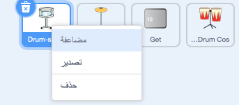
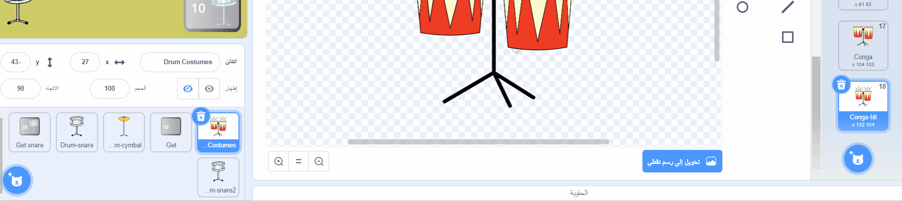
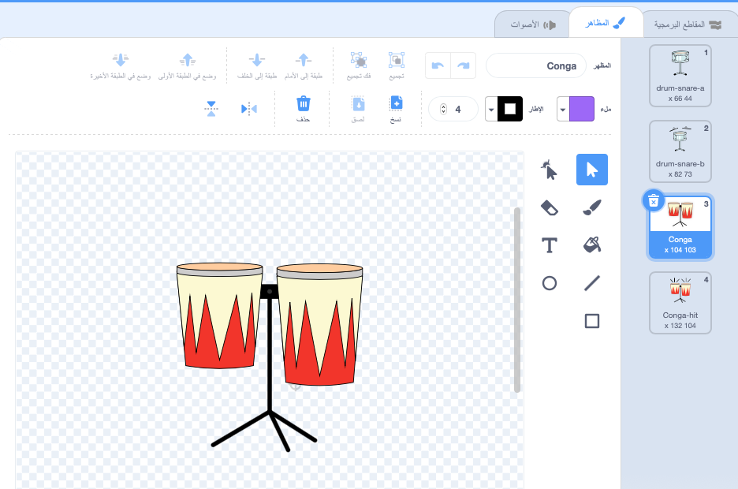
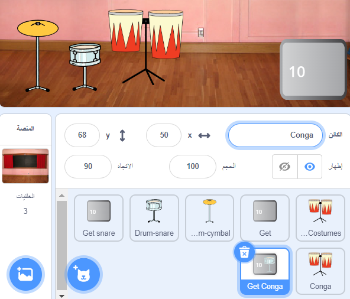
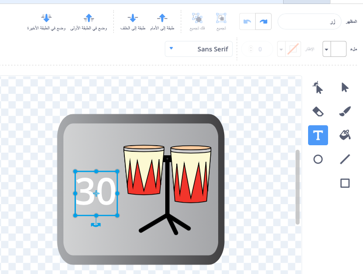

## التطوير الثاني للمشروع

<div style="display: flex; flex-wrap: wrap">
<div style="flex-basis: 200px; flex-grow: 1; margin-right: 15px;">
مهاراتك في استخدام الطبل في تحسن. حان الوقت للترقية الثانية! في هذه الخطوة ، ستختار الأسطوانة المراد إضافتها.
</div>
<div>
! [يظهر المسرح خلفية الحفلة بثلاثة أسطوانات موسيقية.] (images / second-Upgrade.png){:width="300px"}
</div>
</div>

--- task ---

قم بتكرار كائن **Drum-snare**:



--- /task ---

يوجد الكثير من**أزياء الطبل** لتختار من منها.

--- task ---

انقر فوق مظهر **ازياء او مظاهر الطبل** ثم حدد علامة التبويب **مظاهر**.

**اختر:** أسطوانة للترقية التالية. اخترنا **Conga**.

اسحب مظهر "hit" و "not hit" على الطبل الذي اخترته إلى **Drum-snare2** كائن الجديدة:





--- /task ---

--- task ---

قم بتسمية الطبل الخاص بك بما يتناسب مع الأزياء التي اخترتها.


--- /task ---

--- task ---

انقر فوق علامة التبويب **المقاطع البرمجية**. غيّر المقطع البرمجي لاستخدام الأزياء الصحيحة واختر صوتًا لطبلك الجديد.

غيّر عدد الإيقاعات التي تربحها بالنقر على الطبلة الجديدة إلى `5`:


```blocks3
when this sprite clicked
+change [دقة v] by [5] // ٥ دقات لكل نقرة
+switch costume to [ v] //المظهر الثاني للطبل
+play drum [ v] for [0.25] beats //صوت الطبل الخاص بك
+switch costume to [ v] //المظهر الاول للطبل
```

--- /task ---

--- task ---

اسحب الأسطوانة او الطبل الجديدة إلى موقعها على المنصة:


--- /task ---

بعد ذلك ، ستحتاج إلى كائن زر حتى يتمكن اللاعبون من الترقية إلى هذه الأسطوانة الجديدة.

--- task ---

ضاعف كائن**Get snare**.

ضعه في الركن الأيمن السفلي من المنصة. غيّر اسمه إلى `Get` ثم اسم طبلك الجديد:



--- /task ---

--- task ---

احذف أسطوانة **snare drum** من مظهر الزر. انسخ والصق زي "not hit" لطبلتك الجديدة على مظهر الزر.

انقر فوق أداة الــ**نص** وقم بتغيير الرقم إلى `30` لإظهار تكلفة الأسطوانة الجديدة.

يجب أن يبدو الزر الخاص بك كما يلي:



--- /task ---


هذا الزر  يجب ان`يخفى`{:class="block3looks"} في البداية ، ثم `يظهر`{:class="block3looks"} عندما يقوم اللاعب بترقية المشروع إلى snare drum ، حتى يعرف الطبلة التي يعمل عليها.

--- task ---


```blocks3
when flag clicked
- show
+ hide
```

**نصيحة:** لحذف Blocks ، اسحبها إلى قائمة Blocks ، أو انقر بزر الماوس الأيمن واختر **حذف اللبنة**. على جهاز الكمبيوتر ، يمكنك أيضًا النقر فوق اللبنة ثم النقر فوق <kbd>حذف</kbd> لإزالة اللبنة.

--- /task ---

--- task ---

أضف `عندما أتلقى ن`{:class="block3events"} مقطعاً برمجياً سيظهر زر الأسطوانة الجديد كترقية اخرى عندما يحصل اللاعب على طبلة **Drum-snare**:


```blocks3
when I receive [snare v] // تظهر عدما يتم شراء الطبل السابق
show // عرض زر الطبل المتاح التالي
```

--- /task ---

--- task ---

قم بتغيير عدد beats اللازمة لشراء هذا الطبل ، وعدد beats التي يتم إزالتها ، عندما يحصل اللاعب على هذه الطبلة.

قم أيضًا بتغيير الرسالة التي هي `بث`{:class="block3events"} عندما يحصل اللاعب على الطبلة الجديدة. أنشئ رسالة جديدة باسم طبلك الجديد:


```blocks3
when this sprite clicked
if <(دقة)>  [29]> then // غيّر الى 29
hide
change [دقة v] by [-30] // غيّر الى 30
broadcast [conga v] // تغيير اسم الطبل الخاص بك
else
say [عدد غير كافي من الدقات] for [2] seconds 
end
```

--- /task ---

--- task ---

غيّر الرقم `عندما أتلقى snare`{:class="block3events"} مقطعاً برمجياً إلى `بث`{:class="block3events"} اسم أسطوانتك الجديدة. الأسطوانة سوف تظهر `اظهر`{:class="block3looks"} عندما يقوم اللاعب بالترقية إلى الأسطوانة الجديدة:


```blocks3
when I receive [conga v] // تغيير اسم الطبل الخاص بك
show
```

--- /task ---

--- task ---

أضف خلفية **Party**.

أضف نصًا إلى المنصة لتبديل الخلفية عندما يقوم اللاعب بالترقية إلى الأسطوانة الجديدة:


```blocks3
when I receive [conga v] // تغيير اسم الطبل الخاص بك
switch backdrop to (Party v)
```

--- /task ---

--- task ---

**اختبار:** انقر فوق العلم الأخضر لبدء اللعبة واختبر أنه يمكنك كسب beats كافية للحصول على الطبلة الجديدة.

ماذا يحدث إذا نقرت على الزر قبل أن تكسب beats كافية؟

--- /task ---

--- save ---
