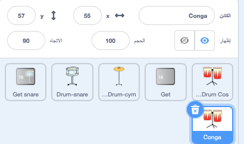

## More drums!

<div style="display: flex; flex-wrap: wrap">
<div style="flex-basis: 200px; flex-grow: 1; margin-right: 15px;">
في هذه الخطوة ، ستختار الأسطوانة المراد إضافتها.
</div>
<div>
! [يظهر المسرح خلفية الحفلة بثلاثة أسطوانات موسيقية.] (images / second-Upgrade.png) {: width = "300px"}
</div>
</div>

--- task ---

قم بتكرار كائن **Drum-snare**:


--- /task ---

--- task ---

انقر فوق مظهر **ازياء او مظاهر الطبل** ثم حدد علامة التبويب **مظاهر**.

**Choose:** which drum to unlock next. اخترنا **Conga**.


--- /task ---

--- task ---

اسحب مظهر "hit" و "not hit" على الطبل الذي اخترته إلى **Drum-snare2** كائن الجديدة:


--- /task ---

--- task ---

Name the new drum to match the costumes you chose.



--- /task ---

--- task ---

انقر فوق علامة التبويب **المقاطع البرمجية**. غيّر المقطع البرمجي لاستخدام الأزياء الصحيحة واختر صوتًا لطبلك الجديد.

غيّر عدد الإيقاعات التي تربحها بالنقر على الطبلة الجديدة إلى `5`:


```blocks3
when this sprite clicked
+change [beats v] by [5] //5 beats per click
+switch costume to [ v] //your hit costume
+play drum [ v] for [0.25] beats //your drum sound
+switch costume to [ v] //your not hit costume
```

--- /task ---

--- task ---

اسحب الأسطوانة او الطبل الجديدة إلى موقعها على المنصة:


--- /task ---

Add a button so that players can unlock the new drum.

--- task ---

Duplicate the **Get snare** sprite and position it in the bottom-right corner of the Stage.

--- /task ---

--- task ---

Change its name (for example `Get conga`):


--- /task ---

--- task ---

Delete the **snare drum** from the new 'Get' button costume.

--- /task ---

--- task ---

Copy the 'not hit' costume for your new drum and paste it to the new 'Get' button costume.

--- /task ---

--- task ---

انقر فوق أداة الــ**نص** وقم بتغيير الرقم إلى `30` لإظهار تكلفة الأسطوانة الجديدة.


--- /task ---

Your new 'Get' button should `hide`{:class="block3looks"} at the start.

--- task ---


```blocks3
when flag clicked
+ hide
```

--- /task ---

--- task ---

Add a `when I receive`{:class="block3events"} script that your new 'Get' button will `show`{:class="block3looks"} when the player unlocks the snare drum.

```blocks3
when I receive [snare v] // appear when previous drum is unlocked
show // show button to get the new drum
```

--- /task ---

--- task ---

Change:
- The number of beats needed to unlock this drum
- The number of beats that are removed when the player unlocks this drum.
- The message that is `broadcast`{:class="block3events"} when the player gets the new drum.

```blocks3
when this sprite clicked
if <(beats)>  [29]> then // change to 29
hide
change [beats v] by [-30] // change to -30
broadcast (conga v) // change to your drum name
else
say [More beats needed!] for [2] seconds 
end
```

--- /task ---

--- task ---

Click your new drum sprite and change the `when I receive snare`{:class="block3events"} script to show it when your new drum is unlocked:

```blocks3
when I receive [conga v] // change to your drum name
show
```

--- /task ---

--- task ---

أضف خلفية **Party**.

--- /task ---

--- task ---

أضف نصًا إلى المنصة لتبديل الخلفية عندما يقوم اللاعب بالترقية إلى الأسطوانة الجديدة:


```blocks3
when I receive [conga v] // change to your drum name
switch backdrop to (Party v)
```

--- /task ---

--- task ---

**Test:** Click the green flag to start the game.

You should get unlock your new drum if you earn enough beats.

What happens if you click the button before you have earned enough beats?

--- /task ---

--- save ---
