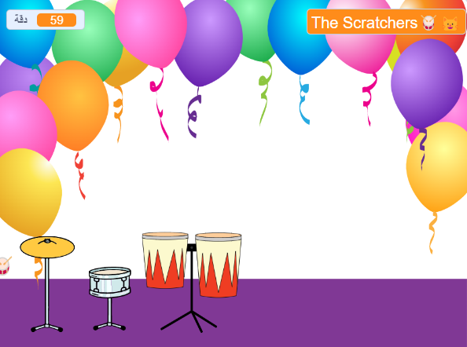

## العب وخصص

حان الوقت لجعل لعبتك تعمل بالطريقة التي تريدها.

{:width="300px"}

--- task ---

العب لعبتك واكسب الإيقاعات.

شاهد المتغير `دقة`{:class="block3variables"} وتأكد من فهم كيفية زيادة الإيقاعات عندما تنقر على الطبول وتنخفض عندما تحصل على طبلة جديدة.

هل أنت سعيد بعدد النبضات التي تربحها لكل طبلة؟ يمكنك تغيير هذا إذا رغبت بذلك.

هل أنت سعيد بعدد النبضات التي تربحها لكل طبلة؟

**نصيحة:** اختبر مشروعك بانتظام حتى تتمكن من العثور على أي أخطاء برمجية وإصلاحها.

--- /task ---

--- task ---

إذا فصلت المقطع البرمجي `اسال`{:class="block3sensing"} على المنصة ، فأعدها وعيّن اسم نجم موسيقى الروك الخاص بك.

لاحظ أن الاسم المعروض على المسرح يتغير.

--- /task ---

--- save ---
