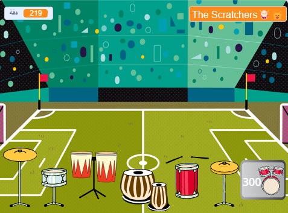

## Challenge

<div style="display: flex; flex-wrap: wrap">
<div style="flex-basis: 200px; flex-grow: 1; margin-right: 15px;">
قم بترقية مشروعك بمزيد من الطبول والمزيد من الخلفيات كلما لعبت المزيد من الأماكن المذهلة. 
</div>
<div>
{:width="300px"}
</div>
</div>

### Add more drums

To add another drum to unlock, look back at the earlier steps of the project.

Here are some reminders if you need them.

--- collapse ---

---
title: For the drum
---

--- task ---

كرر شخصية **الطبل** السابق وأضف مظهر.

--- /task ---

--- task ---

غيّر ` المظهر`{: class = "block3looks"} و `الصوت`{: class = "block3sound"} المستخدم في `عندما نقر هذا الكائن على`{: class = "block3events"} البرنامج النصي.

--- /task ---

--- task ---

غيّر عدد `نبضة`{: class = "block3variables"} المكتسبة في `عندما نقر هذا الكائن على`{: class = "block3events"} نص برمجي.

--- /task ---

--- task ---

قم بتغيير ` رسالة `{: class = "block3events"} التي تجعل الطبل `تعرض`{: class = "block3looks"} رسالى إلى للطبل **الجديد**.

--- /task ---

--- /collapse ---

--- collapse ---

---
title: For the 'Get' button
---

--- task ---

قم بتكرار الكائن السابق **احصل على** كائن.

--- /task ---

--- task ---

قم بتغيير ` الرسالة`{: class = "block3events"} التي تجعل الزر يظهر ` للرسالة `{: class = "block3events"} `البث`{: class = "block3events"} بواسطة ** الأسطوانة السابقة**.

--- /task ---

--- task ---

قم بتغيير `المظهر`{: class = "block3looks"} بما في ذلك تكلفة الأسطوانة الجديدة.

--- /task ---

--- task ---

Change the number of `beats`{:class="block3variables"} you must have to unlock this drum in the `if`{:class="block3events"} condition. Change the negative number of `beats`{:class="block3variables"} you `change by`{:class="block3variables"} when you unlock this drum. Change the number that `beats`{:class="block3variables"} needs to be subtracted from in the `join`{:class="block3operators"} block. Change the message that is `broadcast`{:class="block3events"} to the name of the **new drum**.

--- /task ---

--- /collapse ---

--- collapse ---

---
title: For the venue
---

--- task ---

أضف خلفية جديدة.

--- /task ---

--- task ---

Add a script to the Stage to `switch backdrop to`{:class="block3looks"} the new backdrop when the `message`{:class="block3events"} for this drum is received.

--- /task ---

قد تجد أن طبولك يجب أن تكون في موقع جديد مع خلفية مختلفة.

--- task ---

Add a script starting with `when backdrop changes to`{:class="block3events"} to each **drum** sprite with a `go to`{:class="block3motion"} block to make them change position.

ستحتاج أيضًا إلى تحديد موقع البداية `عند النقر على المقطع لبرمجي العلم الاخضر`{: class = "block3events"}.

--- /task ---

--- /collapse ---

### Improve feedback to the player

Tell the player exactly **how many more** beats are needed to unlock the next drum.

--- task ---

Add this code to `join`{:class="block3operators"} the number of beats needed with the text you have used to tell the player they need more beats if they do not have enough to unlock the next drum:

```blocks3
when this sprite clicked
if <(beats)>  [9]> then //if 10 or more beats
hide
change [beats v] by [-10] //take away the cost of upgrade
else
+ say (join ((10) - (beats)) [beats needed!]) for [2] seconds
end
```

**Note**: Update the numbers to match those needed to unlock each drum.

--- /task ---

### Tidy your code

--- task ---

**Tidy:** If you have time, then it's a good idea to make sure the sprites in the sprite list are in a sensible order, starting with the drums in their locked order and then the buttons in order.

--- /task ---

--- task ---

### Stuck?

**تصحيح:** تأكد أولاً من أنك تفهم حقًا متى يجب أن تظهر الطبول والأزرار وكيف يجب ان متغيير`النبضات` يتغيير{:class="block3variables"} . من الأسهل بكثير تصحيح أخطاء مشروع إذا كنت واضحة .

--- collapse ---
---
title: My drum doesn't show/hide correctly
---

ما لم تكن الأسطوانة الأولى ، يجب أن تحتوي الأسطوانة على `عند النقر فوق العلم`{: class = "block3events"} مقطع برمجي ` للإخفاء `{: class = "block3looks"}.

It should have a `when I receive`{:class="block3events"} `this drum` script to `show`{:class="block3looks"}.

تأكد من أن زر **Get** لهذا الطبل `يبث`{: class = "block3events"} نفس الرسالة.

--- /collapse ---

--- collapse ---
---
title: My Get button doesn't show/hide correctly
---

ما لم يكن الزر للطبل</code>يختفي`: class = "block3looks"} <code>عند النقر فوق العلم`{: class = "block3events"}.

It should `show`{:class="block3looks"} `when I receive`{:class="block3events"} the message for the **previous drum**.

The **Get** button should `show`{:class="block3looks"} to let the player know about the next drum they can unlock.

--- /collapse ---

--- collapse ---
---
title: I can unlock a drum when I don't have enough beats
---

تأكد من أنك قمت بتغيير عدد `نبضات`{: class = "block3variables"} تحتاجها `عند نقر هذا الكائن `{: class = "block3events"} في المقطع البرمجي لزر **Get** للأسطوانة.

--- /collapse ---

--- collapse ---
---
title: The number of beats doesn't change correctly when I unlock a new drum
---

تأكد من ` تغيير نبضة بمفدار` برقم سالب `عندما نقر هذا الكائن`: class = "block3events"} في المقطع البرمجي لزر **Get** للطبل.

تأكد من أن هذا يتطابق مع الرقم الموجود على زي زر الأسطوانة.

--- /collapse ---

--- /task ---

**نصيحة:** إذا كنت غير متاكد ، فلا بأس من حذف الأسطوانة الجديدة وزرها ، والبدء من جديد. في بعض الأحيان يكون من الصعب اكتشاف الخلل.

--- save ---
