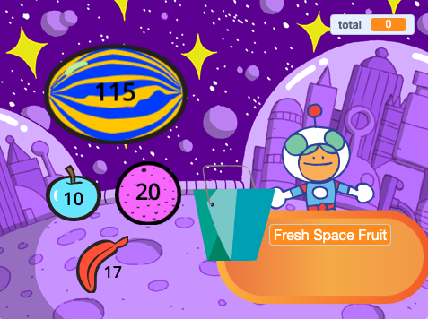

## What can you do now?

إذا كنت تتبع مسار [مشريع اخرى من Scratch](https://projects.raspberrypi.org/en/raspberrypi/more-scratch) ، فيمكنك الانتقال إلى مشروع [الزبون التالي من فضلك!](https://projects.raspberrypi.org/en/projects/next-customer-please) ، حيث ستنشئ متجرًا حيث يمكن للزبائن شراء العناصر او المواد الغذائية وتسجيل المغادرة.

--- print-only ---

--- /print-only ---

--- no-print ---

  <iframe allowtransparency="true" width="485" height="402" src="https://scratch.mit.edu/projects/embed/528696418/?autostart=false" frameborder="0"></iframe>

--- /no-print ---

إذا كنت ترغب في الحصول على مزيد من المتعة في استكشاف Scratch ، فيمكنك تجربة أي من [هذه المشاريع](https://projects.raspberrypi.org/en/projects?software%5B%5D=scratch&curriculum%5B%5D=%201){: target = "_ blank"}.
