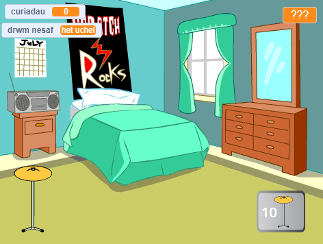

## Cyflwyniad

Creu gêm clicio lle rwyt ti'n ennill curiadau i chwarae drymiau newydd mewn lleoliadau mwy.

Byddi di'n:
+ Defnyddio `newidynnau`{:class="block3variables"} i storio a newid rhifau a thestun (geiriau)
+ `gofyn`{:class="block3sensing"} cwestiwn a defnyddio'r `ateb`{:class="block3sensing"} i addasu'r gêm
+ Defnyddio blociau `os...yna`{:class="block3control"} i wneud dewisiadau

Mae yna lawer o **gemau clicio** lle mae'n rhaid i ti glicio i wneud cynnydd a phrynu uwchraddiadau sy'n dy helpu i fynd yn gyflymach. Wyt ti erioed wedi chwarae gêm clicio? Mae yna hefyd **gemau segur** sy'n dal i fynd hyd yn oed pan nad wyt ti'n eu chwarae. Mae'r gemau yma yn hwyl os nad wyt ti'n treulio gormod o amser yn eu chwarae!

--- no-print ---
--- task ---

### Chwarae ▶️

  
Clicia'r drwm i weld nifer y `curiadau`{:class="block3variables"} yn codi. Byddi di'n cael drwm newydd pan fydd gen ti ddigon o guriadau. 

Faint o `curiadau`{:class="block3variables"} wyt ti'n eu hennill wrth glicio ar y drwm newydd?

  <iframe allowtransparency="true" width="485" height="402" src="https://scratch.mit.edu/projects/embed/522323676/?autostart=false" frameborder="0"></iframe>

--- /task ---
--- /no-print ---

--- print-only ---

--- /print-only ---
