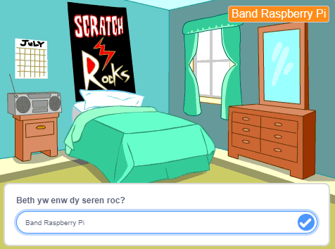
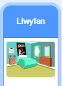
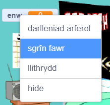

## Set the stage

<div style="display: flex; flex-wrap: wrap">
<div style="flex-basis: 200px; flex-grow: 1; margin-right: 15px;">
In this step, you will set the stage for your first gig and choose a rock star name.
</div>
<div>
{:width="300px"}
</div>
</div>

--- task ---

Open the [Drum star starter project](https://scratch.mit.edu/projects/535783147/editor){:target="_blank"}. Scratch will open in another browser tab.

[[[working-offline]]]

--- /task ---

<p style="border-left: solid; border-width:10px; border-color: #0faeb0; background-color: aliceblue; padding: 10px;">
Musicians called <span style="color: #0faeb0">**DIY artists**</span> start recording music from their bedrooms. They produce their own songs by themselves then release them online for everyone to hear. 
</p>

The game starts in a bedroom like a DIY artist.

--- task ---

Click **Choose a Backdrop** and search for `bedroom`.

**Choose:** Select a bedroom and add it to your project. We chose `Bedroom 3`.


--- /task ---

--- task ---

In Scratch, you can add code to the Stage.

Click on your bedroom backdrop from the Stage pane and add this code:



```blocks3
when flag clicked
switch backdrop to (Bedroom 3 v) //your backdrop name
```

--- /task ---

Every musician needs to choose a rock star name.

A **variable** is a way of storing numbers and/or text. Your rockstar name will be stored in a `variable`{:class="block3variables"} so it can be used at any time.

--- task ---

From the `Variables`{:class="block3variables"} blocks menu, click the **Make a Variable** button.

Call your new variable `name`:


**Notice:** The new `name` variable appears on the Stage and can now be used in the `Variable`{:class="block3variables"} blocks.

--- /task ---

--- task ---

At the start of the project, your rockstar name is unknown.

Add a block to `set name to`{:class="block3variables"} `???`:


```blocks3
when flag clicked
switch backdrop to (Bedroom 3 v) //your backdrop name
+ set [name v] to [???] //your variable
```

--- /task ---

You can `ask`{:class="block3sensing"} a question in Scratch, then use a `variable`{:class="block3variables"} to store the `answer`{:class="block3sensing"}.

--- task ---

Click on the `Sensing`{:class="block3sensing"} blocks menu and add an `ask`{:class="block3sensing"} block to your code:


```blocks3
when flag clicked
switch backdrop to (Bedroom 3 v) //your backdrop name
set [name v] to [???] //your variable
+ ask [What's your rock star name?] and wait //your question
```

--- /task ---

--- task ---

Set the `name`{:class="block3variables"} `variable`{:class="block3variables"} to the `answer`{:class="block3sensing"}:


```blocks3
when flag clicked
switch backdrop to (Bedroom 3 v) //your backdrop name
set [name v] to [???] //your variable
ask [What's your rock star name?] and wait //your question
+ set [name v] to (answer)
```

--- /task ---

Change the way your `variable`{:class="block3variables"} looks on the Stage.

--- task ---

Right-click on the `variable`{:class="block3variables"} on the Stage and choose **large readout**:



--- /task ---

--- task ---

Drag your `variable`{:class="block3variables"} to position it in top-right of the Stage:


--- /task ---

--- task ---

**Test:** Run your project to make sure the `variable`{:class="block3variables"} starts as `???` then updates to your `answer`{:class="block3sensing"}.

--- /task ---

--- task ---

Now that you have tested that the `variable`{:class="block3variables"} changes to the `answer`{:class="block3sensing"}, you can drag the last 2 blocks of code away from the rest of the script. This means you don't have to type an `answer`{:class="block3sensing"} every time you test your project:


```blocks3
when flag clicked
switch backdrop to (Bedroom 3 v) //your backdrop name
set [name v] to [???] //your variable
```

```blocks3
ask [What's your rock star name?] and wait //your question
set [name v] to (answer)
```

--- /task ---

--- save ---
