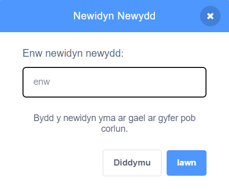

## Gosod y Llwyfan

<div style="display: flex; flex-wrap: wrap">
<div style="flex-basis: 200px; flex-grow: 1; margin-right: 15px;">
Yn y cam yma, byddi di'n gosod y llwyfan ar gyfer dy gig cyntaf ac yn dewis enw seren roc.
</div>
<div>
{:width="300px"}
</div>
</div>

--- task ---

Agora'r [prosiect Seren ddrymiau](https://scratch.mit.edu/projects/535783147/editor){:target="_blank"}. Bydd Scratch yn agor mewn tab arall ar y porwr.

--- /task ---

The drummer starts in a bedroom like a beginner!

--- task ---

Clicia **Dewiswch Gefnlen** a chwilio am `bedroom`.

Select a bedroom and add it to your project. Fe ddewison ni `Bedroom 3`.


--- /task ---

Yn Scratch, galli di ychwanegu cod at y Llwyfan.

--- task ---

Clicia ar dy gefnlen ystafell wely o gwarel y Llwyfan ac ychwanegu'r cod yma:


```blocks3
when flag clicked
switch backdrop to (Bedroom 3 v) //your backdrop name
```

--- /task ---

Mae angen i bob cerddor ddewis enw seren roc.

Mae **newidyn** yn ffordd o storio rhifau a/neu destun. Bydd enw dy seren roc yn cael ei storio mewn `newidyn`{:class="block3variables"} fel bod modd ei ddefnyddio unrhyw bryd.

--- task ---

O'r ddewislen blociau `Newidynnau`{:class="block3variables"} clicia'r botwm **Creu Newidyn**.

Newidia enw dy newidyn i `enw`:



**Nodyn:** Bydd y newidyn `enw` newydd yn ymddangos ar y Llwyfan a bydd modd ei ddefnyddio nawr yn y blociau `Newidyn`{:class="block3variables"}.

--- /task ---

--- task ---

Ar ddechrau'r prosiect, mae enw dy seren roc yn anhysbys.

Ychwanega floc i `gosod enw i`{:class="block3variables"} `???`:


```blocks3
when flag clicked
switch backdrop to (Bedroom 3 v) //your backdrop name
+ set [name v] to [???] //your variable
```

--- /task ---

Galli di `ofyn`{:class="block3sensing"} cwestiwn yn Scratch, ac wedyn defnyddio `newidyn`{:class="block3variables"} i storio'r `ateb`{:class="block3sensing"}.

--- task ---

Clicia ar y ddewislen flociau `Synhwyro`{:class="block3sensing"} ac ychwanegu bloc `gofyn`{:class="block3sensing"} at dy god:

```blocks3
when flag clicked
switch backdrop to (Bedroom 3 v) //your backdrop name
set [name v] to [???] //your variable
+ ask [What's your rock star name?] and wait //your question
```

--- /task ---

--- task ---

Gosoda'r `newidyn`{:class="block3variables"} `enw`{:class="block3variables"} i'r `ateb`{:class="block3sensing"}:

```blocks3
when flag clicked
switch backdrop to (Bedroom 3 v) //your backdrop name
set [name v] to [???] //your variable
ask [What's your rock star name?] and wait //your question
+ set [name v] to (answer)
```

--- /task ---

--- task ---

De-glicia ar y `newidyn`{:class="block3variables"} ar y Llwyfan a dewis **sgrîn fawr**:


--- /task ---

--- task ---

Drag your `variable`{:class="block3variables"} to position it top-right of the Stage:


--- /task ---

--- task ---

**Prawf:** Rheda dy brosiect i wneud yn siŵr bod y `newidyn`{:class="block3variables"} yn dechrau fel `???` ac wedyn yn diweddaru i dy `ateb`{:class="block3sensing"}.

--- /task ---

You don't want to type an answer every time you test your project.

--- task ---

Drag the last two blocks of code away from the rest of the script.

```blocks3
when flag clicked
switch backdrop to (Bedroom 3 v) //your backdrop name
set [name v] to [???] //your variable
```

```blocks3
ask [What's your rock star name?] and wait //your question
set [name v] to (answer)
```

--- /task ---

--- save ---
