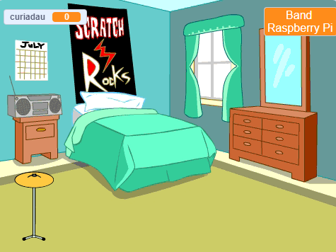
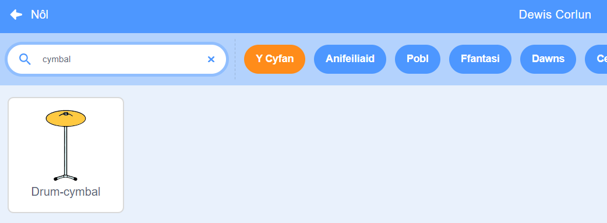

## Drwm cychwynnol

<div style="display: flex; flex-wrap: wrap">
<div style="flex-basis: 200px; flex-grow: 1; margin-right: 15px;">
Byddi di'n ychwanegu corlun **symbal** y galli di ei glicio i ennill curiadau a chwarae sain.
</div>
<div>
{:width="300px"}
</div>
</div>

--- task ---

Clicia **Dewiswch Gorlun** a chwilia am `cymbal`. Ychwanega'r corlun **Drum-cymbal** at dy brosiect.



--- /task ---

--- task ---

Rho dy symbal ar y Llwyfan:


--- /task ---

--- task ---

Ychwanega'r **Estyniad sain**:

[[[generic-scratch3-add-music-extension]]]

--- /task ---

--- task ---

Ychwanega sgript i wneud i'r symbal `newid gwisg`{:class="block3looks"} a `chwarae sain drwm`{:class="block3extensions"}:


```blocks3
when this sprite clicked
switch costume to [drum-cymbal-b v] // hit costume
play drum [(5) Open High-Hat v] for [0.25] beats // sain drwm
switch costume to [drum-cymbal-a v]  // not hit costume
```

--- /task ---

--- task ---

**Prawf:** Profa dy cymbal trwy glicio arno. Gwna'n siŵr dy fod yn clywed sain ac yn gweld y gwisgoedd yn newid.

--- /task ---

Bydd y corlun **Drum-cymbal** yn ennill un curiad i ti bob tro byddi di'n ei glicio.

--- task ---

Crea `newidyn`{:class="block3variables"} o'r enw `curiadau`:


--- /task ---

--- task ---

Ychwanega floc er mwyn `newid curiadau gan 1`{:class="block3variables"} pan gaiff y corlun **Drum-cymbal** ei glicio:


```blocks3
when this sprite clicked
+change [curiadau v] by [1]
switch costume to [drum-cymbal-b v]
play drum [(5) Open High-Hat v] for [0.25] beats 
switch costume to [drum-cymbal-a v]
```

--- /task ---

--- task ---

**Profi:** Profa'r **Drum-cymbal** drwy glicio arno a gwylia'r `curiadau`{:class="block3variables"} yn codi.

--- /task ---

Mae angen i'r newidyn `curiadau`{:class="block3variables"} ddechrau ar `0` curiad pan fyddi di'n dechrau gêm newydd.

--- task ---

Clicia gwarel y Llwyfan ac yna ar y tab **Cod** i ychwanegu cod at y Llwyfan.

Ychwanega floc er mwyn `gosod curiadau i`{:class="block3variables"} `0`:


```blocks3
when flag clicked
switch backdrop to (Bedroom 3 v) 
set [enw v] to [???] 
+ set [curiadau v] to [0]
```
--- /task ---

--- task ---

**Prawf:** Clicia'r faner werdd a gwneud yn siŵr bod dy newidyn `curiadau`{:class="block3variables"} yn dechrau ar `0`.

--- /task ---

--- save ---
