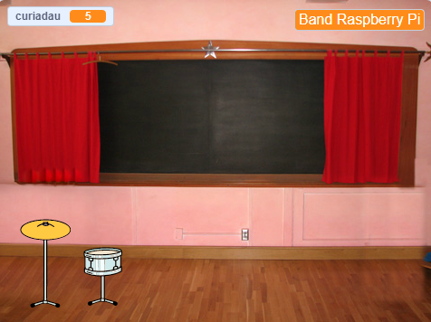

## Uwchraddiad cyntaf

<div style="display: flex; flex-wrap: wrap">
<div style="flex-basis: 200px; flex-grow: 1; margin-right: 15px;">
Byddi di'n ychwanegu dy uwchraddiad cyntaf. Bydd y botwm **Dewis Drwm Gwifrau** yn ymddangos ar y dechrau, fel bod y chwaraewr yn gwybod pa ddrwm mae'n gweithio tuag ato.
</div>
<div>
{:width="300px"}
</div>
</div>

--- task ---

Ychwanega'r corlun **Drum-snare** at dy brosiect a’i osod ar y Llwyfan:


--- /task ---

--- task ---

Llusga'r sgript `pan gaiff y corlun hwn ei glicio`{:class="block3events"} o'r corlun **Drum-cymbal** i'r corlun **Drum-snare**.

[[[scratch3-copy-code]]]

--- /task ---

--- task ---

Newidia'r gwisgoedd a sain y drwm.

Newidia nifer y curiadau sy'n cael eu hennill i `2`:


```blocks3
when this sprite clicked
+change [curiadau v] by [2] //2 guriad y clic
+switch costume to [drum-snare-b v] //gwisg guro
+play drum [(1) Snare Drum v] for [0.25] beats //sain drwm
+switch costume to [drum-snare-a v] //gwisg heb guro
```

--- /task ---

--- task ---

**Profi:** Profa dy brosiect. Gwna'n yn siŵr dy fod ti'n ennill 2 guriad pan fyddi di'n clicio ar y drwm gwifrau.

--- /task ---

Dydy uwchraddiadau ddim ar gael wrth i ti ddechrau'r prosiect. Mae'n rhaid eu hennill gyda churiadau.

--- task ---

Ychwanega sgript i guddio'r corlun **drwm** yma ar ddechrau'r prosiect:


```blocks3
when flag clicked
hide
```

--- /task ---

Bydd botwm yn dangos pa ddrwm yw'r opsiwn uwchraddio nesaf a faint o guriadau fydd yn ei gostio.

--- task ---

**Dyblyga** y corlun **Dewis**:


Newidia'r gwelededd i **Dangos** a newid ei enw i `Dewis Drwm Gwifrau`. Gosoda'r corlun yng nghornel dde isaf y Llwyfan:


--- /task ---

--- task ---

Clicia'r corlun **Drum-snare** ac wedyn mynd i'r tab **Gwisgoedd**. Defnyddia'r offeryn **Dewis** (saeth) i amlygu gwisg heb guro dy ddrwm. Clicia'r eicon **Grŵp** ac wedyn yr eicon **Copïo**:


--- /task ---

--- task ---

Clicia dy gorlun **Dewis Drwm Gwifrau** a **Gludo** gwisg y drwm gwifrau. Efallai bydd angen i ti newid ei faint a'i leoli i ffitio dy fotwm:


--- /task ---

--- task ---

Clicia'r tab **Cod** ac ychwanegu sgript i ddangos y corlun **Dewis Drwm Gwifrau** ar ddechrau’r prosiect:


```blocks3
when flag clicked
show
```

--- /task ---

Dim ond os oes gan y defnyddiwr `10` curiad neu fwy y gellir prynu'r uwchraddiad. Yn [Tyfu gwas y neidr](https://projects.raspberrypi.org/cy-GB/projects/grow-a-dragonfly){:target="_blank"}, wnes di ddysgu sut i wneud penderfyniadau gyda blociau `os`{:class="block3control"}.

Mae bloc `os...yna`{:class="block3control"} yn cael ei ddefnyddio i wneud penderfyniad a bydd yn gwneud pethau gwahanol os mae amod yn `wir` neu `anwir`.

<p style="border-left: solid; border-width:10px; border-color: #0faeb0; background-color: aliceblue; padding: 10px;">
Rydyn ni'n defnyddio <span style="color: #0faeb0">**os ... yna**</span> drwy'r amser i wneud penderfyniadau. Pan fyddi di'n deffro, rwyt ti'n edrych i weld `os`{:class="block3control"} ydy hi'n fore. Rwyt ti'n codi, neu `fel arall`{:class="block3control"} rwyt ti'n mynd yn ôl i gysgu. Allet ti feddwl am unrhyw benderfyniadau `os ... yna`{:class="block3control"} rwyt ti'n eu gwneud? 
</p>

--- task ---

Ychwanega'r cod yma i gael yr uwchraddiad `os`{:class="block3control"} mae gan y chwaraewr ddigon o guriadau, neu `ddweud`{:class="block3looks"} `Dim digon o guriadau!` os nad yw'n gallu uwchraddio:


```blocks3
when this sprite clicked
if <(curiadau)>  [9]> then //os oes 10 curiad neu fwy
hide
change [curiadau v] by [-10] //dileu'r uwchraddio costau
else
say [Dim digon o curiadau!] for [2] seconds 
end
```

--- /task ---

Rho wybod i'r corluniaid a'r Llwyfan fod diweddariad y drwm gwifrau wedi cael ei brynu.

--- task ---

Ychwanega floc `darlledu`{:class="block3events"} i anfon neges `drwm gwifrau` newydd:


```blocks3
when this sprite clicked
if <(curiadau)>  [9]> then // os oes 10 curiad neu fwy
hide
change [curiadau v] by [-10] // dileu'r uwchraddio costau
+ broadcast (drwm gwifrau v) // enw dy ddrwm
else
say [Dim digon o curiadau!] for [2] seconds 
end
```

--- /task ---

--- task ---

Clicia'r corlun **Drum-snare**. Ychwanegu'r sgript yma:


```blocks3
when I receive [drwm gwifrau v]
show
```

--- /task ---

Pan fyddi di'n uwchraddio dy offer, byddi di'n gallu chwarae mewn lleoliadau mwy.

--- task ---

Ychwanega gefnlen arall. Fe ddewison ni **Chalkboard** er mwyn chwarae ein ail gig yn yr ysgol.

Ychwanega god i'r Llwyfan i `newid cefnlen`{:class="block3looks"} ar ôl derbyn y neges uwchraddio:


```blocks3
when I receive [drwm gwifrau v]
switch backdrop to [Chalkboard v]
```

**Awgrym:** Dewisa leoliad sy'n gam bach i fyny o'r ystafell wely. Dylet ti gadw'r lleoliadau mwy tan yn nes ymlaen.

--- /task ---

--- task ---

**Profi:** Rheda dy brosiect. Rho gynnig ar brynu uwchraddiad y drwm gwifrau cyn i ti gael digon o guriadau.

Pan fyddi di'n prynu'r uwchraddiad, gwna'n siŵr bod y canlynol yn digwydd: mae'r drwm gwifrau yn ymddangos, mae'r botwm yn diflannu, mae'r lleoliad yn newid ac mae'r `curiadau`{:class="block3variables"} yn gostwng `10`.

--- /task ---

--- save ---
