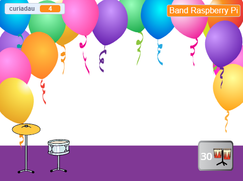
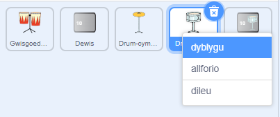
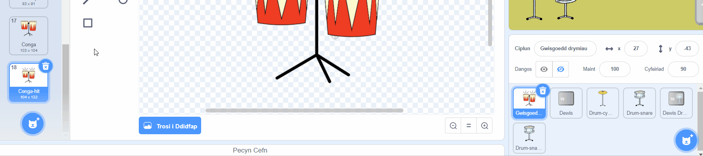
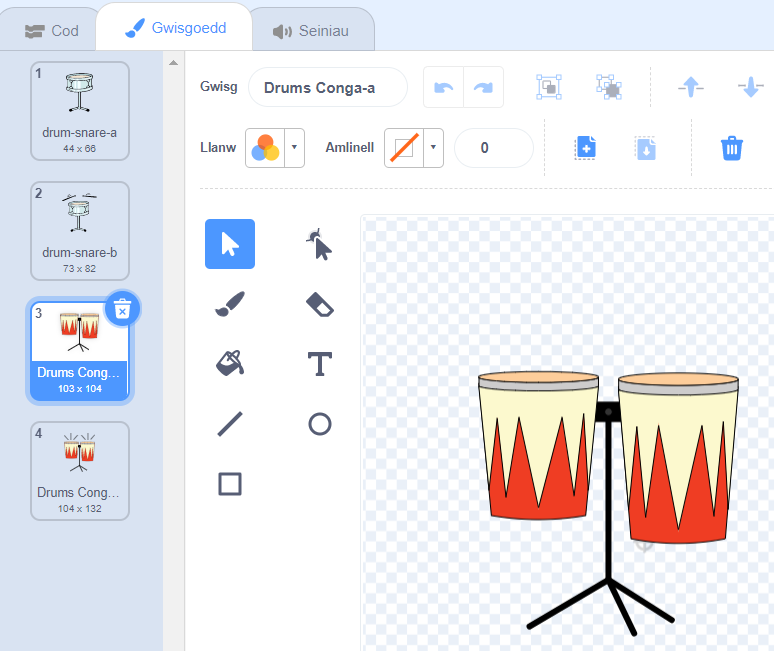
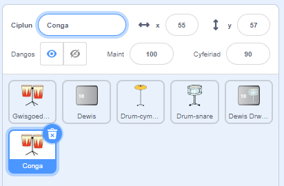
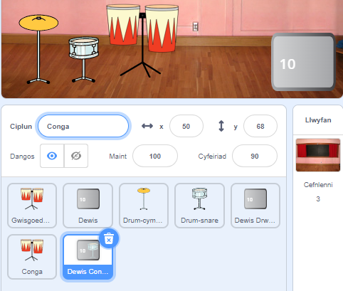
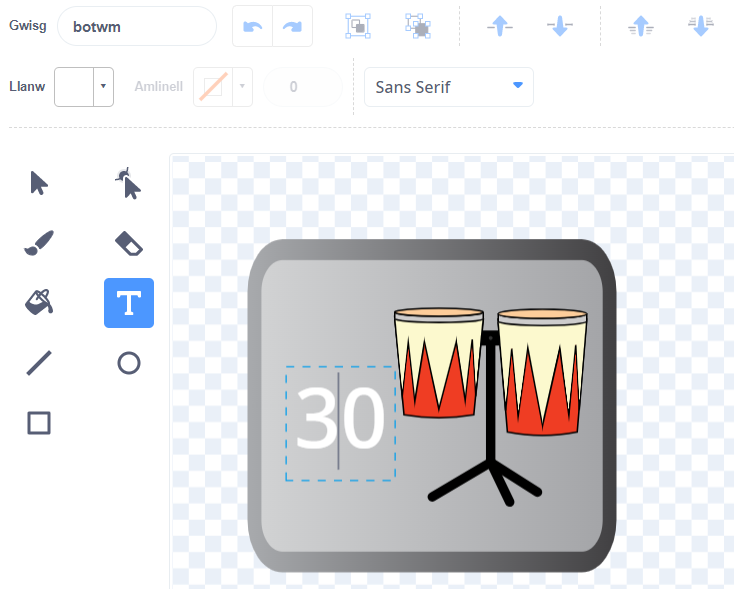
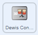

## Ail uwchraddiad

<div style="display: flex; flex-wrap: wrap">
<div style="flex-basis: 200px; flex-grow: 1; margin-right: 15px;">
Mae dy sgiliau drymio yn gwella. Mae'n amser uwchraddio eto! Yn y cam yma, byddi di'n yn dewis pa ddrwm i'w ychwanegu.
</div>
<div>
{:width="300px"}
</div>
</div>

--- task ---

Dyblyga'r corlun **Drum-snare**:



--- /task ---

Mae gan y corlun **Drum Costumes** lawer o wisgoedd drymiau i ti ddewis ohonyn nhw.

--- task ---

Clicia'r corlun **Drum Costumes** ac wedyn mynd i'r tab **Gwisgoedd**.

**Dewisa:** ddrwm ar gyfer yr uwchraddiad nesaf. Fe ddewison ni **Conga**.

Llusga'r gwisgoedd 'hit' a 'not hit' o'r drwm y gwnes di ei ddewis i dy gorlun **Drum-snare2** newydd:





--- /task ---

--- task ---

Enwa dy ddrwm i gyd-fynd â'r gwisgoedd y gwnes di eu dewis.



--- /task ---

--- task ---

Clicia'r tab **Cod**. Newidia'r cod i ddefnyddio'r gwisgoedd cywir a dewis sain ar gyfer dy ddrwm newydd.

Newidia nifer y curiadau rwyt ti'n eu hennill drwy glicio'r drwm newydd i `5`:


```blocks3
when this sprite clicked
+change [beats v] by [5] //5 beats per click
+switch costume to [ v] //your hit costume
+play drum [ v] for [0.25] beats //your drum sound
+switch costume to [ v] //your not hit costume
```

--- /task ---

--- task ---

Llusga dy ddrwm newydd i'w le ar y Llwyfan:


--- /task ---

Nesaf, mae angen botwm fel y gall chwaraewyr uwchraddio i'r drwm newydd yma.

--- task ---

Dyblyga'r corlun **Get snare**.

Gosoda'r corlun yng nghornel dde isaf y Llwyfan. Newidia ei enw i `Get` ac wedyn i enw dy ddrwm newydd:



--- /task ---

--- task ---

Dilea'r **drwm gwifrau** o wisg y botwm. Copïa a gludo'r wisg 'not hit' ar gyfer dy ddrwm newydd i wisg y botwm.

Clicia'r offeryn **Text** a newid y rhif i `30` i ddangos cost y drwm newydd.

Dylai dy fotwm edrych fel hyn:



--- /task ---


Dylai'r botwm yma `guddio`{:class="block3looks"} ac wedyn `dangos`{:class="block3looks"} pan fydd y chwaraewr yn uwchraddio i'r drwm gwifrau, fel ei fod yn gwybod pa ddrwm mae'n gweithio tuag ato.

--- task ---



```blocks3
when flag clicked
- show
+ hide
```

**Awgrym:** I ddileu bloc, rhaid ei lusgo i'r ddewislen Blociau, neu dde-glicio a dewis **Dileu'r Bloc**. Ar gyfrifiadur, galli di hefyd glicio ar floc ac yna taro <kbd>Dileu</kbd> i gael gwared ar floc.

--- /task ---

--- task ---

Ychwanega sgript `pan rwy'n derbyn`{:class="block3events"} y bydd dy fotwm drwm newydd yn ymddangos fel yr uwchraddiad nesaf pan fydd y chwaraewr yn ennill y drwm **Drum-snare**:


```blocks3
when I receive [snare v] // appear when previous drum is bought
show // show button for next available drum
```

--- /task ---

--- task ---

Newidia nifer y curiadau sydd eu hangen i brynu'r drwm yma, a nifer y curiadau sy'n cael eu tynnu pan fydd y chwaraewr yn cael y drwm yma.

Newidia hefyd y neges sy'n cael ei `darlledu`{:class="block3events"} pan fydd y chwaraewr yn cael y drwm newydd. Crea neges newydd gydag enw dy ddrwm newydd:


```blocks3
when this sprite clicked
if <(beats)>  [29]> then // change to 29
hide
change [beats v] by [-30] // change to 30
broadcast [conga v] // change to your drum name
else
say [Not enough beats!] for [2] seconds 
end
```

--- /task ---

--- task ---

Newidia'r sgript `pan rwy'n derbyn snare`{:class="block3events"} i `ddarlledu`{:class="block3events"} enw dy ddrwm newydd. Bydd y drwm yn `dangos`{:class="block3looks"} pan fydd y chwaraewr yn uwchraddio i'r drwm newydd:


```blocks3
when I receive [conga v] // change to your drum name
show
```

--- /task ---

--- task ---

Ychwanega'r gefnlen **Party**.

Ychwanega sgript i'r Llwyfan i newid y gefnlen pan fydd y chwaraewr yn uwchraddio i'r drwm newydd:


```blocks3
when I receive [conga v] // change to your drum name
switch backdrop to (Party v)
```

--- /task ---

--- task ---

**Prawf:** Clicia'r faner werdd i gychwyn y gêm a phrofi dy fod yn gallu ennill digon o guriadau i gael dy ddrwm newydd.

Beth sy'n digwydd os wyt ti'n clicio'r botwm cyn ennill digon o guriadau?

--- /task ---

--- save ---
