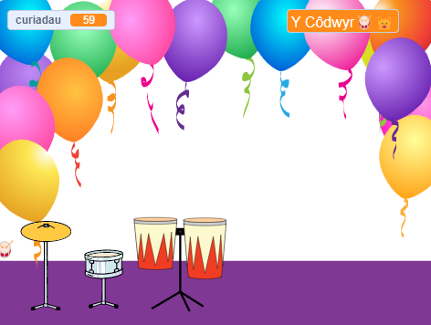

## Chwarae ac addasu

Mae'n bryd gwneud i dy gêm weithio'r union ffordd rwyt ti am iddi wneud.

{:width="300px"}

--- task ---

Chwaraea dy gêm ac ennill curiadau.

Gwylia wrth i'r newidyn `curiadau`{:class="block3variables"} newid a gwna'n siŵr dy fod yn deall sut mae curiadau'n cynyddu pan fyddi di'n clicio ar y drymiau ac yn lleihau pan fyddi di'n cael drwm newydd.

Wyt ti'n hapus gyda faint o guriadau rwyt ti'n eu hennill ar gyfer pob drwm? Galli di newid hyn os wyt ti eisiau.

Wyt ti'n hapus gyda faint o guriadau mae'n ei gostio i brynu drwm newydd?

**Awgrym:** Profa dy brosiect yn rheolaidd fel y galli di ddod o hyd i unrhyw chwilod a'u trwsio.

--- /task ---

--- task ---

Os wyt ti wedi gwahanu'r bloc `gofyn`{:class="block3sensing"} ar y Llwyfan, dylet ti ei roi yn ôl a gosod enw dy seren roc.

Sylwa fod yr enw sy'n cael ei ddangos ar y Llwyfan yn newid.

--- /task ---

--- save ---
