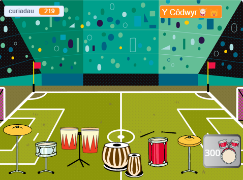

## Uwchraddio dy brosiect

Galli di uwchraddio dy brosiect gyda rhagor o ddrymiau a mwy o gefnlenni wrth i ti chwarae mewn mwy o leoliadau anhygoel. 

{:width="300px"}

Mae llawer mwy o wisgoedd drymiau i ddewis ohonyn nhw i ychwanegu rhagor o uwchraddiadau i'ch prosiect.

I ychwanegu drwm arall i uwchraddio iddo, edrycha yn ôl ar gamau cynharach y prosiect.

Ar gyfer y **drwm**, bydd angen i ti:

--- task ---

Ddyblygu'r corlun **drum** blaenorol ac ychwanegu dwy wisg.

--- /task ---

--- task ---

Newid y `wisg`{:class="block3looks"} a'r `sain`{:class="block3sound"} sy'n cael eu defnyddio yn y sgript `pan gaiff y corlun hwn ei glicio`{:class="block3events"}.

--- /task ---

--- task ---

Newid nifer y `curiadau`{:class="block3variables"} sy'n cael eu hennill yn y sgript `pan gaiff y corlun hwn ei glicio`{:class="block3events"}.

--- /task ---

--- task ---

Newid y `neges`{:class="block3events"} sy'n gwneud i'r drwm `ddangos`{:class="block3looks"} i neges ar gyfer y **drwm newydd**.

--- /task ---

Ar gyfer y **botwm**, bydd angen i chi:

--- task ---

Dyblyga'r corlun **Get** blaenorol.

--- /task ---

--- task ---

Newidia'r `neges`{:class="block3events"} sy'n gwneud i'r botwm ymddangos i'r `neges`{:class="block3events"} sy'n cael ei `darlledu`{:class="block3events"} gan y **drwm blaenorol**.

--- /task ---

--- task ---

Newidia'r `wisg`{:class="block3looks"} gan gynnwys cost y drwm newydd.

--- /task ---

--- task ---

Newidia nifer y `curiadau`{:class="block3variables"} sydd ei angen i enill y drwm yma yn yr amod `os`{:class="block3events"}. Newidia'r nifer negyddol o `guriadau`{:class="block3variables"} sy'n `newid gan`{:class="block3variables"} pan fydd rhywun yn cael y drwm yma. Newidia'r neges sy'n cael ei `darlledu`{:class="block3events"} i enw'r **drwm newydd**.

--- /task ---

Ar gyfer y **lleoliad**, bydd angen i ti:

--- task ---

Ychwanegu cefnlen newydd.

--- /task ---

--- task ---

Ychwanegu sgript i'r Llwyfan i `newid cefnlen i`{:class="block3looks"} y gefnlen newydd pan fydd y `neges`{:class="block3events"} ar gyfer y drwm yma yn cael ei derbyn.

--- /task ---

Efallai y gweli fod angen i dy ddrymiau fod mewn safle newydd ar gefnlen wahanol.

--- task ---

Ychwanega sgript sy'n dechrau gyda `pan fydd cefndir yn newid i`{:class="block3events"} i bob corlun **drwm** gyda bloc `mynd i`{:class="block3motion"} i wneud iddyn nhw newid eu safle.

Bydd hefyd angen i ti osod eu safleoedd cychwynnol `ar ôl clicio'r faner`{:class="block3events"}.

--- /task ---

--- task ---

**Tacluso:** Os oes gen ti amser, mae'n syniad gwneud yn siŵr bod y corluniau ar y rhestr corluniau mewn trefn synhwyrol, gan gychwyn gyda'r drymiau yn y drefn y cawson nhw eu huwchraddio ac yna'r botymau mewn trefn.

--- /task ---

--- task ---

**Debug:** Yn gyntaf gwna'n siŵr dy fod yn deall yn iawn pryd y dylai'r drymiau a'r botymau ymddangos a sut y dylai'r newidyn `curiadau`{:class="block3variables"} newid. Mae'n llawer haws difa chwilod prosiect os wyt ti'n glir am yr hyn mae i fod i'w wneud.

--- collapse ---
---
title: Dydy fy nrwm ddim yn ymddangos/cuddio yn gywir
---

Oni bai mai hwn ydy'r drwm cyntaf, dylai dy ddrwm gael sgript `pan fydd y faner wedi'i chlicio`{:class="block3events"} i'w `guddio`{:class="block3looks"}. A dylai gael sgript `pan rwy'n derbyn`{:class="block3events"} `y drwm yma` i'w `ddangos`{:class="block3looks"}.

Gwiria fod y botwm **Get** ar gyfer y drwm yma yn `darlledu`{:class="block3events"} yr un neges.

--- /collapse ---

--- collapse ---
---
title: Dydy'r botwm Fy Get ddim yn ymddangos/cuddio yn gywir
---

Oni bai fod y botwm ar gyfer y drwm cyntaf un, dylai `guddio`{:class="block3looks"} `pan fydd y faner wedi'i chlicio`{:class="block3events"}. A dylai `ddangos`{:class="block3looks"} `pan rwy'n derbyn`{:class="block3events"} y neges ar gyfer y **drwm blaenorol**. Dylai'r botwm **Get** `ddangos`{:class="block3looks"} i roi gwybod i'r chwaraewr am yr uwchraddiad nesaf mae'n yn gweithio tuag ato.

--- /collapse ---

--- collapse ---
---
title: Dw i'n gallu prynu drwm pan nad oes gen i ddigon o guriadau
---

Gwna'n siŵr dy fod wedi newid nifer y `curiadau`{:class="block3variables"} sydd eu hangen `pan gaiff y corlun hwn ei glicio`{:class="block3events"} yn y sgript ar gyfer y botwm **Get** ar gyfer y drwm.

--- /collapse ---

--- collapse ---
---
title: Dydy nifer y curiadau ddim yn newid yn gywir pan fydda i'n cael drwm newydd
---

Gwna'n siŵr dy fod wedi `newid curiadau gan`{:class="block3variables"} gyda rhif negatif `pan gaiff y corlun hwn ei glicio`{:class="block3events"} yn y sgript ar gyfer y botwm **Get** ar gyfer y drwm.

Sicrha fod hyn yn cyfateb i rif gwisg botwm y drwm.

--- /collapse ---

--- /task ---

--- collapse ---
---
teitl: Prosiect gorffenedig
---

Galli di weld y [prosiect wedi'i gwblhau yma](https://scratch.mit.edu/projects/522323676/){:target="_blank"}.

--- /collapse ---

**Awgrym:** Os wyt ti'n dechrau drysu, mae'n iawn dileu'r drwm newydd a'i fotwm, a dechrau eto. Weithiau mae'n anodd dod o hyd i chwilod.

--- save ---
