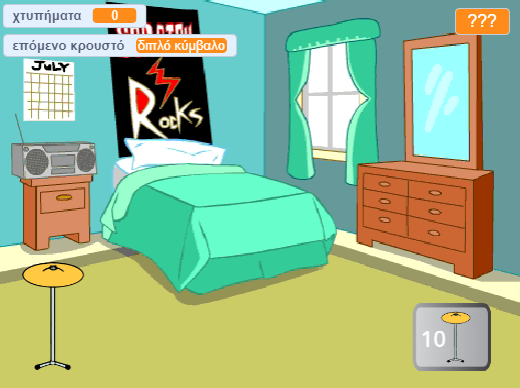

## Εισαγωγή

Δημιούργησε ένα παιχνίδι με κλικ όπου κερδίζεις χτυπήματα για να παίξεις νέα τύμπανα σε μεγαλύτερους χώρους.

Θα:
+ Χρησιμοποιήσεις `μεταβλητές`{:class="block3variables"} για να αποθηκεύσεις και να αλλάξεις αριθμούς και κείμενο (λέξεις)
+ `κάνεις`{:class="block3sensing"} μια ερώτηση και θα χρησιμοποιήσεις την `απάντηση`{:class="block3sensing"} για να προσαρμόσεις το παιχνίδι
+ Χρησιμοποιήσεις μπλοκ `εάν...αλλιώς`{:class="block3control"} για να πάρεις αποφάσεις

Υπάρχουν πολλά **παιχνίδια με κλικ** στα οποία πρέπει να κάνεις κλικ για να σημειώσεις πρόοδο και να αγοράσεις αναβαθμίσεις που σε βοηθούν να προχωρήσεις πιο γρήγορα. Έχεις παίξει ποτέ ένα παιχνίδι με κλικ; Υπάρχουν επίσης **παιχνίδια σε αδράνεια** που η πρόοδος συνεχίζεται ακόμα και όταν δεν τα παίζεις. Αυτά τα παιχνίδια είναι διασκεδαστικά αρκεί να μην αφιερώνεις πολύ χρόνο παίζοντας τα!

--- no-print ---
--- task ---

### Δοκίμασέ το

  
Κάνε κλικ στο τύμπανο και παρακολούθησε τον αριθμό των "χτυπημάτων"{:class="block3variables"} να αυξάνεται. Απόκτησε ένα νέο τύμπανο όταν έχεις αρκετά χτυπήματα. 

Πόσα `χτυπήματα`{:class="block3variables"} κερδίζεις όταν κάνεις κλικ στο νέο τύμπανο;

  <iframe allowtransparency="true" width="485" height="402" src="https://scratch.mit.edu/projects/embed/716225080/?autostart=false" frameborder="0"></iframe>

--- /task ---
--- /no-print ---

--- print-only ---

--- /print-only ---
