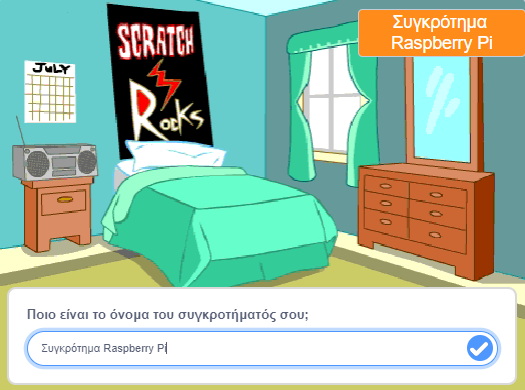
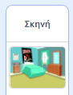
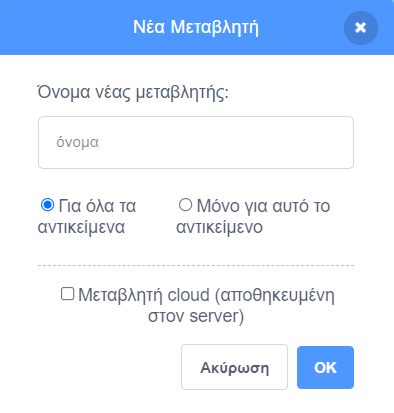
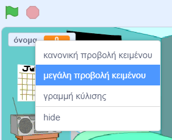

## Επίλεξε το Σκηνικό

<div style="display: flex; flex-wrap: wrap">
<div style="flex-basis: 200px; flex-grow: 1; margin-right: 15px;">
Σε αυτό το βήμα, θα δημιουργήσεις τη σκηνή για την πρώτη σου συναυλία και θα επιλέξεις ένα όνομα ροκ σταρ.
</div>
<div>
{:width="300px"}
</div>
</div>

--- task ---

Open the [Drum star starter project](https://scratch.mit.edu/projects/535783147/editor){:target="_blank"}. Το Scratch θα ανοίξει σε νέα καρτέλα του φυλλομετρητή.

[[[working-offline]]]

--- /task ---

<p style="border-left: solid; border-width:10px; border-color: #0faeb0; background-color: aliceblue; padding: 10px;">
Musicians called <span style="color: #0faeb0">**DIY artists**</span> start recording music from their bedrooms. Παράγουν τα δικά τους τραγούδια μόνοι τους και στη συνέχεια τα κυκλοφορούν στο διαδίκτυο για να τα ακούσουν όλοι. 
</p>

The game starts in a bedroom like a DIY artist.

--- task ---

Κάνε κλικ στο **Επιλέξτε Υπόβαθρο** και αναζήτησε `υπνοδωμάτιο (bedroom)`.

**Διάλεξε:** Επίλεξε το υπνοδωμάτιο που προτιμάς στο έργο σου. Επιλέξαμε `Bedroom 3`.


--- /task ---

--- task ---

Στο Scratch, μπορείς να προσθέσεις κώδικα στο Υπόβαθρο.

Κάνε κλικ στο σκηνικό του υπνοδωματίου σου από το παράθυρο της Σκηνής και πρόσθεσε αυτόν τον κώδικα:



```blocks3
when flag clicked
switch backdrop to (Bedroom 3 v) //your backdrop name
```

--- /task ---

Κάθε μουσικός πρέπει να επιλέξει ένα όνομα ροκ σταρ.

Μια **μεταβλητή** είναι ένας τρόπος αποθήκευσης αριθμών ή/και κειμένου. Το όνομά του ροκ σταρ σου, θα αποθηκευτεί σε μια `μεταβλητή`{:class="block3variables"}, ώστε να μπορεί να χρησιμοποιηθεί ανά πάσα στιγμή.

--- task ---

Από το μενού μπλοκ `Μεταβλητές`{:class="block3variables"} κάνε κλικ στο κουμπί **Δημιουργία μεταβλητής**.

Κάλεσε τη νέα σου μεταβλητή `όνομα`:



**Σημείωση:** Η νέα μεταβλητή `όνομα` εμφανίζεται στη Σκηνή και μπορεί πλέον να χρησιμοποιηθεί στα μπλοκ `Μεταβλητές`{:class="block3variables"}.

--- /task ---

--- task ---

Στην αρχή του έργου, το όνομα του ροκ σταρ σου είναι άγνωστο.

Πρόσθεσε ένα μπλοκ στο `όρισε όνομα σε`{:class="block3variables"} `???`:


```blocks3
when flag clicked
switch backdrop to (Bedroom 3 v) //your backdrop name
+ set [name v] to [???] //your variable
```

--- /task ---

Μπορείς να προσθέσεις ένα μπλοκ`ρώτησε`{:class="block3sensing"} στο Scratch και μετά να χρησιμοποιήσεις μια `μεταβλητή`{:class="block3variables"} για να αποθηκεύσεις τις `απαντήσεις`{:class="block3sensing"}.

--- task ---

Κάνε κλικ στο μενού μπλοκ `Αισθητήρες`{:class="block3sensing"} και πρόσθεσε ένα μπλοκ `ρώτησε`{:class="block3sensing"} στον κώδικά σου:


```blocks3
when flag clicked
switch backdrop to (Bedroom 3 v) //your backdrop name
set [name v] to [???] //your variable
+ ask [What's your rock star name?] and wait //your question
```

--- /task ---

--- task ---

Όρισε τη `μεταβλητή`{:class="block3variables"} `όνομα`{:class="block3variables"} ως την `απάντηση`{:class="block3sensing"}:


```blocks3
when flag clicked
switch backdrop to (Bedroom 3 v) //your backdrop name
set [name v] to [???] //your variable
ask [What's your rock star name?] and wait //your question
+ set [name v] to (answer)
```

--- /task ---

Άλλαξε τον τρόπο εμφάνισης της `μεταβλητής`{:class="block3variables"} στη Σκηνή.

--- task ---

Κάνε δεξί κλικ ξανά στη `μεταβλητή`{:class="block3variables"} που εμφανίζεται στη Σκηνή και επίλεξε **αλλαγή εύρους γραμμής κύλισης**:



--- /task ---

--- task ---

Σύρε τη `μεταβλητή`{:class="block3variables"} για να την τοποθετήσεις στην επάνω δεξιά γωνία της Σκηνής:


--- /task ---

--- task ---

**Δοκιμή:** Εκτέλεσε το έργο σου για να βεβαιωθείς ότι η `μεταβλητή`{:class="block3variables"} ξεκινά ως `???` και στη συνέχεια ενημερώνεται με την τιμή της `απάντησης`{:class="block3sensing"}.

--- /task ---

--- task ---

Τώρα που δοκίμασες ότι η `μεταβλητή`{:class="block3variables"} αλλάζει στην την τιμή της `απάντησης`{:class="block3sensing"}, μπορείς να σύρεις τα τελευταία 2 μπλοκ κώδικα μακριά από το υπόλοιπο σενάριο. Αυτό σημαίνει ότι δεν χρειάζεται να πληκτρολογήσεις μια `απάντηση`{:class="block3sensing"} κάθε φορά που δοκιμάζεις το έργο σου:


```blocks3
when flag clicked
switch backdrop to (Bedroom 3 v) //your backdrop name
set [name v] to [???] //your variable
```

```blocks3
ask [What's your rock star name?] and wait //your question
set [name v] to (answer)
```

--- /task ---

--- save ---
