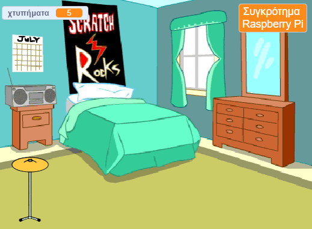
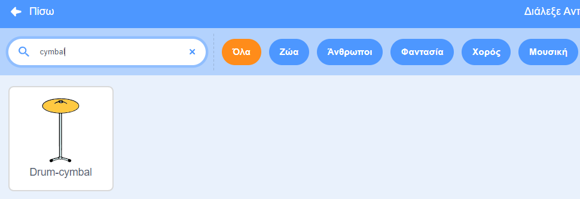
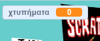

## Αρχικό τύμπανο

<div style="display: flex; flex-wrap: wrap">
<div style="flex-basis: 200px; flex-grow: 1; margin-right: 15px;">
Θα προσθέσεις ένα αντικείμενο **κύμβαλο** (cymbal) στο οποίο μπορείς να κάνεις κλικ για να κερδίσεις χτυπήματα και να παίξεις έναν ήχο.
</div>
<div>
{:width="300px"}
</div>
</div>

--- task ---

Κάνε κλικ στο **Επιλέξτε ένα Αντικείμενο** και αναζητήσε το `cymbal`. Πρόσθεσε το αντικείμενο **Drum-cymbal** στο έργο σου.



--- /task ---

--- task ---

Τοποθέτησε το κύμβαλο σου στη σκηνή:


--- /task ---

--- task ---

Πρόσθεσε την **επέκταση Μουσική**:

[[[generic-scratch3-add-music-extension]]]

--- /task ---

--- task ---

Πρόσθεσε ένα script για να κάνεις το κύμβαλο `αλλάξει ενδυμασία`{:class="block3looks"} και να `παίζει έναν ήχο τυμπάνου`{:class="block3extensions"}:


```blocks3
when this sprite clicked
switch costume to [drum-cymbal-b v] // hit costume
play drum [(5) Open High-Hat v] for [0.25] beats // drum sound
switch costume to [drum-cymbal-a v]  // not hit costume
```

--- /task ---

--- task ---

**Δοκιμή:** Δοκίμασε το κύμβαλό σου κάνοντας κλικ σε αυτό. Βεβαιώσου ότι ακούς έναν ήχο και κοίτα την ενδυμασία να αλλάζει.

--- /task ---

Το αντικείμενο **Drum-cymbal** θα σου δίνει ένα χτύπημα κάθε φορά που κάνεις κλικ σε αυτό.

--- task ---

Δημιούργησε μια `μεταβλητή`{:class="block3variables"} που ονομάζεται `χτυπήματα`:



--- /task ---

--- task ---

Πρόσθεσε ένα μπλοκ για να `αλλάξεις τα χτυπήματα κατά 1`{:class="block3variables"} όταν κάνεις κλικ στο αντικείμενο **Drum-cymbal**:


```blocks3
when this sprite clicked
+change [beats v] by [1]
switch costume to [drum-cymbal-b v]
play drum [(5) Open High-Hat v] for [0.25] beats 
switch costume to [drum-cymbal-a v]
```

--- /task ---

--- task ---

**Δοκιμή:** Δοκίμασε το **Drum-cymbal** κάνοντας κλικ πάνω του και κοίτα τα `χτυπήματα`{:class="block3variables"} να αυξάνονται.

--- /task ---

Η μεταβλητή `χτυπήματα`{:class="block3variables"} πρέπει να ξεκινά με `0` χτυπήματα όταν ξεκινάς ένα νέο παιχνίδι.

--- task ---

Κάνε κλικ στο παράθυρο Σκηνή και στη συνέχεια στην καρτέλα **Κώδικας** για να προσθέσεις κώδικα στη Σκηνή.

Πρόσθεσε ένα μπλοκ για να `ορίσεις χτυπήματα σε`{:class="block3variables"} `0`:


```blocks3
when flag clicked
switch backdrop to (Bedroom 3 v) 
set [name v] to [???] 
+ set [beats v] to [0]
```
--- /task ---

--- task ---

**Δοκιμή:** Κάνε κλικ στην πράσινη σημαία και βεβαιώσου η μεταβλητή `χτυπήματα`{:class="block3variables"} ξεκινά από `0`.

--- /task ---

--- save ---
