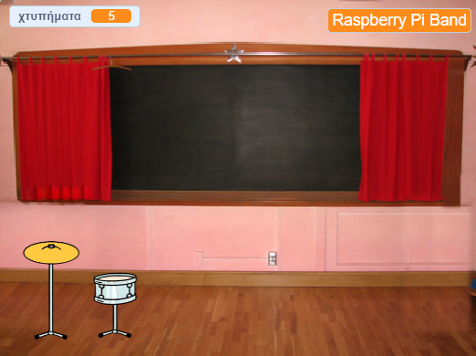
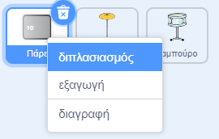
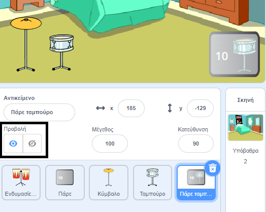
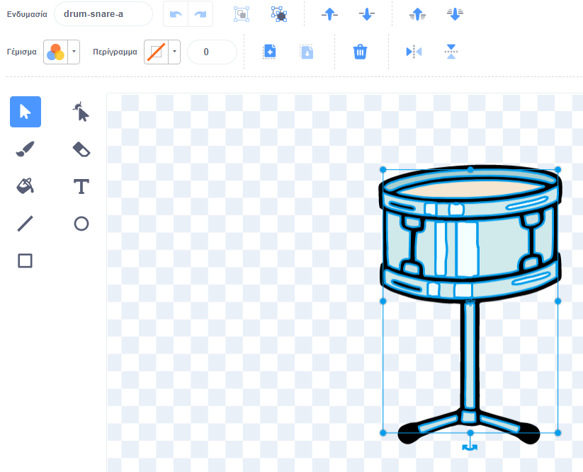
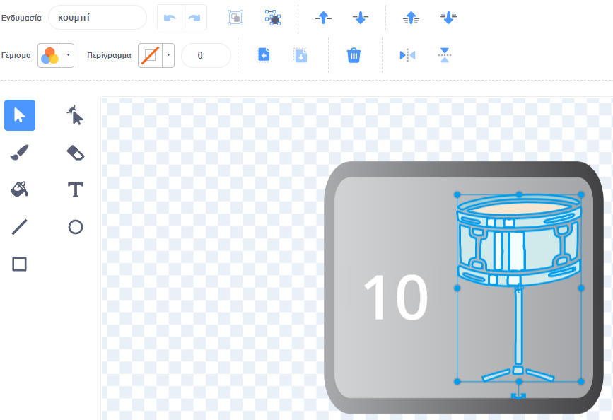

## Πρώτη αναβάθμιση

<div style="display: flex; flex-wrap: wrap">
<div style="flex-basis: 200px; flex-grow: 1; margin-right: 15px;">
Θα προσθέσεις την πρώτη σου αναβάθμιση. Το κουμπί **Πάρε ταμπούρο** θα εμφανιστεί στην αρχή, ώστε ο παίκτης να ξέρει ποιο τύμπανο θέλει να αποκτήσει.
</div>
<div>
{:width="300px"}
</div>
</div>

--- task ---

Πρόσθεσε το αντικείμενο **Drum-snare** στο έργο σου και τοποθέτησε το στο Υπόβαθρο:


--- /task ---

--- task ---

Σύρε το script `όταν γίνει κλικ σε αυτό το αντικείμενο`{:class="block3events"} από το αντικείμενο **Drum-cymbal** στο αντικείμενο **Drum-snare**.

[[[scratch3-copy-code]]]

--- /task ---

--- task ---

Άλλαξε τις ενδυμασίες και τον ήχο του τυμπάνου.

Άλλαξε τον αριθμό των χτυπημάτων που κερδίζεις σε `2`:


```blocks3
when this sprite clicked
+change [χτυπήματα v] by [2] //2 χτυπήματα ανά κλικ
+switch costume to [drum-snare-b v] //ενδυμασία χτυπημένου
+play drum [(1) Snare Drum v] for [0.25] beats //drum sound
+switch costume to [drum-snare-a v] //ενδυμασία μη χτυπημένου
```

--- /task ---

--- task ---

**Δοκιμή:** Τρέξε το έργο σου. Βεβαιώσου ότι κερδίζεις 2 χτυπήματα όταν κάνεις κλικ στο ταμπούρο.

--- /task ---

Οι αναβαθμίσεις δεν είναι διαθέσιμες όταν ξεκινάς το έργο. Πρέπει να κερδίζονται με χτυπήματα.

--- task ---

Πρόσθεσε ένα script για να αποκρύψεις αυτό το αντικείμενο **τύμπανο** στην αρχή του έργου:


```blocks3
when flag clicked
hide
```

--- /task ---

Ένα κουμπί θα δείξει ποιο τύμπανο είναι η επόμενη επιλογή αναβάθμισης και πόσα χτυπήματα θα κοστίσει.

--- task ---

**Διπλασίασε** το αντικείμενο **Πάρε**:



Άλλαξε την προβολή σε **Εμφάνιση** και άλλαξε το όνομά του σε `Πάρε ταμπούρο`. Τοποθέτησε το στην κάτω δεξιά γωνία της Σκηνής:



--- /task ---

--- task ---

Κάνε κλικ στο αντικείμενο **Drum-snare** και επίλεξε την καρτέλα **Ενδυμασίες**. Χρησιμοποιήσε το εργαλείο **Επιλογή** (βέλος) για να επισημάνεις τη μη χτυπημένη ενδυμασία του τυμπάνου σου. Κάνε κλικ στο εικονίδιο **Ομαδοποίηση** και στη συνέχεια στο εικονίδιο **Αντιγραφή**:




--- /task ---

--- task ---

Κάνε κλικ στο αντικείμενο **Πάρε ταμπούρο** και **Επιλόλλησε** στην ενδυμασία ταμπούρο. Ίσως χρειαστεί να αλλάξεις το μέγεθος και να το τοποθετήσεις κατάλληλα ώστε να ταιριάζει στο κουμπί σου:




--- /task ---

--- task ---

Κάνε κλικ στην καρτέλα **Κώδικας** και πρόσθεσε ένα σενάριο για να εμφανιστεί το αντικείμενο **Πάρε ταμπούρο** στην αρχή του έργου:


```blocks3
when flag clicked
show
```

--- /task ---

Η αναβάθμιση μπορεί να αγοραστεί μόνο εάν ο χρήστης έχει `10` ή περισσότερα χτυπήματα. Στο [Grow a dragonfly](https://projects.raspberrypi.org/el-GR/projects/grow-a-dragonfly){:target="_blank"}, έμαθες πώς να λαμβάνεις αποφάσεις με `εάν`{:class="block3control"} μπλοκ.

Ένα μπλοκ `εάν ... αλλιώς`{:class="block3control"} χρησιμοποιείται για τη λήψη μιας απόφασης και θα κάνει διαφορετικά πράγματα εάν μια συνθήκη είναι `αληθής` ή `ψευδής`.

<p style="border-left: solid; border-width:10px; border-color: #0faeb0; background-color: aliceblue; padding: 10px;">
Χρησιμοποιούμε <span style="color: #0faeb0">**αν ... αλλιώς**</span> όλη την ώρα για να λάβουμε αποφάσεις. Όταν ξυπνάς, ελέγχεις `εάν`{:class="block3control"} είναι πρωί. Σηκώνεσαι ή `αλλιώς`{:class="block3control"} κοιμάσαι ξανά. Μπορείς να σκεφτείς άλλες αποφάσεις «αν ... αλλιώς»{:class="block3control"} που λαμβάνεις; 
</p>

--- task ---

Πρόσθεσε αυτόν τον κώδικα για να λάβεις την αναβάθμιση `εάν`{:class="block3control"} ο παίκτης έχει αρκετά χτυπήματα ή να `πει`{:class="block3looks"} `Δεν υπάρχουν αρκετά χτυπήματα!` εάν δεν μπορεί να γίνει η αναβάθμιση:


```blocks3
when this sprite clicked
if <(χτυπήματα)>  [9]> then //εάν 10 ή περισσότερα χτυπήματα
hide
change [χτυπήματα v] by [-10] //αφαίρεσε το κόστος της αναβάθμισης
else
say [Όχι αρκετά χτύπήματα!] for [2] seconds 
end
```

--- /task ---

Ενημέρωσε τα άλλα αντικείμενα και τη Σκηνή ότι η αναβάθμιση σε τάμπουρο έχει αγοραστεί.

--- task ---

Πρόσθεσε ένα μπλοκ `μετάδωσε`{:class="block3events"} για να στείλεις ένα νέο μήνυμα `ταμπούρο`:


```blocks3
when this sprite clicked
if <(χτυπήματα)>  [9]> then // εάν 10 ή περισσότερα χτυπήματα
hide
change [χτυπήματα v] by [-10] // αφαίρεσε το κόστος της αναβάθμισης
+ broadcast [ταμπούρο v] // το όνομα του τυμπάνου σου
else
say [Όχι αρκετά χτύπήματα!] for [2] seconds 
end
```

--- /task ---

--- task ---

Κάνε κλικ στο αντικείμενο **Drum-snare**. Πρόσθεσε αυτό το script:


```blocks3
when I receive [ταμπούρο v]
show
```

--- /task ---

Όταν αναβαθμίζεις τον εξοπλισμό σου, θα μπορείς να παίξεις σε μεγαλύτερους χώρους.

--- task ---

Πρόσθεσε κι άλλο υπόβαθρο. Επιλέξαμε τον **Μαυροπίνακα (Chalkoard)** για να παίξουμε τη δεύτερη συναυλία μας στο σχολείο.

Πρόσθεσε κώδικα στο υπόβαθρο για να `αλλάξεις υπόβαθρο`{:class="block3looks"} όταν λάβεις το μήνυμα αναβάθμισης:


```blocks3
when I receive [ταμπούρο v]
switch backdrop to [Chalkboard v]
```

**Συμβουλή:** Επίλεξε έναν χώρο που απέχει ένα μικρό βήμα από την κρεβατοκάμαρα. Θέλεις να αποθηκεύσεις μεγαλύτερους χώρους για αργότερα.

--- /task ---

--- task ---

**Δοκιμή:** Τρέξε το έργο σου. Δοκίμασε να αγοράσεις την αναβάθμιση του αντικειμένου ταμπούρου πριν να έχεις αρκετά χτυπήματα.

Όταν αγοράζεις τον έλεγχο αναβάθμισης: εμφανίζεται το ταμπούρο, το κουμπί εξαφανίζεται, ο χώρος διεξαγωγής αλλάζει και τα `χτυπήματα`{:class="block3variables"} μειώνονται κατά `10`.

--- /task ---

--- save ---
