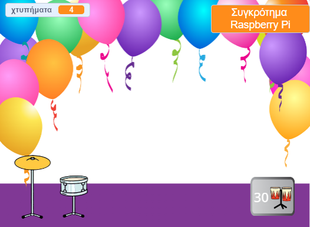
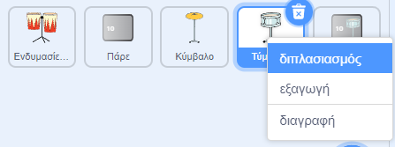
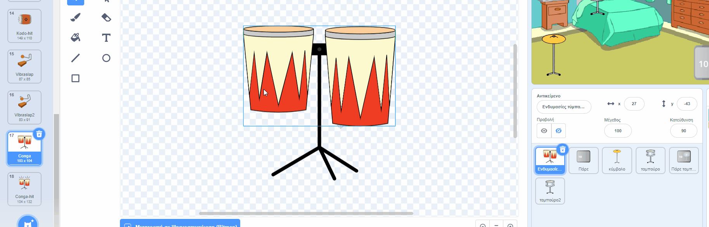
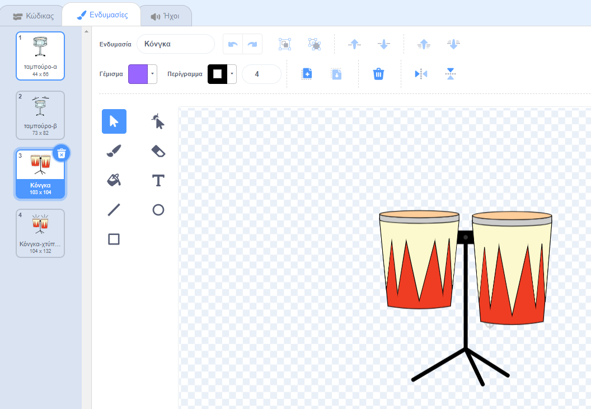
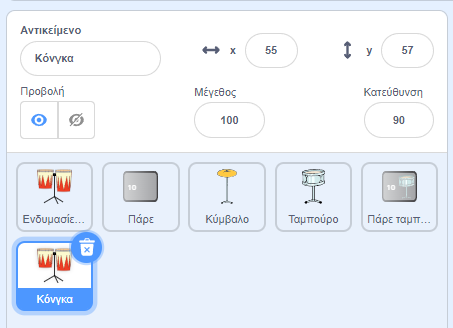
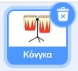
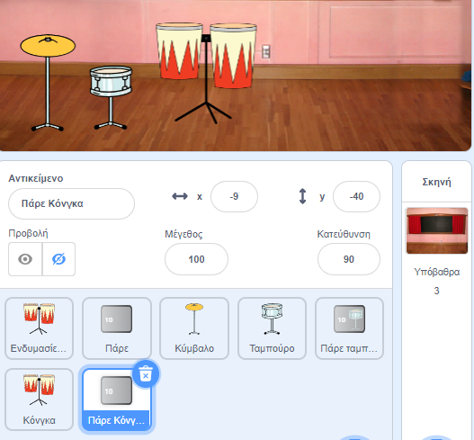
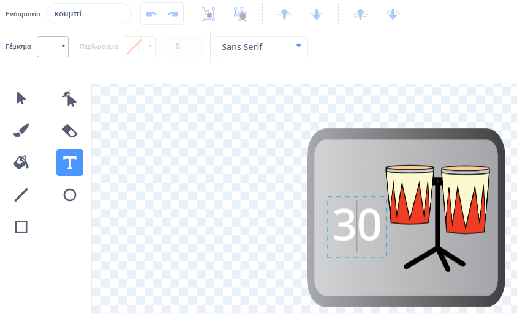
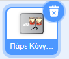
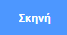

## Δεύτερη αναβάθμιση

<div style="display: flex; flex-wrap: wrap">
<div style="flex-basis: 200px; flex-grow: 1; margin-right: 15px;">
Οι ικανότητές σου στα τύμπανα βελτιώνονται. Ώρα για δεύτερη αναβάθμιση! Σε αυτό το βήμα, θα επιλέξεις ποιο τύμπανο θα προσθέσεις.
</div>
<div>
{:width="300px"}
</div>
</div>

--- task ---

Διπλασίασε το αντικείμενο **Drum-snare**:



--- /task ---

Το αντικείμενο **Ενδυμασίες Τυμπάνων** έχει πολλές ενδυμασίες τυμπάνων από τις οποίες μπορείς να επιλέξεις.

--- task ---

Κάνε κλικ στο αντικείμενο **Ενδυμασίες Τυμπάνων** και επίλεξε την καρτέλα **Ενδυμασίες**.

**Επίλεξε:** ένα τύμπανο για την επόμενη αναβάθμιση. Επιλέξαμε **Κόνγκα (Conga)**.

Σύρε τις ενδυμασίες «χτυπημένο» και «μη χτυπημένο» του τυμπάνου που έχεις επιλέξει στο νέο σου αντικείμενο **Drum-snare2**:





--- /task ---

--- task ---

Ονόμασε το τύμπανο σου ώστε να ταιριάζει με τις ενδυμασίες που επέλεξες.



--- /task ---

--- task ---

Κάνε κλικ στην καρτέλα **Κώδικας**. Άλλαξε τον κώδικα για να χρησιμοποιήσεις τις σωστές ενδυμασίες και επίλεξε έναν ήχο για το νέο του τύμπανο.

Άλλαξε τον αριθμό των χτυπημάτων που κερδίζεις κάνοντας κλικ στο νέο τύμπανο σε `5`:



```blocks3
when this sprite clicked
+change [χτυπήματα v] by [5] //5 χτυπήματα ανά κλικ
+switch costume to [ v] //your hit costume
+play drum [ v] for [0.25] beats //ο ήχος του τυμπάνου σου
+switch costume to [ v] //your not hit costume
```

--- /task ---

--- task ---

Σύρε το νέο σου τύμπανο στη θέση του στη Σκηνή:


--- /task ---

Στη συνέχεια, χρειάζεσαι ένα κουμπί για να μπορούν οι παίκτες να κάνουν αναβάθμιση σε αυτό το νέο τύμπανο.

--- task ---

Αντίγραψε το αντικείμενο **Πάρε ταμπούρο**.

Τοποθέτησε το στην κάτω δεξιά γωνία του Σκηνικού. Άλλαξε το όνομά του σε `Πάρε` και μετά το όνομα του νέου σου τυμπάνου:



--- /task ---

--- task ---

Διάγραψε το **ταμπούρο** από την ενδυμασία του κουμπιού. Αντίγραψε και επικόλλησε την ενδυμασία "μη χτυπημένο" για το νέο σου τύμπανο στην ενδυμασία του κουμπιού.

Κάνε κλικ στο εργαλείο **Κείμενο** και άλλαξε τον αριθμό σε `30` για να εμφανίσεις το κόστος του νέου τυμπάνου.

Το κουμπί σου θα πρέπει να μοιάζει κάπως έτσι:



--- /task ---


Αυτό το κουμπί πρέπει να `εξαφανίζεται`{:class="block3looks"} στην αρχή και μετά να `εμφανίζεται`{:class="block3looks"} όταν ο παίκτης κάνει αναβάθμιση στο ταμπούρο, ώστε να γνωρίζει ποιο τύμπανο είναι το επόμενο για το οποίο προσπαθεί.

--- task ---



```blocks3
when flag clicked
- show
+ hide
```

**Συμβουλή:** Για να διαγράψεις ένα μπλοκ, σύρε το στο μενού Μπλοκ ή κάνε δεξί κλικ και επίλεξε **Διαγραφή μπλοκ**. Σε έναν υπολογιστή, μπορείς επίσης να κάνεις κλικ σε ένα μπλοκ και, στη συνέχεια, να πατήσεις το πλήκτρο <kbd>Delete</kbd> για να αφαιρέσεις ένα μπλοκ.

--- /task ---

--- task ---

Πρόσθεσε ένα script `όταν λάβω`{:class="block3events"} που θα εμφανίζεται το νέο κουμπί του τυμπάνου σου ως επόμενη αναβάθμιση όταν ο παίκτης λάβει το τύμπανο **Drum-snare**:


```blocks3
when I receive [ταμπούρο v] // εμφανίζεται όταν αγοράζεις το προηγούμενο τύμπανο
show // εμφάνισε το κουμπί για το επόμενο διαθέσιμο τύμπανο
```

--- /task ---

--- task ---

Άλλαξε τον αριθμό των χτυπημάτων που χρειάζονται για να αγοράσεις αυτό το τύμπανο και τον αριθμό των χτυπημάτων που αφαιρούνται, όταν ο παίκτης πάρει αυτό το τύμπανο.

Άλλαξε επίσης το μήνυμα που `μεταδίδεται`{:class="block3events"} όταν ο παίκτης λάβει το νέο τύμπανο. Δημιούργησε ένα νέο μήνυμα με το όνομα του νέου σου τυμπάνου:


```blocks3
when this sprite clicked
if <(χτυπήματα)>  [29]> then // αλλαγή σε 29
hide
change [χτυπήματα v] by [-30] // αλλαγή σε 30
broadcast [κόνγκα v] // άλλαξε το όνομα του τυμπάνου σου
else
say [Όχι αρκετά χτύπήματα!] for [2] seconds 
end
```

--- /task ---

--- task ---

Άλλαξε το script `όταν λάβω ταμπούρο`{:class="block3events"} για να `μεταδώσεις`{:class="block3events"} το όνομα του νέου σου τυμπάνου. Το τύμπανο θα `εμφανιστεί`{:class="block3looks"} όταν ο παίκτης αναβαθμιστεί στο νέο τύμπανο:


```blocks3
when I receive [κόνγκα v] // άλλαξε το όνομα του τυμπάνου σου
show
```

--- /task ---

--- task ---

Πρόσθεσε το σκηνικό **Party**.

Πρόσθεσε ένα σενάριο στην Σκηνή για να αλλάξεις το υπόβαθρο όταν ο παίκτης αναβαθμιστεί στο νέο τύμπανο:



```blocks3
when I receive [κόνγκα v] // άλλαξε το όνομα του τυμπάνου σου
switch backdrop to (Party v)
```

--- /task ---

--- task ---

**Δοκιμή:** Κάνε κλικ στην πράσινη σημαία για να ξεκινήσεις το παιχνίδι και δοκίμασε ότι μπορείς να κερδίσεις αρκετά χτυπήματα για να αποκτήσεις το νέο σου τύμπανο.

Τι θα συμβεί αν κάνεις κλικ στο κουμπί πριν κερδίσεις αρκετά χτυπήματα;

--- /task ---

--- save ---
