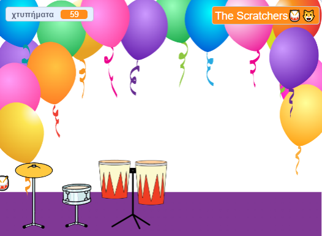

## Παίξε και προσάρμοσε

Ήρθε η ώρα να κάνεις το παιχνίδι σου να λειτουργεί όπως ακριβώς θέλεις.

{:width="300px"}

--- task ---

Παίξε το παιχνίδι σου και κερδίσε χτυπήματα.

Παρακολούθησε την αλλαγή της μεταβλητής `χτυπήματα`{:class="block3variables"} και βεβαιώσου ότι καταλαβαίνεις πώς αυξάνονται τα χτυπήματα όταν κάνεις κλικ στα τύμπανα και μειώνονται όταν λαμβάνεις ένα νέο τύμπανο.

Είσαι ευχαριστημένος με το πόσα χτυπήματα κερδίζεις για κάθε τύμπανο; Μπορείς να το αλλάξεις αν θέλεις.

Είσαι ευχαριστημένος με το πόσα χτυπήματα κερδίζεις για κάθε τύμπανο;

**Συμβουλή:** Δοκίμαζε το έργο σου τακτικά, ώστε να μπορείς να βρεις και να διορθώσεις τυχόν σφάλματα.

--- /task ---

--- task ---

Εάν διαχώρισες το μπλοκ `ρώτησε`{:class="block3sensing"} στη Σκηνή, τοποθέτησε το ξανά και όρισε το όνομα του ροκ σταρ σου.

Παρατήρησε ότι το όνομα που εμφανίζεται στο Υπόβαθρο αλλάζει.

--- /task ---

--- save ---
