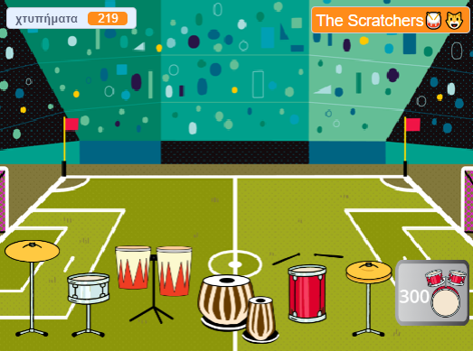

## Challenge

<div style="display: flex; flex-wrap: wrap">
<div style="flex-basis: 200px; flex-grow: 1; margin-right: 15px;">
Αναβάθμισε το έργο σου, με περισσότερα τύμπανα και περισσότερα σκηνικά καθώς παίζεις σε πιο εκπληκτικούς χώρους. 
</div>
<div>
{:width="300px"}
</div>
</div>

### Add more drums

To add another drum to unlock, look back at the earlier steps of the project.

Here are some reminders if you need them.

--- collapse ---

---
title: For the drum
---

--- task ---

Αντίγραψε το προηγούμενο αντικείμενο **τύμπανο** και πρόσθεσε δύο ενδυμασίες.

--- /task ---

--- task ---

Άλλαξε την `ενδυμασία`{:class="block3looks"} και τον `ήχο`{:class="block3sound"} που χρησιμοποιούνται στο script `όταν γίνει κλικ σε αυτό το αντικείμενο`{:class="block3events"}.

--- /task ---

--- task ---

Άλλαξε τον αριθμό των `χτυπημάτων`{:class="block3variables"} που κέρδισες στο script `όταν γίνει κλικ σε αυτό το αντικείμενο`{:class="block3events"}.

--- /task ---

--- task ---

Άλλαξε το `μήνυμα`{:class="block3events"} που κάνει το τύμπανο να `εμφανίζεται`{:class="block3looks"} σε ένα μήνυμα για το **νέο τύμπανο**.

--- /task ---

--- /collapse ---

--- collapse ---

---
title: For the 'Get' button
---

--- task ---

Διπλασιάσεις το αντικείμενο **Πάρε**.

--- /task ---

--- task ---

Αλλάξεις το `μήνυμα`{:class="block3events"} που κάνει το κουμπί να εμφανίζεται στο `μήνυμα`{:class="block3events"} `μετάδωσε`{:class="block3events"} με το **προηγούμενο τύμπανο**.

--- /task ---

--- task ---

Αλλάξεις την `ενδυμασία`{:class="block3looks"} συμπεριλαμβανομένου του κόστους του νέου τυμπάνου.

--- /task ---

--- task ---

Change the number of `beats`{:class="block3variables"} you must have to unlock this drum in the `if`{:class="block3events"} condition. Change the negative number of `beats`{:class="block3variables"} you `change by`{:class="block3variables"} when you unlock this drum. Change the number that `beats`{:class="block3variables"} needs to be subtracted from in the `join`{:class="block3operators"} block. Change the message that is `broadcast`{:class="block3events"} to the name of the **new drum**.

--- /task ---

--- /collapse ---

--- collapse ---

---
title: For the venue
---

--- task ---

Προσθέσεις ένα νέο υπόβαθρο.

--- /task ---

--- task ---

Add a script to the Stage to `switch backdrop to`{:class="block3looks"} the new backdrop when the `message`{:class="block3events"} for this drum is received.

--- /task ---

Μπορεί να διαπιστώσεις ότι τα τύμπανά σου πρέπει να βρίσκονται σε νέα θέση σε ένα διαφορετικό υπόβαθρο.

--- task ---

Add a script starting with `when backdrop changes to`{:class="block3events"} to each **drum** sprite with a `go to`{:class="block3motion"} block to make them change position.

Θα χρειαστεί επίσης να ορίσεις την αρχική τους θέση `όταν γίνει κλικ στην πράσινη σημαία`{:class="block3events"}.

--- /task ---

--- /collapse ---

### Improve feedback to the player

Tell the player exactly **how many more** beats are needed to unlock the next drum.

--- task ---

Add this code to `join`{:class="block3operators"} the number of beats needed with the text you have used to tell the player they need more beats if they do not have enough to unlock the next drum:

```blocks3
when this sprite clicked
if <(beats)>  [9]> then //if 10 or more beats
hide
change [beats v] by [-10] //take away the cost of upgrade
else
+ say (join ((10) - (beats)) [beats needed!]) for [2] seconds
end
```

**Note**: Update the numbers to match those needed to unlock each drum.

--- /task ---

### Tidy your code

--- task ---

**Tidy:** If you have time, then it's a good idea to make sure the sprites in the sprite list are in a sensible order, starting with the drums in their locked order and then the buttons in order.

--- /task ---

--- task ---

### Stuck?

**Εντοπισμός σφαλμάτων:** Πρώτα βεβαιώσου ότι καταλαβαίνεις πραγματικά πότε πρέπει να εμφανίζονται τα τύμπανα και τα κουμπιά και πώς πρέπει να αλλάζει η μεταβλητή `χτυπήματα`{:class="block3variables"}. Είναι πολύ πιο εύκολο να διορθώσεις ένα έργο εάν είσαι ξεκάθαρος σχετικά με το τι πρέπει να κάνει.

--- collapse ---
---
title: My drum doesn't show/hide correctly
---

Εκτός και αν είναι το πρώτο τύμπανο, το τύμπανο σου θα πρέπει να έχει ένα script `όταν γίνει κλικ στην πράσινη σημαία`{:class="block3events"} για να `εξαφανίζεται`{:class="block3looks"}.

It should have a `when I receive`{:class="block3events"} `this drum` script to `show`{:class="block3looks"}.

Έλεγξε ότι το κουμπί **Πάρε** για αυτό το τύμπανο `μεταδίδει`{:class="block3events"} το ίδιο μήνυμα.

--- /collapse ---

--- collapse ---
---
title: My Get button doesn't show/hide correctly
---

Εκτός αν το κουμπί είναι για το πρώτο τύμπανο, τότε θα πρέπει να `εξαφανίζεται`{:class="block3looks"} `όταν γίνει κλικ στημ πράσινη σημαία`{:class="block3events"}.

It should `show`{:class="block3looks"} `when I receive`{:class="block3events"} the message for the **previous drum**.

The **Get** button should `show`{:class="block3looks"} to let the player know about the next drum they can unlock.

--- /collapse ---

--- collapse ---
---
title: I can unlock a drum when I don't have enough beats
---

Βεβαιώσου ότι έχεις αλλάξει τον αριθμό των `χτυπημάτων`{:class="block3variables"} που απαιτούνται `όταν γίνει κλικ σε αυτό το αντικείμενο`{:class="block3events"} στο σενάριο για το κουμπί **Πάρε** για το τύμπανο.

--- /collapse ---

--- collapse ---
---
title: The number of beats doesn't change correctly when I unlock a new drum
---

Έλεγξε ότι έχεις το `άλλαξε χτυπήματα κατα`{:class="block3variables"} έναν αρνητικό αριθμό `όταν γίνει κλικ σε αυτό το αντικείμενο`{:class="block3events"} στο σενάριο για το κουμπί **Πάρε** για το τύμπανο.

Βεβαιώσου ότι αυτό ταιριάζει με τον αριθμό στην ενδυμασία του κουμπιού του τυμπάνου.

--- /collapse ---

--- /task ---

**Συμβουλή:** Εάν μπερδευτείς πολύ, τότε είναι καλό να διαγράψείς το νέο τύμπανο και το κουμπί του και να ξεκινήσεις ξανά. Μερικές φορές είναι δύσκολο να εντοπίσεις ένα σφάλμα.

--- save ---
