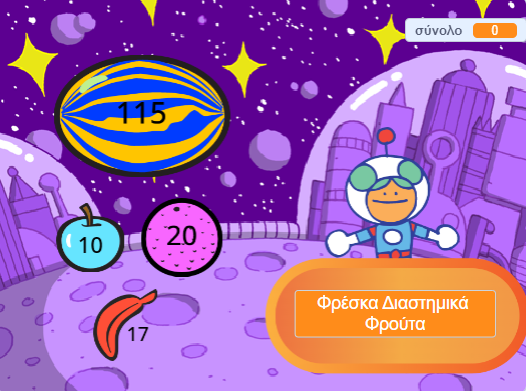

## Και τώρα;

Εάν ακολουθείς το μονοπάτι [Περισσότερη Scratch](https://projects.raspberrypi.org/el-GR/raspberrypi/more-scratch), μπορείς να προχωρήσεις στο έργο [Επόμενος πελάτης παρακαλώ!](https://projects.raspberrypi.org/el-GR/projects/next-customer-please), όπου θα φτιάξεις ένα κατάστημα όπου οι πελάτες θα μπορούν να αγοράζουν αντικείμενα και να τα πληρώνουν.

--- print-only ---

--- /print-only ---

--- no-print ---

  <iframe allowtransparency="true" width="485" height="402" src="https://scratch.mit.edu/projects/embed/528696418/?autostart=false" frameborder="0"></iframe>

--- /no-print ---

Εάν θέλεις να διασκεδάσεις περισσότερο εξερευνώντας την Scratch, τότε μπορείς να δοκιμάσεις οποιοδήποτε από [αυτά τα έργα](https://projects.raspberrypi.org/el-GR/projects?software%5B%5D=scratch&curriculum%5B%5D=%201){:target="_blank"}.

***
Το έργο αυτό μεταφράστηκε από τους εθελοντές:

Κυπραίου Μαρία
Μάνος Ζεάκης

Χάρη στους εθελοντές, μπορούμε να δώσουμε σε ανθρώπους σε όλο τον κόσμο την ευκαιρία να μάθουν στη γλώσσα τους. Μπορείτε να μας βοηθήσετε να προσεγγίσουμε περισσότερους ανθρώπους μεταφράζοντας εθελοντικά - περισσότερες πληροφορίες στο [rpf.io/translate](https://rpf.io/translate).
