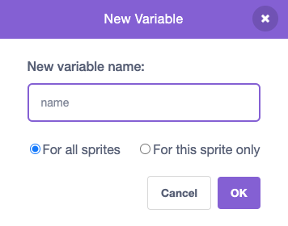

## Set the stage

In this step, you will set the stage for your first gig and choose a rock star name.

--- task ---

Open a [new Scratch project](http://rpf.io/scratch-new){:target="_blank"} and delete the cat sprite. Scratch will open in another browser tab.

[[[working-offline]]]

--- /task ---

<p style="border-left: solid; border-width:10px; border-color: #0faeb0; background-color: aliceblue; padding: 10px;">
Musicians called <span style="color: #0faeb0">**DIY artists**</span> start recording from their bedrooms. They produce their own songs cheaply then release them online for a global audience. 
</p>

Set your project so it starts in a bedroom like a DIY artist. 

--- task ---

Click **Choose a Backdrop** and search for `bedroom`. 


**Choose:** a bedroom backdrop and add it to your project. We chose `Bedroom 3`


--- /task ---

--- task ---

In Scratch, you can add code to the Stage. 

Click on your bedroom backdrop from the Stage pane and add this code:


```blocks3
when flag clicked
switch backdrop to (Bedroom 3 v) //your backdrop name
```

--- /task ---

### Every musician needs a rock star name. 

You can `ask`{:class="block3sensing"} a question in Scratch then use the `answer`{:class="block3sensing"}. 

A **variable** is a way of storing numbers and/or text. In this project the `answer`{:class="block3sensing"} will be stored in a `variable`{:class="block3variables"} so it can be used at any time.

--- task ---

From the `Variables`{:class="block3variables"} blocks menu click the **Make a Variable** button.

Name your new variable `name`:



**Notice:** The new `name` variable appears on the Stage and can now be used in the `Variable`{:class="block3variables"} blocks. 

--- /task ---

--- task ---

At the start of the project the name is unknown. Add a block to `set`{:class="block3variables"} `name to`{:class="block3variables"} `???`

```blocks3
when flag clicked
switch backdrop to (Bedroom 3 v) //your backdrop name
+ set [name v] to (???) //your variable
```

--- /task ---

--- task ---

Click on the `Sensing`{:class="block3sensing"} blocks menu and add an `ask`{:class="block3sensing"} block to your code:

```blocks3
when flag clicked
switch backdrop to (Bedroom 3 v) //your backdrop name
set [name v] to (???) //your variable
+ ask [What is your rock star name?] and wait //your question
```

--- /task ---

--- task ---

Set the `name` `variable`{:class="block3variables"} to the `answer`{:class="block3sensing"}.

```blocks3
when flag clicked
switch backdrop to (Bedroom 3 v) //your backdrop name
set [name v] to (???) //your variable
ask [What is your rock star name?] and wait //your question
+ set [name v] to (answer)
```

--- /task ---

Change the way your variable looks on the Stage.

--- task ---

Right-click on the `variable`{:class="block3variables"} on the Stage and choose `large readout`. 


--- /task ---

--- task ---

Drag your `variable`{:class="block3variables"} to position it in top-right of the Stage. 


--- /task ---

--- task ---

**Test:** Run your project to make sure the `variable`{:class="block3variables"} starts as `???` then updates to your `answer`{:class="block3sensing"}.

--- /task ---

--- task ---

Now that you know the `variable`{:class="block3variables"} changes to the `answer`{:class="block3sensing"} you can drag the last 2 blocks of code away from the rest of the script so you don't have to type an `answer`{:class="block3sensing"} every time you test your project.

```blocks3
when flag clicked
switch backdrop to (Bedroom 3 v) //your backdrop name
set [name v] to (???) //your variable
```

```blocks3
ask [What is your rock star name?] and wait //your question
set [name v] to (answer)
```
--- /task ---

--- save ---