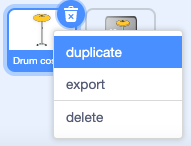
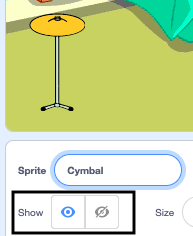

## First drum

You will add a drum sprite that you can click to earn beats and play a sound.

--- task ---

Duplicate the **Drum costumes** sprite and click on the **Costumes** tab. 



Each type of drum has two costumes, one looks like the drum has been hit.

**Choose:** a drum costume to use for your first drum. We chose the **Cymbal**.

--- /task ---

--- task ---

Name your sprite to match the drum you have chosen and change the `show` property.

Position your new drum on the Stage.



--- /task ---

--- task ---

Add the Music extension.

[[[scratch3-duplicate-sprite]]]

--- /task ---

--- task ---

Add a script to make the drum `switch costume`{:class="block3looks"} and `play a drum sound`{:class="block3extensions"} `when sprite clicked`{:class="block3events"}.

**Choose:** costumes and a drum sound that work for your drum:


```blocks3
when this sprite clicked
switch costume to [drum-cymbal-b v] //your hit costume
play drum ((5) Open High-Hat v) for [0.25] beats //your drum sound
switch costume to [drum-cymbal-a v]  //your unhit costume
```

--- /task ---

--- task ---

**Test:** Test your drum by clicking on it. Make sure you hear a sound and see the costume change.

--- /task ---

The first drum will earn you one beat each time you click it.

--- task ---
Create a variable called `beats`.


--- /task ---

--- task ---

Add a block to `change beats by 1`{:class="block3variables"} when the drum is clicked:


```blocks3
when this sprite clicked
+change [beats v] by [1]
switch costume to [drum-cymbal-b v]
play drum ((5) Open High-Hat v) for [0.25] beats
switch costume to [drum-cymbal-a v]
```

--- /task ---

--- task ---

**Test:** Test your drum by clicking on it and watch your `beats`{:class="block3variables"} increase.

--- /task ---

The `beats`{:class="block3variables"} variable needs to start at 0 beats when you start a new game.

--- task ---

Click on the **Stage** pane and then the **Code** tab to add code to the Stage.

Add a block to set `beats`{:class="block3variables"} to `0`:


```blocks3
when flag clicked
switch backdrop to (Bedroom 3 v) //your backdrop name
set [name v] to (???) //your variable
+ set [beats v] to [0]
```
--- /task ---

--- task ---

**Test:** Click the green flag and make sure your `beats`{:class="block3variables"} variable starts at `0`.

--- /task ---

--- save ---
