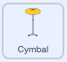

## Starter drum

<div style="display: flex; flex-wrap: wrap">
<div style="flex-basis: 200px; flex-grow: 1; margin-right: 15px;">
In this step, you will add a cymbal sprite that you can click to earn beats and play a sound.
</div>
<div>
{:width="300px"}
</div>
</div>

--- task ---

Click **Choose a Sprite** and search 'cymbal'. Add the **Drum-cymbal** sprite to your project.


--- /task ---

--- task ---

Position your cymbal on the Stage:


--- /task ---

--- task ---

Add the Music extension:

[[[generic-scratch3-add-music-extension]]]

--- /task ---

--- task ---

Add a script to make the cymbal `switch costume`{:class="block3looks"} and `play a drum sound`{:class="block3extensions"}:



```blocks3
when this sprite clicked
switch costume to [drum-cymbal-b v] // hit costume
play drum [(5) Open High-Hat v] for [0.25] beats // drum sound
switch costume to [drum-cymbal-a v]  // not hit costume
```

--- /task ---

--- task ---

**Test:** Test your cymbal by clicking on it. Make sure you hear a sound and see the costume change.

--- /task ---

The **Drum-cymbal** sprite will earn you one beat each time you click it.

--- task ---

Create a variable called `beats`:


--- /task ---

--- task ---

Add a block to `change beats by 1`{:class="block3variables"} when the **Drum-cymbal** sprite is clicked:


```blocks3
when this sprite clicked
+change [beats v] by [1]
switch costume to [drum-cymbal-b v]
play drum [(5) Open High-Hat v] for [0.25] beats 
switch costume to [drum-cymbal-a v]
```

--- /task ---

--- task ---

**Test:** Test the **Drum-cymbal** by clicking on it and watch the `beats`{:class="block3variables"} increase.

--- /task ---

The `beats`{:class="block3variables"} variable needs to start at `0` beats when you start a new game.

--- task ---

Click on the **Stage** pane and then the **Code** tab to add code to the Stage.

Add a block to `set beats to`{:class="block3variables"} `0`:


```blocks3
when flag clicked
switch backdrop to (Bedroom 3 v) //your backdrop name
set [name v] to [???] //your variable
+ set [beats v] to [0]
```
--- /task ---

--- task ---

**Test:** Click the green flag and make sure your `beats`{:class="block3variables"} variable starts at `0`.

--- /task ---

--- save ---
f