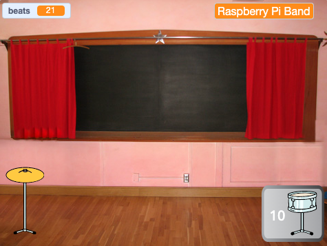
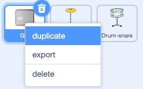
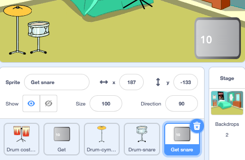
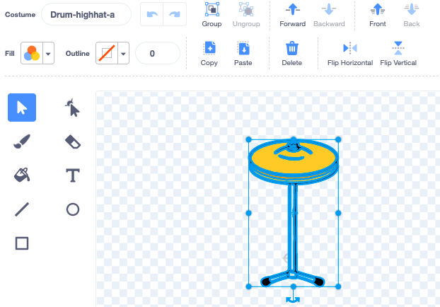
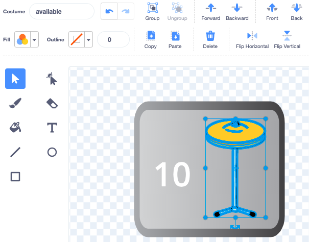

## First upgrade

<div style="display: flex; flex-wrap: wrap">
<div style="flex-basis: 200px; flex-grow: 1; margin-right: 15px;">
You will add your first upgrade. The **Get snare** button will show at the start, so the player knows which drum they are working towards.
</div>
<div>
{:width="300px"}
</div>
</div>

--- task ---

Add the **Drum-snare** sprite to your project and position it on the Stage:


--- /task ---

--- task ---

Drag the `when this sprite clicked`{:class="block3events"} script from the **Drum-cymbal** sprite to the **Drum-snare** sprite.

[[[scratch3-copy-code]]]

--- /task ---

--- task ---

Change the costumes and the drum sound.

Change the number of beats earned to `2`:


```blocks3
when this sprite clicked
+change [beats v] by [2] //2 beats per click
+switch costume to [drum-snare-b v] //hit costume
+play drum [(1) Snare Drum v] for [0.25] beats //drum sound
+switch costume to [drum-snare-a v] //not hit costume
```

--- /task ---

--- task ---

**Test:** Try out your project. Make sure that you earn 2 beats when you click on the snare drum.  

--- /task ---

Upgrades are not available when you start the project. They have to be earned with beats. 

--- task ---

Add a script to hide this **drum** sprite at the start of the project:


```blocks3
when flag clicked
hide
```

--- /task ---

A button will show which drum is the next upgrade option and how many beats it will cost. 

--- task ---

**Duplicate** the **Get** sprite:



Change the visibility to **Show** and change its name to `Get snare`. Position it in the bottom-right corner of the Stage: 



--- /task ---

--- task ---

Click on the **Drum-snare** sprite and go to the **Costumes** tab. Use the **Select** (arrow) tool to highlight the not hit costume of your drum. Click on the **Group** icon then the **Copy** icon:  




--- /task ---

--- task ---

Click on your **Get snare** sprite and **Paste** the snare costume. You might need to resize and position it to fit your button: 




--- /task ---

--- task ---

Click on the **Code** tab and add a script to show the **Get snare** sprite at the start of the project:


```blocks3
when flag clicked
show
```

--- /task ---

The upgrade can only be bought if the user has `10` or more beats. In [Grow a dragonfly](https://projects.raspberrypi.org/en/projects/grow-a-dragonfly){:target="_blank"}, you learned about making decisions with `if`{:class="block3control"} blocks. 

An `if ... else`{:class="block3control"} block is used to make a decision and will do different things if a condition is `true` or `false`. 

<p style="border-left: solid; border-width:10px; border-color: #0faeb0; background-color: aliceblue; padding: 10px;">
We use <span style="color: #0faeb0">**if ... else**</span> all the time to make decisions. When you wake up, you check `if`{:class="block3control"} it is morning. You get up, or `else`{:class="block3control"} you go back to sleep. Can you think of any `if ... else`{:class="block3control"} decisions you make? 
</p>

--- task ---

Add this code to get the upgrade `if`{:class="block3control"} the player has enough beats, or `say`{:class="block3looks"} `More beats needed!` if they are not able to upgrade:


```blocks3
when this sprite clicked
if <(beats)>  [9]> then //if 10 or more beats
hide
change [beats v] by [-10] //take away the cost of upgrade
else
say [More beats needed!] for [2] seconds 
end
```

--- /task ---

Instead of only telling the player they need **more** beats, you can tell the player exactly **how many more** beats are needed to get the upgrade.

A `join`{:class="block3operators"} block is used to concatenate, or 'link' two values together.


--- task ---

Add this code to `join`{:class="block3operators"} the number of beats needed with the text you have used to tell the player they need more beats if they are not able to upgrade:

```blocks3
when this sprite clicked
if <(beats)>  [9]> then //if 10 or more beats
hide
change [beats v] by [-10] //take away the cost of upgrade
else
+ say (join ((10) - (beats)) [beats needed!]) for [2] seconds
end
```

--- /task ---

--- task ---

Add a `broadcast`{:class="block3events"} block to send a new `snare` message:


```blocks3
when this sprite clicked
if <(beats)>  [9]> then // if 10 or more beats
hide
change [beats v] by [-10] // take away the cost of upgrade
+ broadcast [snare v] // your drum name
else
say (join ((10) - (beats)) [beats needed!]) for [2] seconds
end
```

--- /task ---

--- task ---

Click on the **Drum-snare** sprite. Add this script:


```blocks3
when I receive [snare v]
show
```

--- /task ---

When you upgrade your equipment, you will be able to play at bigger venues. 

--- task ---

Add another backdrop. We chose **Chalkboard** to play our second gig at school. 

Add code to the Stage to `switch backdrop`{:class="block3looks"} when the upgrade message is received:


```blocks3
when I receive [snare v]
switch backdrop to [Chalkboard v]
```

**Tip:** Choose a venue that's a small step up from the bedroom. You want to save bigger venues for later.

--- /task ---

--- task ---

**Test:** Run your project. Try and buy the snare upgrade before you have enough beats. 

When you buy the upgrade check: the snare appears, the button disappears, the venue changes and the `beats`{:class="block3variables"} go down by `10`. 

--- /task ---

--- save ---
