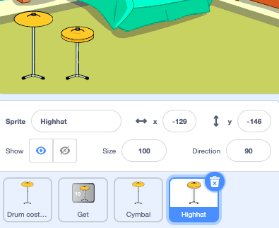
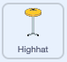
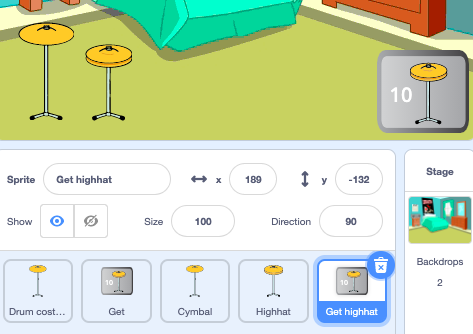
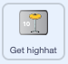

## First upgrade

Now you can add your first upgrade. 

--- task ---

Duplicate the **Drum costumes** sprite again and choose a second drum. We chose Highhat.

Name the new sprite to match and set it to `show`. 

Position the sprite on the Stage.



--- /task ---

--- task ---

Create a new `variable`{:class="block3variables"} called `next drum`.

--- /task ---

--- task ---

Drag the `when this sprite clicked`{:class="block3events"} script from your first drum to your new drum.

[[[scratch3-copy-code]]]

--- /task ---

--- task ---

Change the costumes and the drum sound.

Change the number of beats earned to `2`.



```blocks3
when this sprite clicked
+change [beats v] by [2]
+switch costume to [drum-highhat-b v] //your hit costume
+play drum ((6) Closed High-Hat v) for [0.25] beats //your drum sound
+switch costume to [drum-highhat-a v] //your unhit costume
```

--- /task ---

--- task ---

**Test:** Try out your project. Make sure to test your new drum.  

--- /task ---

Upgrades are not available when you start the project, they have to be earned with beats. 

--- task ---

Add a script to hide this drum sprite at the start of the project:


```blocks3
when flag clicked
hide
```

--- /task ---

A button will show which drum is the next upgrade option and how many beats it will cost. 

--- task ---

Duplicate the **Get** sprite and change the visibility to `show`.

Position it in the bottom-right corner of the Stage and change it's name to match your drum. Ours is `Get highhat`. 



--- /task ---

--- task ---

Click on your first upgrade sprite and go to the **Costumes** tab. Use the **Select** (arrow) tool to highlight the unhit costume of your drum then click the **Copy** icon.  


--- /task ---

--- task ---

Click on your new button sprite and **Paste** the drum costume. You might need to resize and position it to fit your button. 




--- /task ---

--- task ---

Click on the **Code** tab and add a script to show the button sprite at the start of the project:


```blocks3
when flag clicked
show
```

--- /task ---

The upgrade can only be bought when the user has collected `ten` or more beats.

An `if ... else`{:class="block3control"} block can be used to do something if a condition is `true` or another action if a condtion is `false`. 

<p style="border-left: solid; border-width:10px; border-color: #0faeb0; background-color: aliceblue; padding: 10px;">
We use <span style="color: #0faeb0">**if ... else**</span> all the time to make decisions. We could say “if it’s cold, then wear a jumper else wear a t-shirt”. Can you think of any `if ... else`{:class="block3control"} decisions you make? 
</p>

--- task ---

Add this code to get the upgrade `if`{:class="block3control"} the user has enough beats or `say`{:class="block3looks"} `Not enough beats!` if they are not able to upgrade.

```blocks3
when this sprite clicked
if <(beats)>  [9]> then //if 10 or more beats
hide
change [beats v] by [-10] //take away the cost of upgrade
else
say [Not enough beats!] for [2] seconds 
end
```

--- /task ---

Let other sprites and the Stage know that the upgrade has been bought.

--- task ---

Add a `broadcast`{:class="block3events"} block to send a new message with the name of your upgrade.

```blocks3
when this sprite clicked
if <(beats)>  [9]> then // if 10 or more beats
hide
change [beats v] by [-10] // take away the cost of upgrade
+ broadcast [highhat v] // your drum name
else
say [Not enough beats!] for [2] seconds 
end
```

--- /task ---

--- task ---

Click on the first upgrade drum sprite. Add this script:


```blocks3
when I receive [highhat v]
show
```

--- /task ---

When you upgrade your equipment you will be able to play at bigger venues. 

--- task ---

Add another backdrop. We chose **Chalkboard** to play our second gig at school. 

Add code to the Stage to `switch backdrop`{:class="block3looks"} when the upgrade message is received.

```blocks3
when I receive [highhat v]
swtch backdrop to [Chalkboard v]
```

**Tip:** Remember the venues get bigger with more upgrades so it is better to make small changes.

--- /task ---

--- task ---

**Test:** Run your project. Try and buy the upgrade before you have enough beats. Check that the upgrade appears, the button disappears, the venue changes and the `beats`{:class="block3variables"} go down by `10` when when you buy the upgrade. 

--- /task ---

--- save ---