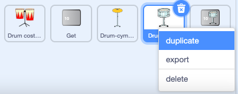
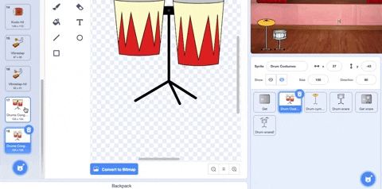

## Second upgrade

Your drum skills are improving, time for a second upgrade. This time you will choose a drum.

--- task ---

Duplicate the **Drum-snare**  sprite:



--- /task ---

The Drum costumes sprite has lots of drum costumes for you to choose from.

--- task ---

Click on the **Drum costumes** sprite and select the **Costumes** tab.

**Choose:** a drum for the next upgrade. Drag the 'hit' and 'not hit' costumes of your chosen drum to your new **Drum-snare2** sprite:




--- /task ---

--- task ---

Name your drum to match the costumes you chose.


--- /task ---

--- task ---

Click on the **Code** tab. Change the code to use the correct costumes and choose a sound for your new drum.

Change the number of beats you earn by clicking the new drum to `5`:

```blocks3
when this sprite clicked
+change [beats v] by [5] //5 beats per click
+switch costume to [ v] //your hit costume
+play drum [ v] for [0.25] beats //your drum sound
+switch costume to [ v] //your not hit costume
```

--- /task ---

Next, you need a button so that players can upgrade to this new drum.

--- task ---

Duplicate the **Get** sprite.

Position it in the bottom-right corner of the Stage and change its name to 'Get' and then the name of your new drum:


--- /task ---

--- task ---

Delete the Snare drum from the costume and copy and paste the 'unhit' costume for your new drum to the button costume. 

Change the number to `30` to show the cost of the new drum.

Your button should look like this:


--- /task ---

This button should appear when the player upgrade to the snare drum so they know which drum they are working towards.

--- task ---

Add a `when I recieve`{:class="block3events"} script that your new drum button will show as the next upgrade when the player gets the **Snare** drum.

```blocks3
when I receive [snare v]
show
```

--- /task ---

--- task ---

Change the number of beats needed to buy this drum and the number of beats that are removed when the player gets this drum. 

Also change the message that is broadcast when the player gets the new drum to match the new drum. 

```blocks3
when this sprite clicked
+if <(beats)>  [29]> then // change to 29
hide
+change [beats v] by [-30] // change to 30
+ broadcast [drum v] // your drum name
else
say [Not enough beats!] for [2] seconds 
end
```
--- /task ---

--- task ---
**Test:** Click the green flag to start the game and test that you can earn enough beats to get your new drum. 

What happens if you click the button before you have earned enough beats?

--- /task ---

