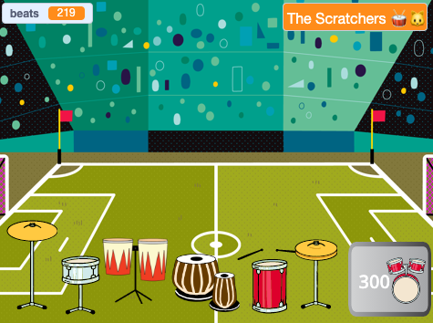

## Challenge

<div style="display: flex; flex-wrap: wrap">
<div style="flex-basis: 200px; flex-grow: 1; margin-right: 15px;">
Upgrade your project with more drums and more backdrops as you play more amazing venues. 
</div>
<div>
{:width="300px"}
</div>
</div>

### Add more drums

To add another drum to unlock, look back at the earlier steps of the project.

Here are some reminders if you need them.

--- collapse ---

---
title: For the drum
---

--- task ---

Duplicate the previous **drum** sprite and add two costumes. 

--- /task ---

--- task ---

Change the `costume`{:class="block3looks"} and `sound`{:class="block3sound"} used in the `when this sprite clicked`{:class="block3events"} script. 

--- /task ---

--- task ---

Change the number of `beats`{:class="block3variables"} earned in the `when this sprite clicked`{:class="block3events"} script. 

--- /task ---

--- task ---

Change the `message`{:class="block3events"} that makes the drum `show`{:class="block3looks"} to a message for the **new drum**. 

--- /task ---

--- /collapse ---

--- collapse ---

---
title: For the 'Get' button
---

--- task ---

Duplicate the previous **Get** sprite. 

--- /task ---

--- task ---

Change the `message`{:class="block3events"} that makes the button appear to the `message`{:class="block3events"} `broadcast`{:class="block3events"} by the **previous drum**. 

--- /task ---

--- task ---

Change the `costume`{:class="block3looks"} including the cost of the new drum. 

--- /task ---

--- task ---

Change the number of `beats`{:class="block3variables"} you must have to unlock this drum in the `if`{:class="block3events"} condition. Change the negative number of `beats`{:class="block3variables"} you `change by`{:class="block3variables"} when you unlock this drum. Change the number that `beats`{:class="block3variables"} needs to be subtracted from in the `join`{:class="block3operators"} block. 
Change the message that is `broadcast`{:class="block3events"} to the name of the **new drum**.

--- /task ---

--- /collapse ---

--- collapse ---

---
title: For the venue
---

--- task ---

Add a new backdrop. 

--- /task ---

--- task ---

Add a script to the Stage to `switch backdrop to`{:class="block3looks"} the new backdrop when the `message`{:class="block3events"} for this drum is received.

--- /task ---

You might find that your drums need to be in a new position on a different backdrop. 

--- task ---

Add a script starting with `when backdrop changes to`{:class="block3events"} to each **drum** sprite with a `go to`{:class="block3motion"} block to make them change position.

You will also need to set their starting position `when flag clicked`{:class="block3events"}.

--- /task ---

--- /collapse ---

### Improve feedback to the player

Tell the player exactly **how many more** beats are needed to unlock the next drum.

--- task ---

Add this code to `join`{:class="block3operators"} the number of beats needed with the text you have used to tell the player they need more beats if they do not have enough to unlock the next drum:

```blocks3
when this sprite clicked
if <(beats)>  [9]> then //if 10 or more beats
hide
change [beats v] by [-10] //take away the cost of upgrade
else
+ say (join ((10) - (beats)) [beats needed!]) for [2] seconds
end
```

**Note**: Update the numbers to match those needed to unlock each drum.

--- /task ---

### Tidy your code

--- task ---

**Tidy:** If you have time, then it's a good idea to make sure the sprites in the sprite list are in a sensible order, starting with the drums in their locked order and then the buttons in order.

--- /task ---

--- task ---

### Stuck?

**Debug:** First make sure you really understand when the drums and buttons should show and how the `beats`{:class="block3variables"} variable should change. It's much easier to debug a project if you are clear on what it is supposed to do.

--- collapse ---
---
title: My drum doesn't show/hide correctly
---

Unless it is the first drum, your drum should have a `when flag clicked`{:class="block3events"} script to `hide`{:class="block3looks"}. 

It should have a `when I receive`{:class="block3events"} `this drum` script to `show`{:class="block3looks"}. 

Check that the **Get** button for this drum `broadcasts`{:class="block3events"} the same message.

--- /collapse ---

--- collapse ---
---
title: My Get button doesn't show/hide correctly
---

Unless the button is for the very first drum, then it should `hide`{:class="block3looks"} `when flag clicked`{:class="block3events"}.

It should `show`{:class="block3looks"} `when I receive`{:class="block3events"} the message for the **previous drum**. 

The **Get** button should `show`{:class="block3looks"} to let the player know about the next drum they can unlock.

--- /collapse ---

--- collapse ---
---
title: I can unlock a drum when I don't have enough beats
---

Check that you have changed the number of `beats`{:class="block3variables"} needed `when this sprite clicked`{:class="block3events"} in the script for the **Get** button for the drum. 

--- /collapse ---

--- collapse ---
---
title: The number of beats doesn't change correctly when I unlock a new drum
---

Check that you have `changed beats by`{:class="block3variables"} a negative number `when this sprite clicked`{:class="block3events"} in the script for the **Get** button for the drum. 

Make sure this matches the number on the drum button costume.

--- /collapse ---

--- /task ---

**Tip:** If you get really muddled then it's fine to delete the new drum and its button, and start again. Sometimes it is hard to spot a bug.

--- save ---
