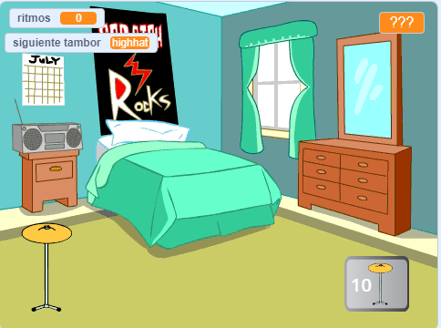

## Lo que harás

Crea un juego de clics en donde ganas ritmos para tocar nuevos tambores en lugares más grandes.

Vas a:
+ Usa `variables`{:class="block3variables"} para almacenar, y cambiar números y texto (palabras)
+ `pregunta`{:class="block3sensing"} y usa la `respuesta`{:class="block3sensing"} para personalizar el juego
+ Usa bloques `si...sino`{:class="block3control"} para tomar decisiones

Hay muchos **juegos de clics** en los que tienes que hacer clic para avanzar y comprar mejoras que te ayudan a ir más rápido. ¿Alguna vez has jugado un juego de clics? Existen también **juegos de inactividad** que avanzan incluso cuando no estás jugando. ¡Son divertidos siempre y cuando no pases demasiado tiempo jugándolos!

--- no-print --- --- task ---

### Reproducir ▶️

  
Haz clic en el tambor y observa cómo aumenta el número de `ritmos`{:class="block3variables"}. Consigue un tambor nuevo cuando obtengas suficientes ritmos. 

¿Cuántos `ritmos`{:class="block3variables"} ganas al hacer clic en el nuevo tambor?

  <iframe allowtransparency="true" width="485" height="402" src="https://scratch.mit.edu/projects/embed/522323676/?autostart=false" frameborder="0"></iframe>

--- /task --- --- /no-print ---

--- print-only ---

--- /print-only ---
