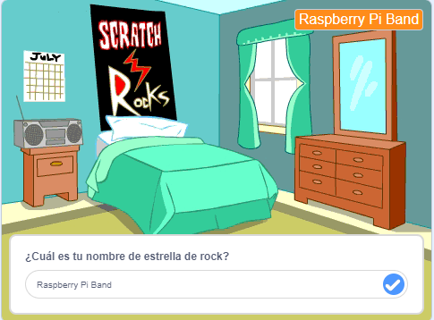
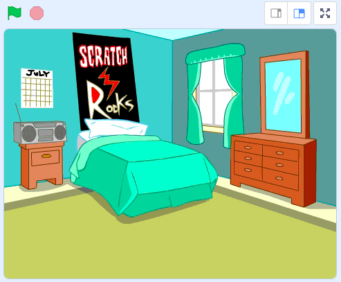
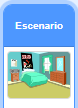
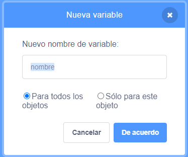
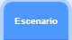
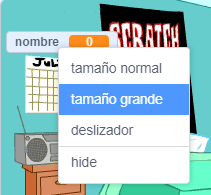

## Prepara el escenario

<div style="display: flex; flex-wrap: wrap">
<div style="flex-basis: 200px; flex-grow: 1; margin-right: 15px;">
En este paso, prepararás el escenario para tu primer concierto y elegirás tu nombre de estrella de rock.
</div>
<div>
{:width="300px"}
</div>
</div>

--- task ---

Abre el [proyecto inicial de Estrella de la batería](https://scratch.mit.edu/projects/535783147/editor){:target="_blank"}. Scratch se abrirá en otra pestaña del navegador.

[[[working-offline]]]

--- /task ---

<p style="border-left: solid; border-width:10px; border-color: #0faeb0; background-color: aliceblue; padding: 10px;">
Los músicos llamados <span style="color: #0faeb0">**artistas independientes**</span> empiezan grabando música en sus habitaciones. Ellos mismos producen sus canciones y luego las lanzan en internet para que todos las escuchen. 
</p>

El juego comienza en un dormitorio como el de un artista independiente.

--- task ---

Haz clic en **Elegir un Fondo** y busca `Bedroom`.

**Elegir:** Selecciona un dormitorio y agrégalo a tu proyecto. Elegimos `Bedroom 3`.



--- /task ---

--- task ---

En Scratch, puede agregar código a Stage (el escenario).

Haz clic en el fondo de tu dormitorio desde el panel Stage (Escenario) y agrega este código:



```blocks3
when flag clicked
switch backdrop to (Bedroom 3 v) //your backdrop name
```

--- /task ---

Todo músico necesita elegir su nombre de estrella de rock.

Una **variable ** es una forma de almacenar números y/o texto. Tu nombre de estrella de rock se almacenará en una `variable `{:class="block3variables"} para ser utilizado en cualquier momento.

--- task ---

Haz clic en el menú de bloques `Variables`{:class="block3variables"} y selecciona el botón **Crear una Variable**.

Asígnale un `nombre`:



**Aviso:** La nueva variable `nombre` aparece en el escenario y se puede usar ahora en los bloques `Variable`{:class="block3variables"}.

--- /task ---

--- task ---

Al comienzo del proyecto, tu nombre de estrella de rock es desconocido.

Agrega un bloque para `establecer nombre a`{:class="block3variables"} `???`:



```blocks3
when flag clicked
switch backdrop to (Bedroom 3 v) //your backdrop name
+ set [name v] to [???] //your variable
```

--- /task ---

Puedes `preguntar`{:class="block3sensing"} en Scratch, luego usar una `variable`{:class="block3variables"} para almacenar la `respuesta`{:class="block3sensing"}.

--- task ---

Haz clic en el menú de bloques `Sensores`{:class="block3sensing"} y agrega un bloque `preguntar`{:class="block3sensing"} a tu código:


```blocks3
when flag clicked
switch backdrop to (Bedroom 3 v) //your backdrop name
set [name v] to [???] //your variable
+ ask [What's your rock star name?] and wait //your question
```

--- /task ---

--- task ---

Establece la `variable`{:class="block3variables"} `nombre`{:class="block3variables"} para la `respuesta`{:class="block3sensing"}:


```blocks3
when flag clicked
switch backdrop to (Bedroom 3 v) //your backdrop name
set [name v] to [???] //your variable
ask [What's your rock star name?] and wait //your question
+ set [name v] to (answer)
```

--- /task ---

Cambia el estilo de tu `variable`{:class="block3variables"} en el Escenario.

--- task ---

Haz clic con el botón derecho en la `variable `{:class="block3variables"} en el Escenario y elige **tamaño grande**:



--- /task ---

--- task ---

Arrastra tu `variable`{:class="block3variables"} para colocarla en la parte superior derecha:


--- /task ---

--- task ---

**Prueba:** Ejecuta tu proyecto para asegurarte de que la `variable`{:class="block3variables"} comience como `???`, luego se actualiza en tu`respuesta`{:class="block3sensing"}.

--- /task ---

--- task ---

Ahora que has probado que la `variable `{:class="block3variables"} cambia según la `respuesta`{:class="block3sensing"}, puedes arrastrar los últimos 2 bloques de código fuera del resto del script. Esto quiere decir que no tienes que escribir una `respuesta`{:class="block3sensing"} cada vez que pruebas tu proyecto:


```blocks3
when flag clicked
switch backdrop to (Bedroom 3 v) //your backdrop name
set [name v] to [???] //your variable
```

```blocks3
ask [What's your rock star name?] and wait //your question
set [name v] to (answer)
```

--- /task ---

--- save ---
