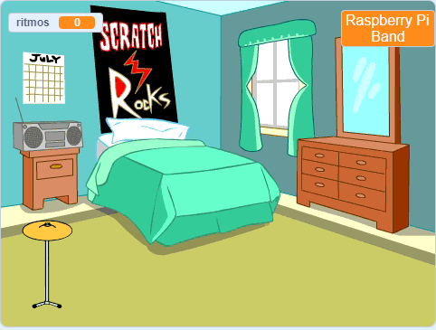
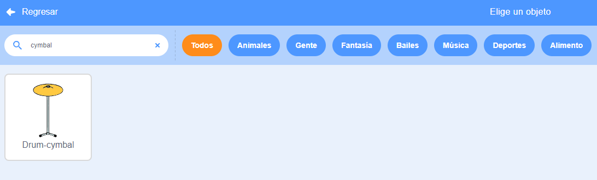
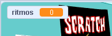

## Tambor de principiante

<div style="display: flex; flex-wrap: wrap">
<div style="flex-basis: 200px; flex-grow: 1; margin-right: 15px;">
Agregarás una imagen de un **platillo** en el que puedes hacer clics para ganar ritmos y reproducir un sonido.
</div>
<div>
{:width="300px"}
</div>
</div>

--- task ---

Click **Choose a Sprite** and search `cymbal`.



--- /task ---

--- task ---

Add the **Drum-cymbal** sprite and position it on the Stage:


--- /task ---

--- task ---

Agrega la **Extensión musical**:

[[[generic-scratch3-add-music-extension]]]

--- /task ---

--- task ---

Agrega una secuencia de comandos para hacer `cambiar disfraz a`{:class="block3looks"} y `reproducir un sonido de tambor`{:class="block3extensions"} al platillo:


```blocks3
when this sprite clicked
switch costume to [drum-cymbal-b v] // hit costume
play drum [(5) Open High-Hat v] for [0.25] beats // drum sound
switch costume to [drum-cymbal-a v]  // not hit costume
```

--- /task ---

--- task ---

**Prueba:** Prueba tu platillo haciendo clic en él.

You should hear a sound and see the costume change.

--- /task ---

La imágen del **Platillo** te otorgará un ritmo cada vez que hagas clic en él.

--- task ---

Create a `variable`{:class="block3variables"} (for all sprites) called `beats`:



--- /task ---

--- task ---

Agrega un bloque para `cambiar ritmos en 1`{:class="block3variables"} cuando hagas clic en la imagen del **Platillo**:

```blocks3
when this sprite clicked
+change [beats v] by [1]
switch costume to [drum-cymbal-b v]
play drum [(5) Open High-Hat v] for [0.25] beats 
switch costume to [drum-cymbal-a v]
```

--- /task ---

--- task ---

**Test:** Test the **Drum-cymbal** by clicking on it.

You should see the `beats`{:class="block3variables"} increase.

--- /task ---

La variable `ritmos`{:class="block3variables"} debe comenzar en `0`cuando comienzas un nuevo juego.

--- task ---

Click on the Stage pane and then the **Code** tab.

Agrega un bloque `fijar ritmos a`{:class="block3variables"} `0`:


```blocks3
when flag clicked
switch backdrop to (Bedroom 3 v) 
set [name v] to [???] 
+ set [beats v] to [0]
```
--- /task ---

--- task ---

**Prueba:** Haz clic en la bandera verde y asegúrate de que tu variable `ritmos`{:class="block3variables"} comienza en `0`.

--- /task ---

--- save ---
