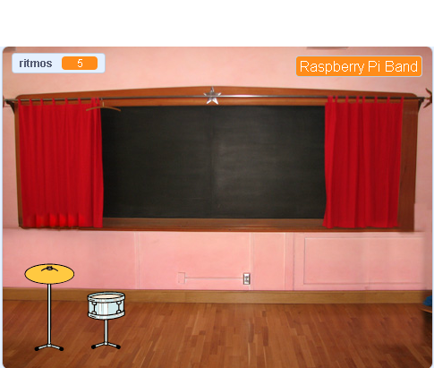
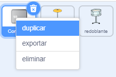
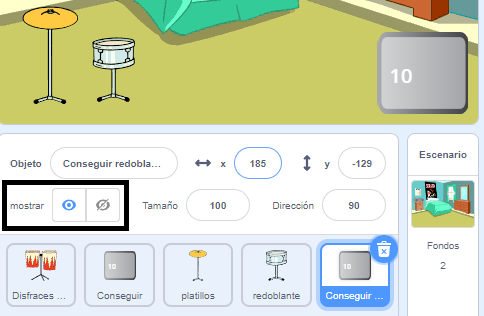
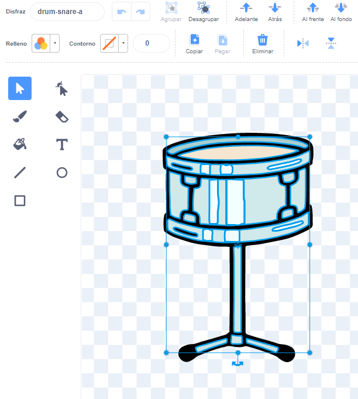
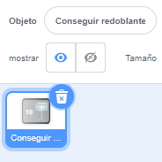
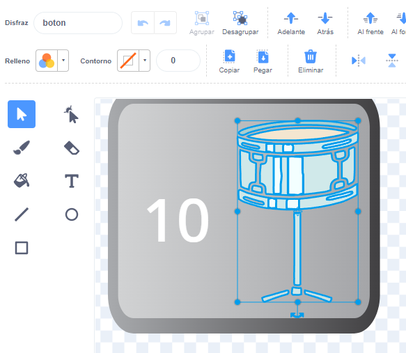

## Primera actualización

<div style="display: flex; flex-wrap: wrap">
<div style="flex-basis: 200px; flex-grow: 1; margin-right: 15px;">
Agregarás tu primera actualización. El botón **Conseguir redoblante** aparecerá al principio, para que el jugador o la jugadora sepa qué tambor tiene en mira.
</div>
<div>
{:width="300px"}
</div>
</div>

--- task ---

Agrega la imagen del **Drum-snare** a tu proyecto, cámbiale el nombre a "redoblante" y colócalo en el Escenario:


--- /task ---

--- task ---

Arrastra el comando `al hacer clic en este objeto`{:class="block3events"} de la imagen del **Platillo** a la imagen **Redoblante**.

[[[scratch3-copy-code]]]

--- /task ---

--- task ---

Cambia los disfraces y el sonido del tambor.

Cambia el número de ritmos ganados a `2`:


```blocks3
when this sprite clicked
+change [ritmos v] by [2] //2 ritmos por clic
+switch costume to [drum-snare-b v] //estilo tocado
+play drum [(1) Snare Drum v] for [0.25] beats //sonido de tambor
+switch costume to [drum-snare-a v] //estilo sin tocar
```

--- /task ---

--- task ---

**Prueba:** Pon tu proyecto a prueba. Asegúrate de ganar 2 ritmos cuando hagas clic en el redoblante.

--- /task ---

Las actualizaciones no están disponibles cuando se inicia el proyecto. Hay que ganárselas con los ritmos.

--- task ---

Agrega una secuencia de comandos para ocultar la imagen del **tambor** al inicio del proyecto:


```blocks3
when flag clicked
hide
```

--- /task ---

Un botón mostrará qué tambor es la próxima opción para aztualizar y cuántos ritmos costará.

--- task ---

**Duplicar** la imagen de **Conseguir**:



Cambia la visibilidad a **Mostrar** y cambiale el nombre a `Conseguir redoblante`. Colócalo en la esquina inferior derecha del Escenario:



--- /task ---

--- task ---

Haz clic en la imagen **Redoblante** y ve a la pestaña **Estilos**. Usa la herramienta (flecha) **Seleccionar** para resaltar el disfrad de tu tambor que no fue tocado. Haz clic en el icono **Grupo** y luego en el icono **Copiar**:




--- /task ---

--- task ---

Haz clic en tu objeto **Conseguir redoblante** y **Pega** el disfraz del redoblante. Es posible que debas ajustar el tamaño y reubicarlo para que quepa en tu botón:





--- /task ---

--- task ---

Haz clic en la pestaña **Código** y agrega una secuencia de comandos para mostrar la imagen **Conseguir redoblante** al inicio del proyecto:


```blocks3
when flag clicked
show
```

--- /task ---

Solo se puede comprar la actualización si se tienen `10` o más ritmos. En [Haz crecer una libélula](https://projects.raspberrypi.org/es-LA/projects/grow-a-dragonfly){:target="_blank"}, aprendiste a tomar decisiones con bloques `si`{:class="block3control"}.

Un bloque `si … sino`{:class="block3control"} se usa para tomar una decisión y realizará diferentes acciones si una condición es `verdadera` o `falsa`.

<p style="border-left: solid; border-width:10px; border-color: #0faeb0; background-color: aliceblue; padding: 10px;">
Usamos <span style="color: #0faeb0">**si … sino**</span> todo el tiempo para tomar decisiones. Cuando te despiertas, compruebas `si`{:class="block3control"} es de mañana. Te levantas, o `sino`{:class="block3control"} te vuelves a dormir. ¿Puedes pensar en alguna decisión `si ... sino`{:class="block3control"} que hayas tomado? 
</p>

--- task ---

Agrega este código para obtener la actualización `si`{:class="block3control"} hay suficientes ritmos, o para `informar`{:class="block3looks"} `¡No hay suficientes ritmos!` si no se pueden actualizar:


```blocks3
when this sprite clicked
if <(ritmos)>  [9]> then //si 10 o más ritmos
hide
change [ritmos v] by [-10] //eliminar el costo de la actualización
else
say [¡No hay suficientes ritmos!] for [2] seconds 
end
```

--- /task ---

Hazle saber a los otrss objetos y al Escenario que se compró la actualización para el redoblante.

--- task ---

Agrega un bloque `transmitir`{:class="block3events"} para enviar un nuevo mensaje `redoblante`:


```blocks3
when this sprite clicked
if <(ritmos)>  [9]> then // si 10 o más ritmos
hide
change [ritmos v] by [-10] // eliminar el costo de la actualización
+ broadcast (redoblante v) // tu nombre de tambor
else
say [¡No hay suficientes ritmos!] for [2] seconds 
end
```

--- /task ---

--- task ---

Haz clic en el objeto **Redoblante**. Agrega esta secuencia de comandos:


```blocks3
when I receive [redoblante v]
show
```

--- /task ---

Cuando actualices tu equipo, podrás tocar en lugares más grandes.

--- task ---

Agrega otro fondo. Elegimos **Chalkboard** para tocar en nuestro segundo concierto en la escuela.

Agrega el código al Escenario para `cambiar fondo`{:class="block3looks"} cuando se reciba el mensaje de actualización:


```blocks3
when I receive [redoblante v]
switch backdrop to [Chalkboard v]
```

**Sugerencia:** Elige un lugar que sea una pequeña mejora en relación con el dormitorio. Desearás guardar los lugares más grandes para más adelante.

--- /task ---

--- task ---

**Prueba:** Ejecuta tu proyecto. Prueba y compra la actualización del redoblante antes de que tengas suficientes ritmos.

Cuando compras la verificación de actualización: el redoblante aparece, el botón desaparece, el lugar cambia y los `ritmos`{:class="block3variables"} descienden a `10`.

--- /task ---

--- save ---
