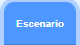

## Primera actualización

<div style="display: flex; flex-wrap: wrap">
<div style="flex-basis: 200px; flex-grow: 1; margin-right: 15px;">
Agregarás tu primera actualización. El botón **Conseguir redoblante** aparecerá al principio, para que el jugador o la jugadora sepa qué tambor tiene en mira.
</div>
<div>
{:width="300px"}
</div>
</div>

--- task ---

Agrega la imagen del **Drum-snare** a tu proyecto, cámbiale el nombre a "redoblante" y colócalo en el Escenario:


--- /task ---

--- task ---

Arrastra el script `al hacer clic en este objeto`{:class="block3events"} de la imagen del **Platillo** al del **Redoblante**.

[[[scratch3-copy-code]]]

--- /task ---

--- task ---

Cambia los disfraces y el sonido del tambor.

Cambia el número de ritmos ganados a `2`:


```blocks3
when this sprite clicked
+change [beats v] by [2] //2 beats per click
+switch costume to [drum-snare-b v] //hit costume
+play drum [(1) Snare Drum v] for [0.25] beats //drum sound
+switch costume to [drum-snare-a v] //not hit costume
```

--- /task ---

--- task ---

**Prueba:** Pon tu proyecto a prueba. Asegúrate de ganar 2 ritmos cuando hagas clic en el redoblante.

--- /task ---

Las actualizaciones no están disponibles cuando inicias el proyecto. Hay que ganárselas con los ritmos.

--- task ---

Agrega un script para ocultar el objeto del **tambor** al inicio del proyecto:


```blocks3
when flag clicked
hide
```

--- /task ---

Un botón mostrará qué tambor es el próximo para actualizar y cuántos ritmos costará.

--- task ---

**Duplicar** el objeto de **Conseguir**:


Cambia la visibilidad a **Mostrar** y cámbiale el nombre a `Conseguir redoblante`. Colócalo en la esquina inferior derecha del Escenario:


--- /task ---

--- task ---

Haz clic en la imagen **Redoblante** y ve a la pestaña **Estilos**. Usa la herramienta (flecha) **Seleccionar** para resaltar el disfraz de tu tambor que no fue tocado. Haz clic en el icono **Grupo** y luego en **Copiar**:


--- /task ---

--- task ---

Haz clic en tu objeto **Conseguir redoblante** y **Pega** el disfraz del redoblante. Es posible que debas ajustar el tamaño y reubicarlo para que quepa en tu botón:


--- /task ---

--- task ---

Haz clic en la pestaña **Código** y agrega un script para mostrar el objeto **Conseguir redoblante** al inicio del proyecto:


```blocks3
when flag clicked
show
```

--- /task ---

Solo se puede comprar la actualización si se tienen `10` o más ritmos. En [Haz crecer una libélula](https://projects.raspberrypi.org/en/projects/grow-a-dragonfly){:target="_blank"}, aprendiste a tomar decisiones con bloques `si`{:class="block3control"}.

Un bloque `si … sino`{:class="block3control"} se usa para tomar una decisión y realizará diferentes acciones si una condición es `cierta` o `falsa`.

<p style="border-left: solid; border-width:10px; border-color: #0faeb0; background-color: aliceblue; padding: 10px;">
Usamos <span style="color: #0faeb0">**si … sino**</span> todo el tiempo para tomar decisiones. Cuando te despiertas, compruebas `si`{:class="block3control"} es de mañana. Te levantas, o `sino`{:class="block3control"} te vuelves a dormir. ¿Puedes pensar en alguna decisión `si ... sino`{:class="block3control"} que hayas tomado? 
</p>

--- task ---

Add this code to get the upgrade `if`{:class="block3control"} the player has enough beats, or `say`{:class="block3looks"} `More beats needed!` if they are not able to upgrade:


```blocks3
when this sprite clicked
if <(beats)>  [9]> then //if 10 or more beats
hide
change [beats v] by [-10] //take away the cost of upgrade
else
say [More beats needed!] for [2] seconds 
end
```

--- /task ---

Instead of only telling the player they need **more** beats, you can tell the player exactly **how many more** beats are needed to get the upgrade.

A `join`{:class="block3operators"} block is used to concatenate, or 'link' two values together.


--- task ---

Add this code to `join`{:class="block3operators"} the number of beats needed with the text you have used to tell the player they need more beats if they are not able to upgrade:

```blocks3
when this sprite clicked
if <(beats)>  [9]> then //if 10 or more beats
hide
change [beats v] by [-10] //take away the cost of upgrade
else
+ say (join ((10) - (beats)) [beats needed!]) for [2] seconds
end
```

--- /task ---

--- task ---

Add a `broadcast`{:class="block3events"} block to send a new `snare` message:


```blocks3
when this sprite clicked
if <(beats)>  [9]> then // if 10 or more beats
hide
change [beats v] by [-10] // take away the cost of upgrade
+ broadcast [snare v] // your drum name
else
say (join ((10) - (beats)) [beats needed!]) for [2] seconds
end
```

--- /task ---

--- task ---

Click on the **Drum-snare** sprite. Add this script:


```blocks3
when I receive [snare v]
show
```

--- /task ---

When you upgrade your equipment, you will be able to play at bigger venues.

--- task ---

Add another backdrop. We chose **Chalkboard** to play our second gig at school.

Add code to the Stage to `switch backdrop`{:class="block3looks"} when the upgrade message is received:



```blocks3
when I receive [snare v]
switch backdrop to [Chalkboard v]
```

**Tip:** Choose a venue that's a small step up from the bedroom. You want to save bigger venues for later.

--- /task ---

--- task ---

**Test:** Run your project. Try and buy the snare upgrade before you have enough beats.

When you buy the upgrade check: the snare appears, the button disappears, the venue changes and the `beats`{:class="block3variables"} go down by `10`.

--- /task ---

--- save ---
