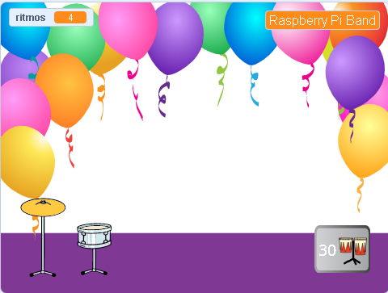
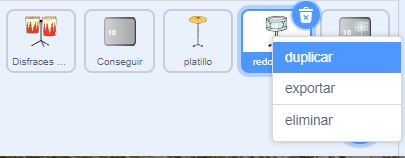
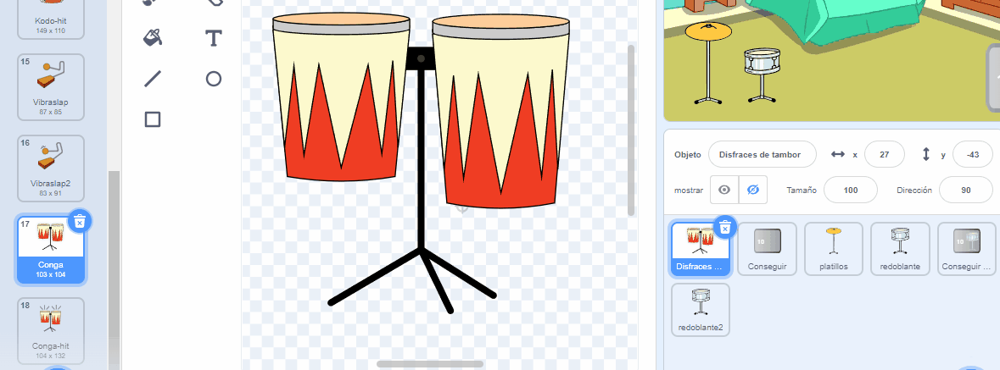
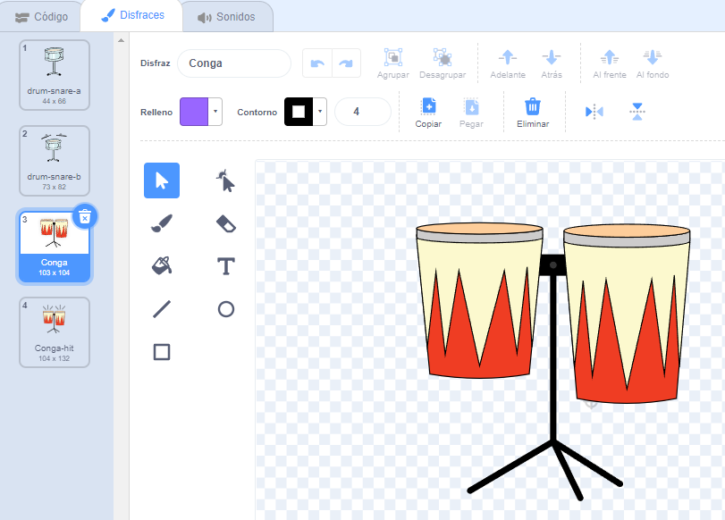
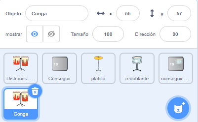
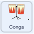
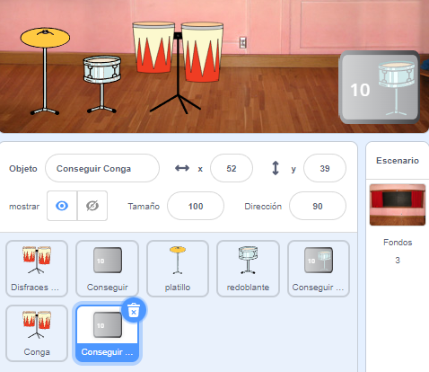
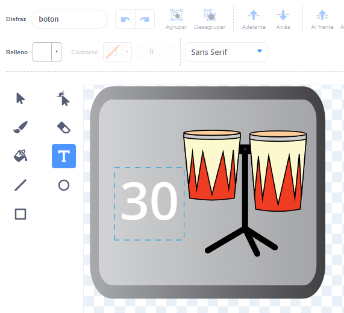
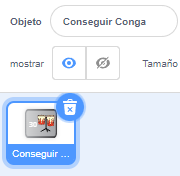

## More drums!

<div style="display: flex; flex-wrap: wrap">
<div style="flex-basis: 200px; flex-grow: 1; margin-right: 15px;">
En este paso, elegirás qué tambor agregar.
</div>
<div>
{:width="300px"}
</div>
</div>

--- task ---

Duplica la imagen del **Redoblante**:



--- /task ---

--- task ---

Haz clic en el objeto **Drum Costumes** y selecciona la pestaña **Disfraces**.

**Choose:** which drum to unlock next. Elegimos **Conga**.


--- /task ---

--- task ---

Arrastra los disfraces 'hit' y 'not hit' del tambor elegido a tu nuevo objeto **Redoblante2**:





--- /task ---

--- task ---

Name the new drum to match the costumes you chose.



--- /task ---

--- task ---

Haz clic en la pestaña **Código**. Cambia el código para usar los disfraces correctos y elige un sonido para tu nuevo tambor.

Cambia el número de ritmos que ganas haciendo clic en el nuevo tambor a `5`:



```blocks3
when this sprite clicked
+change [beats v] by [5] //5 beats per click
+switch costume to [ v] //your hit costume
+play drum [ v] for [0.25] beats //your drum sound
+switch costume to [ v] //your not hit costume
```

--- /task ---

--- task ---

Arrastra tu nuevo tambor a su posición en el Escenario:


--- /task ---

Add a button so that players can unlock the new drum.

--- task ---

Duplicate the **Get snare** sprite and position it in the bottom-right corner of the Stage.

--- /task ---

--- task ---

Change its name (for example `Get conga`):



--- /task ---

--- task ---

Delete the **snare drum** from the new 'Get' button costume.

--- /task ---

--- task ---

Copy the 'not hit' costume for your new drum and paste it to the new 'Get' button costume.

--- /task ---

--- task ---

Haz clic en la herramienta **Texto** y cambia el número a `30` para mostrar el precio del nuevo tambor.



--- /task ---

Your new 'Get' button should `hide`{:class="block3looks"} at the start.

--- task ---



```blocks3
when flag clicked
+ hide
```

--- /task ---

--- task ---

Add a `when I receive`{:class="block3events"} script that your new 'Get' button will `show`{:class="block3looks"} when the player unlocks the snare drum.

```blocks3
when I receive [snare v] // appear when previous drum is unlocked
show // show button to get the new drum
```

--- /task ---

--- task ---

Change:
- The number of beats needed to unlock this drum
- The number of beats that are removed when the player unlocks this drum.
- The message that is `broadcast`{:class="block3events"} when the player gets the new drum.

```blocks3
when this sprite clicked
if <(beats)>  [29]> then // change to 29
hide
change [beats v] by [-30] // change to -30
broadcast (conga v) // change to your drum name
else
say [More beats needed!] for [2] seconds 
end
```

--- /task ---

--- task ---

Click your new drum sprite and change the `when I receive snare`{:class="block3events"} script to show it when your new drum is unlocked:

```blocks3
when I receive [conga v] // change to your drum name
show
```

--- /task ---

--- task ---

Agrega el fondo **Party**.

--- /task ---

--- task ---

Agrega un script al Escenario para cambiar el fondo cuando se actualice al nuevo tambor:


```blocks3
when I receive [conga v] // change to your drum name
switch backdrop to (Party v)
```

--- /task ---

--- task ---

**Test:** Click the green flag to start the game.

You should unlock your new drum if you earn enough beats.

What happens if you click the button before you have earned enough beats?

--- /task ---

--- save ---
