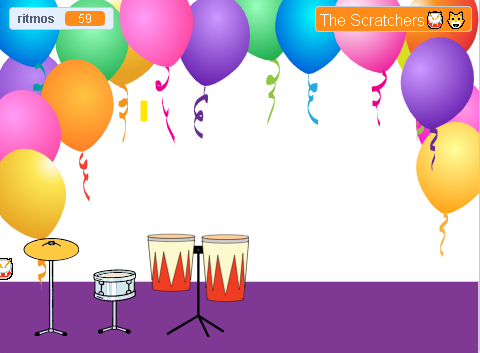

## Juega y personaliza

Es hora de hacer que tu juego funcione como tú quieres.

{:width="300px"}

--- task ---

Juega tu juego y gana ritmos.

Mira cómo cambia la variable `ritmos`{:class="block3variables"} y asegúrate de comprender cómo aumentan los ritmos cuando haces clic en los tambores y cómo disminuyen cuando obtienes un tambor nuevo.

¿Estás feliz con la cantidad de ritmos que ganas por cada tambor? Puedes cambiar esto si quieres.

¿Estás feliz con la cantidad de ritmos que te costó conseguir un nuevo tambor?

**Sugerencia:** Prueba tu proyecto con frecuencia para que puedas encontrar y corregir cualquier error.

--- /task ---

--- task ---

Si separaste el bloque para `preguntar`{:class="block3sensing"} en el escenario, vuelve a colocarlo y configura tu nombre de estrella de rock.

Observa cómo cambia el nombre que se muestra en el Escenario.

--- /task ---

--- save ---
