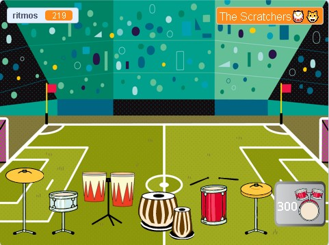

## Mejora tu proyecto

Mejora tu proyecto con más tambores y más fondos mientras tocas en lugares más increíbles. 

{:width="300px"}

Hay muchos más estilos de tambores por elegir para agregar más actualizaciones a tu proyecto.

Para agregar otra mejora de tambor, revisa los pasos anteriores del proyecto.

Para el **tambor**, deberás:

--- task ---

Duplicar la imagen del **tambor** anterior y agregar dos disfraces.

--- /task ---

--- task ---

Cambiar el `disfraz`{:class="block3looks"} y el `sonido`{:class="block3sound"} que se usan en la secuencia de comandos `al hacer clic en este objeto`{:class="block3events"}.

--- /task ---

--- task ---

Cambia el número de `ritmos`{:class="block3variables"} que se ganan en la secuencia de comandos `al hacer clic en este objeto`{:class="block3events"}.

--- /task ---

--- task ---

Cambia el `mensaje`{:class="block3events"} `mostrar`{:class="block3looks"} del tambor a un mensaje para el **nuevo tambor**.

--- /task ---

Para el **botón**, deberás:

--- task ---

Duplicar la imagen anterior **Conseguir**.

--- /task ---

--- task ---

Cambiar el `mensaje`{:class="block3events"} que hace aparecer al botón en el `mensaje`{:class="block3events"} `transmitir`{:class="block3events"} por el **tambor anterior**.

--- /task ---

--- task ---

Cambiar el `disfraz`{:class="block3looks"} incluyendo al precio del nuevo tambor.

--- /task ---

--- task ---

Cambiar el número de `ritmos`{:class="block3variables"} que debes poseer para conseguir este tambor en la condición `si`{:class="block3events"}. Cambiar el número negativo de `ritmos`{:class="block3variables"} al `cambiar por`{:class="block3variables"} cuando consigas este tambor. Cambiar el mensaje que conecta `enviar`{:class="block3events"} con el nombre de los **nuevos tambores**.

--- /task ---

Para el **lugar**, deberás:

--- task ---

Agregar un nuevo fondo.

--- /task ---

--- task ---

Agregar una secuencia de comandos al Escenario para `cambiar fondo a`{:class="block3looks"} el nuevo fondo cuando se reciba el `mensaje`{:class="block3events"} para este tambor.

--- /task ---

Es posible que descubras que tus tambores deben estar en una nueva posición sobre un fondo diferente.

--- task ---

Agregar una secuenca de comandos que comience con `cuando el fondo cambia a`{:class="block3events"} para cada imagen de **tambor** con un bloque `ir a`{:class="block3motion"} para que cambie de posición.

También deberás fijar tu posición inicial en `cuando se hace clic en la bandera`{:class="block3events"}.

--- /task ---

--- task ---

**Ordernar:** Si tienes tiempo, es una buena idea asegurarte de que las imágenes en la lista sigan un orden sensato, comenzando por los tambores con su orden de actualización y siguiendo luego con los botones en orden.

--- /task ---

--- task ---

**Depurar:** Primero, asegúrate de comprender realmente cuándo deberían los tambores y los botones aparecer y cómo debe cambiar la variable `ritmos`{:class="block3variables"}. Es mucho más fácil depurar un proyecto si tienes claro lo que se supone que debes hacer.

--- collapse ---
---
title: Mi tambor no aparece/no se oculta correctamente
---

A menos que sea el primer tambor, tu tambor debería tener una secuencia de comandos `cuando se hace clic en la bandera`{:class="block3events"} para poderse `ocultar`{:class="block3looks"}. Y debería tener una secuencia de comandos `al recibir`{:class="block3events"} `este tambor` para `mostrar`{:class="block3looks"}.

Comprueba que el botón **Conseguir** para este tambor `envía`{:class="block3events"} el mismo mensaje.

--- /collapse ---

--- collapse ---
---
title: Mi botón Conseguir no aparece/no se oculta correctamente
---

A menos que el botón sea para el primer tambor, se debería `ocultar`{:class="block3looks"} `cuando se hace clic en la bandera`{:class="block3events"}. Y debería `aparecer`{:class="block3looks"} el mensaje `cuando recibo`{:class="block3events"} para el **tambor anterior**. El botón **Conseguir** debería `aparecer`{:class="block3looks"} para informar acerca de la próxima actualización que se tiene en la mira.

--- /collapse ---

--- collapse ---
---
title: Puedo comprar un tambor cuando no tengo suficientes ritmos
---

Comprueba que hayas cambiado el número de `ritmos`{:class="block3variables"} necesarios `al hacer clic en este objeto`{:class="block3events"} en la secuencia de comandos del botón **Conseguir** para el tambor.

--- /collapse ---

--- collapse ---
---
title: El número de ritmos no cambia correctamente cuando consigo un tambor nuevo
---

Comprueba que hayas `cambiado ritmos en`{:class="block3variables"} un número negativo `al hacer clic en este objeto`{:class="block3events"} en la secuencia de comandos del botón **Conseguir** para el tambor.

Asegúrate de que coincida con el número del disfraz del botón del tambor.

--- /collapse ---

--- /task ---

--- collapse ---
---
title: Proyecto terminado
---

Puedes ver el [proyecto completo aquí](https://scratch.mit.edu/projects/767331840/){:target="_blank"}.

--- /collapse ---

**Sugerencia:** Si te confundes mucho, no hay problemas si eliminas el nuevo tambor y su botón y comienzas de nuevo. A veces es difícil detectar un error.

--- save ---
