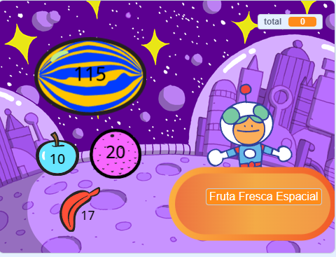

## ¿Qué sigue?

Si está siguiendo la ruta [Más Scratch](https://projects.raspberrypi.org/es-LA/raspberrypi/more-scratch), puedes pasar al proyecto [¡Próximo cliente por favor!](https://projects.raspberrypi.org/es-LA/projects/next-customer-please), donde crearás una tienda en donde los clientes pueden comprar artículos y pagar.

--- print-only ---

--- /print-only ---

--- no-print ---

  <iframe allowtransparency="true" width="485" height="402" src="https://scratch.mit.edu/projects/embed/528696418/?autostart=false" frameborder="0"></iframe>

--- /no-print ---

Si quieres seguir dirvitiéndote explorando Scratch, puedes probar cualquiera de [estos proyectos](https://projects.raspberrypi.org/es-LA/projects?software%5B%5D=scratch&curriculum%5B%5D=%201){:target="_blank"}.

***
Este proyecto fue traducido por voluntarios:

Laura Lurati

Gracias a los voluntarios, podemos dar a las personas de todo el mundo la oportunidad de aprender en su propio idioma. Puedes ayudarnos a llegar a más personas ofreciéndote como voluntario para traducir. Más información en [rpf.io/translate](https://rpf.io/translate).
