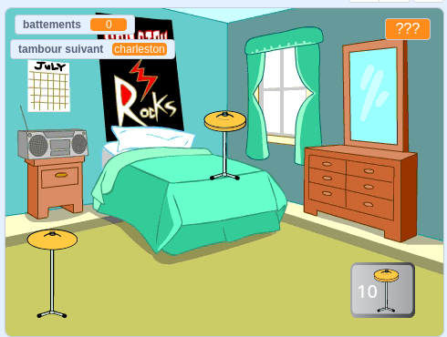

## Ce que tu vas faire

Crée un jeu de clics où tu gagnes des battements pour jouer de nouveaux tambours et dans de plus grandes salles.

Tu vas :
+ Utiliser des `variables`{:class="block3variables"} pour stocker et modifier des nombres et du texte (mots)
+ `demander`{:class="block3sensing"} une question et utiliser la `réponse`{:class="block3sensing"} pour personnaliser le jeu
+ Utiliser des blocs `si...sinon` {:class="block3control"} pour prendre des décisions

Il existe de nombreux **jeux de clic** où tu dois cliquer pour progresser et acheter des améliorations qui t'aideront à aller plus vite. As-tu déjà joué à un jeu de clics ? Il existe également des **jeux inactifs** qui continuent même lorsque tu n'y joues pas. Ces jeux sont amusants tant que tu ne passes pas trop de temps à y jouer !

--- no-print --- --- task ---

### Joue ▶️

  
Clique sur le tambour et regarde le nombre de « battements »{:class="block3variables"} augmenter. Obtiens un nouveau tambour lorsque tu as assez de battements. 

Combien de « battements »{:class="block3variables"} gagnes-tu en cliquant sur le nouveau tambour ?

  <iframe allowtransparency="true" width="485" height="402" src="https://scratch.mit.edu/projects/embed/522323676/?autostart=false" frameborder="0"></iframe>

--- /task --- --- /no-print ---

--- print-only ---

--- /print-only ---
