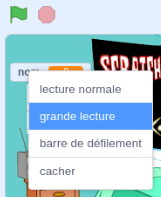

## Mise en place de la scène

<div style="display: flex; flex-wrap: wrap">
<div style="flex-basis: 200px; flex-grow: 1; margin-right: 15px;">
Dans cette étape, tu prépareras la scène pour ton premier concert et choisiras un nom de rockstar.
</div>
<div>
{:width="300px"}
</div>
</div>

--- task ---

Ouvre le [projet de démarrage Star du tambour](https://scratch.mit.edu/projects/535783147/editor){:target="_blank"}. Scratch s'ouvrira dans un autre onglet du navigateur.

--- /task ---

The drummer starts in a bedroom like a beginner!

--- task ---

Clique sur **Choisir un arrière-plan** et recherche `bedroom`.

Select a bedroom and add it to your project. Nous avons choisi `Bedroom 3`.


--- /task ---

Dans Scratch, tu peux ajouter du code à la scène.

--- task ---

Clique sur l'arrière-plan de ta chambre dans le volet Scène et ajoute ce code :


```blocks3
when flag clicked
switch backdrop to (Bedroom 3 v) //your backdrop name
```

--- /task ---

Chaque musicien doit choisir un nom de rockstar.

Une **variable** est un moyen de stocker des nombres et/ou du texte. Ton nom de rockstar sera stocké dans une `variable`{:class="block3variables"} afin qu'il puisse être utilisé à tout moment.

--- task ---

Dans le menu des blocs `Variables`{:class="block3variables"}, clique sur le bouton **Créer une variable**.

Appelle ta nouvelle variable `nom` :


**Remarque :** La nouvelle variable `nom` apparaît sur la scène et peut désormais être utilisée dans les blocs `Variable`{:class="block3variables"}.

--- /task ---

--- task ---

Au départ du projet, ton nom de rockstar est inconnu.

Ajoute un bloc à `mettre nom à`{:class="block3variables"} `???` :


```blocks3
when flag clicked
switch backdrop to (Bedroom 3 v) //your backdrop name
+ set [name v] to [???] //your variable
```

--- /task ---

Tu peux `demander`{:class="block3sensing"} une question dans Scratch, puis utiliser une `variable`{:class="block3variables"} pour stocker la `réponse`{:class="block3sensing"}.

--- task ---

Clique sur le menu des blocs `Capteurs`{:class="block3sensing"} et ajoute un bloc `demander`{:class="block3sensing"} à ton code :

```blocks3
when flag clicked
switch backdrop to (Bedroom 3 v) //your backdrop name
set [name v] to [???] //your variable
+ ask [What's your rock star name?] and wait //your question
```

--- /task ---

--- task ---

Définis la `variable`{:class="block3variables"} `nom`{:class="block3variables"} avec la `réponse`{:class="block3sensing"} :

```blocks3
when flag clicked
switch backdrop to (Bedroom 3 v) //your backdrop name
set [name v] to [???] //your variable
ask [What's your rock star name?] and wait //your question
+ set [name v] to (answer)
```

--- /task ---

--- task ---

Fais un clic droit sur la `variable`{:class="block3variables"} sur la scène et choisis **grande lecture** :



--- /task ---

--- task ---

Drag your `variable`{:class="block3variables"} to position it top-right of the Stage:


--- /task ---

--- task ---

**Test :** Exécute ton projet pour t'assurer que la `variable`{:class="block3variables"} commence par `???` puis met à jour ta `réponse`{:class="block3sensing"}.

--- /task ---

You don't want to type an answer every time you test your project.

--- task ---

Drag the last two blocks of code away from the rest of the script.

```blocks3
when flag clicked
switch backdrop to (Bedroom 3 v) //your backdrop name
set [name v] to [???] //your variable
```

```blocks3
ask [What's your rock star name?] and wait //your question
set [name v] to (answer)
```

--- /task ---

--- save ---
