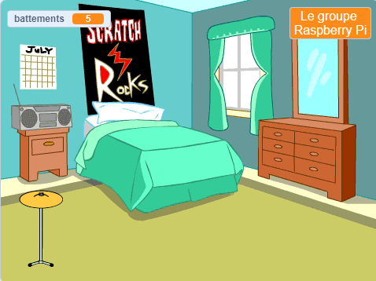
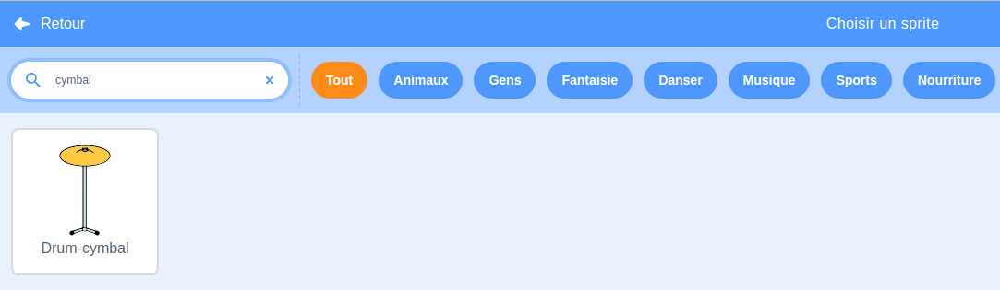
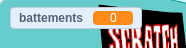

## Tambour de départ

<div style="display: flex; flex-wrap: wrap">
<div style="flex-basis: 200px; flex-grow: 1; margin-right: 15px;">
Tu ajouteras un sprite **cymbale** sur lequel tu pourras cliquer pour gagner des battements et jouer un son.
</div>
<div>
{:width="300px"}
</div>
</div>

--- task ---

Clique sur **Choisir un Sprite** et recherche `cymbal`. Ajoute le sprite **Drum-cymbal** à ton projet.



--- /task ---

--- task ---

Positionne ta cymbale sur la scène :


--- /task ---

--- task ---

Ajoute l'extension **Musique**:

[[[generic-scratch3-add-music-extension]]]

--- /task ---

--- task ---

Ajoute un script pour que la cymbale `bascule sur le costume`{:class="block3looks"} et `joue du tambour`{:class="block3extensions"} :


```blocks3
when this sprite clicked
switch costume to [drum-cymbal-b v] // hit costume
play drum [(5) Open High-Hat v] for [0.25] beats // drum sound
switch costume to [drum-cymbal-a v]  // not hit costume
```

--- /task ---

--- task ---

**Test :** Teste ta cymbale en cliquant dessus. Assure-toi d'entendre un son et de voir le changement de costume.

--- /task ---

Le sprite **cymbale** te rapportera un battement à chaque fois que tu cliqueras dessus.

--- task ---

Crée une `variable`{:class="block3variables"} appelée `battements` :



--- /task ---

--- task ---

Ajoute un bloc à `ajouter 1 a battements`{:class="block3variables"} lorsque le sprite **cymbale** est cliqué :


```blocks3
when this sprite clicked
+change [beats v] by [1]
switch costume to [drum-cymbal-b v]
play drum [(5) Open High-Hat v] for [0.25] beats 
switch costume to [drum-cymbal-a v]
```

--- /task ---

--- task ---

**Test :** Teste la **cymbale** en cliquant dessus et regarde les `battements`{:class="block3variables"} augmenter.

--- /task ---

La variable `battements`{:class="block3variables"} doit commencer à `0` battements lorsque tu démarres une nouvelle partie.

--- task ---

Clique sur le volet Scène, puis sur l'onglet **Code** pour ajouter du code à la scène.

Ajoute un bloc à `mettre battements à`{:class="block3variables"} `0` :


```blocks3
when flag clicked
switch backdrop to (Bedroom 3 v) 
set [name v] to [???] 
+ set [beats v] to [0]
```
--- /task ---

--- task ---

**Test :** Clique sur le drapeau vert et assure-toi que ta variable `battements`{:class="block3variables"} commence à `0`.

--- /task ---

--- save ---
