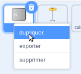
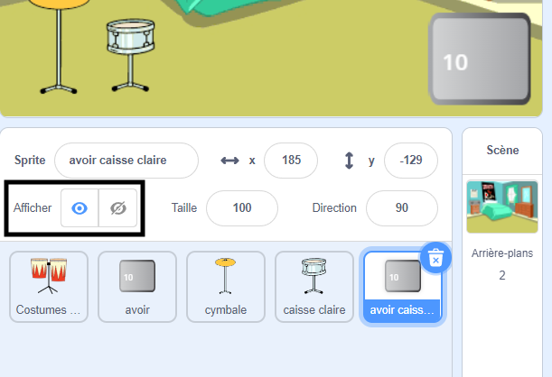
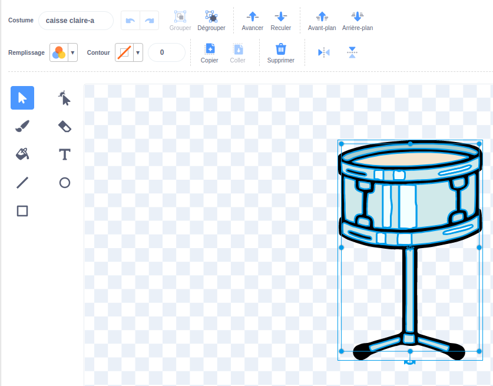
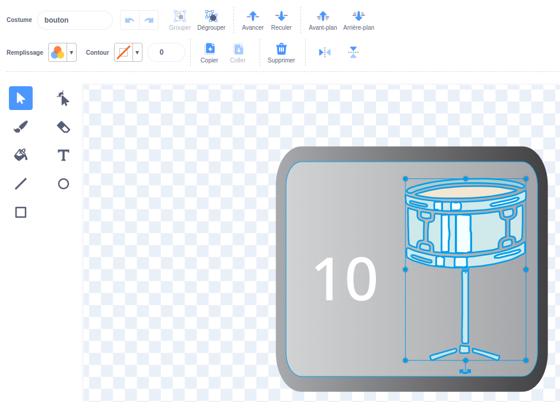
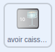

## Tambour suivant

--- task ---

Ajoute le sprite **caisse claire** à ton projet et positionne-le sur la scène :


--- /task ---

--- task ---

Fais glisser le script `quand ce sprite est cliqué `{:class="block3events"} du sprite **cymbale** vers le sprite **caisse claire**.

--- /task ---

--- task ---

Change le costume et le son de batterie pour le sprite **caisse claire**.


```blocks3
when this sprite clicked
+switch costume to [drum-snare-b v] //hit costume
+play drum [(1) Snare Drum v] for [0.25] beats //drum sound
+switch costume to [drum-snare-a v] //not hit costume
```

--- /task ---

--- task ---

Change le nombre de battements gagnés à `2` :

```blocks3
when this sprite clicked
+change [beats v] by [2] //2 beats per click
switch costume to [drum-snare-b v] //hit costume
play drum [(1) Snare Drum v] for [0.25] beats //drum sound
switch costume to [drum-snare-a v] //not hit costume
```

--- /task ---

--- task ---

**Test :** essaie ton projet.

Assure-toi de gagner 2 battements lorsque tu cliques sur la caisse claire.

--- /task ---

Le tambour suivant n'est pas disponible quand tu démarres le projet. Il faut le gagner avec des battements.

--- task ---

Ajoute un script pour cacher ce sprite **caisse claire** au début du projet :

```blocks3
when flag clicked
hide
```

--- /task ---

Ajoute un bouton pour indiquer quel est le prochain tambour et combien de battements il coûtera.

--- task ---

**Duplique** le sprite **Avoir** :



--- /task ---

--- task ---

Modifie la visibilité sur **Afficher**. 

--- /task ---

--- task ---

Change son nom en `avoir caisse claire`.

--- /task ---

--- task ---

Positionne-le dans le coin inférieur droit de la scène :



--- /task ---

--- task ---

Clique sur le sprite **caisse claire** et va dans l'onglet **Costumes**.


Utilise l'outil **Sélectionner** (flèche) pour mettre en surbrillance le costume non frappé de ton tambour. Clique sur l'icône **Grouper** puis sur l'icône **Copier** :



--- /task ---

--- task ---

Clique sur ton sprite **avoir caisse claire** et **colle** le costume de caisse claire. Tu devras peut-être le redimensionner et le positionner pour l'adapter à ton bouton :



--- /task ---

--- task ---

Clique sur l'onglet **Code** et ajoute un script pour afficher le sprite **avoir caisse claire** au début du projet :



```blocks3
when flag clicked
show
```

--- /task ---

Le tambour suivant ne peut être débloqué que si l'utilisateur a `10` ou plus de battements.

--- task ---

Ajoute ce code pour débloquer le tambour suivant `si`{:class="block3control"} le joueur a suffisamment de battements, ou `dis`{:class="block3looks"} `Plus de battements nécessaires !` s'il n'y en a pas assez :

```blocks3
when this sprite clicked
if <(beats)>  [9]> then //if 10 or more beats
hide
change [beats v] by [-10] //take away the cost of upgrade
else
say [More beats needed!] for [2] seconds 
end
```

--- /task ---

--- task ---

Ajoute un bloc `envoyer à tous`{:class="block3events"} pour envoyer un nouveau message `caisse claire` :

```blocks3
when this sprite clicked
if <(beats)>  [9]> then // if 10 or more beats
hide
change [beats v] by [-10] // take away the cost of upgrade
+ broadcast (snare v) // your drum name
else
say [More beats needed!] for [2] seconds
end
```

--- /task ---

--- task ---

Clique sur le sprite **caisse claire**.


Ajoute ce script :

```blocks3
when I receive [snare v]
show
```

--- /task ---

--- task ---

**Test :** exécute ton projet.

Tu ne devrais pas pouvoir débloquer le tambour suivant avant d'avoir accumulé suffisamment de battements.

--- /task ---

Lorsque tu débloques de nouveaux tambours, tu peux jouer dans des salles plus grandes !

--- task ---

Ajoute un autre arrière-plan. Nous avons choisi **Chalkboard** pour jouer notre deuxième concert à l'école.

**Astuce :** choisis une salle qui soit un peu mieux qu'une chambre. Tu veux garder les salles plus grandes pour plus tard !

--- /task ---

--- task ---

Clique sur la scène.


Ajoute du code à la scène pour `basculer sur l'arrière-plan`{:class="block3looks"} lorsque le message d'amélioration est reçu :

```blocks3
when I receive [snare v]
switch backdrop to [Chalkboard v]
```

--- /task ---

--- task ---

**Test :** exécute ton projet.

Lorsque tu déverrouilles le tambour suivant : la caisse claire devrait apparaître, le bouton disparaît, la salle change et les `battements`{:class="block3variables"} diminuent de `10`.

--- /task ---

--- save ---
