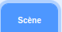

## Première amélioration

<div style="display: flex; flex-wrap: wrap">
<div style="flex-basis: 200px; flex-grow: 1; margin-right: 15px;">
Tu vas ajouter ta première amélioration. Le bouton **Avoir caisse claire** s'affichera au début, afin que le joueur sache vers quel tambour il travaille.
</div>
<div>
{:width="300px"}
</div>
</div>

--- task ---

Ajoute le sprite **caisse claire** à ton projet et positionne-le sur la scène :


--- /task ---

--- task ---

Fais glisser le `quand ce sprite est cliqué `{:class="block3events"} sur le script du sprite **cymbale** vers le sprite **caisse claire**.

[[[scratch3-copy-code]]]

--- /task ---

--- task ---

Change les costumes et le son du tambour.

Change le nombre de battements gagnés à `2` :


```blocks3
when this sprite clicked
+change [beats v] by [2] //2 beats per click
+switch costume to [drum-snare-b v] //hit costume
+play drum [(1) Snare Drum v] for [0.25] beats //drum sound
+switch costume to [drum-snare-a v] //not hit costume
```

--- /task ---

--- task ---

**Test :** Essaie ton projet. Assure-toi de gagner 2 battements lorsque tu cliques sur la caisse claire.

--- /task ---

Les améliorations ne sont pas disponibles lorsque tu démarres le projet. Ils doivent être gagnés avec des battements.

--- task ---

Ajoute un script pour cacher ce sprite **tambour** au début du projet :


```blocks3
when flag clicked
hide
```

--- /task ---

Un bouton indiquera quel tambour est la prochaine option d'amélioration et combien de battements cela coûtera.

--- task ---

**Dupliquer** le **Avoir** sprite :


Change la visibilité en **montrer** et change son nom en `Avoir caisse claire`. Positionne-le dans le coin inférieur droit de la scène :


--- /task ---

--- task ---

Clique sur le sprite **caisse claire** et va dans l'onglet **Costumes**. Utilise l'outil **Sélectionner** (flèche) pour mettre en surbrillance le costume non frappé de ton tambour. Clique sur l'icône **Grouper** puis sur l'icône **Copier** :


--- /task ---

--- task ---

Clique sur ton sprite **Avoir caisse claire** et **Colle** le costume de caisse claire. Tu devras peut-être le redimensionner et le positionner pour l'adapter à ton bouton :


--- /task ---

--- task ---

Clique sur l'onglet **Code** et ajoute un script pour afficher le sprite **Avoir caisse claire** au début du projet :


```blocks3
when flag clicked
show
```

--- /task ---

L'amélioration ne peut être achetée que si l'utilisateur a `10` battements ou plus. Dans [Faire grandir une libellule](https://projects.raspberrypi.org/en/projects/grow-a-dragonfly){:target="_blank"}, tu as appris à prendre des décisions avec des blocs `si` {:class="block3control"}.

Un bloc `si ... sinon`{:class="block3control"} est utilisé pour prendre une décision et fera des choses différentes si une condition est `vraie` ou `fausse`.

<p style="border-left: solid; border-width:10px; border-color: #0faeb0; background-color: aliceblue; padding: 10px;">
Nous utilisons <span style="color: #0faeb0">**si ... sinon**</span> tout le temps pour prendre des décisions. Lorsque tu te réveilles, tu vérifies "si"{:class="block3control"} c'est le matin. Tu te lèves, ou "sinon"{:class="block3control"} tu te rendors. Peux-tu penser à des décisions "si ... sinon"{:class="block3control"} que tu prends ? 
</p>

--- task ---

Ajoute ce code pour obtenir l'amélioration `si`{:class="block3control"} le joueur a assez de battements, ou `dire`{:class="block3looks"} `pas assez de battements !` s'ils ne peuvent pas faire une amélioration :


```blocks3
when this sprite clicked
if <(beats)>  [9]> then //if 10 or more beats
hide
change [beats v] by [-10] //take away the cost of upgrade
else
say [Not enough beats!] for [2] seconds 
end
```

--- /task ---

Fais savoir aux autres sprites et à la scène que l'amélioration de la caisse claire a été achetée.

--- task ---

Ajoute un bloc `envoyer à tous`{:class="block3events"} pour envoyer un nouveau message `caisse claire` :


```blocks3
when this sprite clicked
if <(beats)>  [9]> then // if 10 or more beats
hide
change [beats v] by [-10] // take away the cost of upgrade
+ broadcast [snare v] // your drum name
else
say [Not enough beats!] for [2] seconds 
end
```

--- /task ---

--- task ---

Clique sur le sprite **caisse claire**. Ajoute ce script :


```blocks3
when I receive [snare v]
show
```

--- /task ---

Lorsque tu améliores ton équipement, tu pourras jouer dans de plus grandes salles.

--- task ---

Ajoute un autre arrière-plan. Nous avons choisi **Chalkboard** pour jouer notre deuxième concert à l'école.

Ajoute du code à la scène pour `basculer sur l'arrière-plan`{:class="block3looks"} lorsque le message d'amélioration est reçu :



```blocks3
when I receive [snare v]
switch backdrop to [Chalkboard v]
```

**Astuce :** Choisis une salle qui est un peu plus élevé que la chambre. Tu veux garder les grands événements pour plus tard.

--- /task ---

--- task ---

**Test :** Exécute ton projet. Essaie d'acheter l'amélioration de la caisse claire avant d'avoir suffisamment de battements.

Lorsque tu achètes l'amélioration : la caisse claire apparaît, le bouton disparaît, la salle change et les `battements`{:class="block3variables"} diminuent de `10`.

--- /task ---

--- save ---
