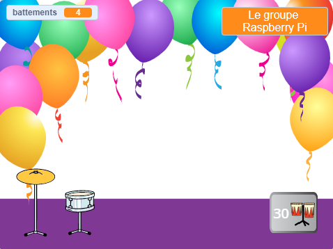
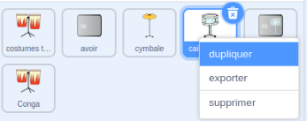
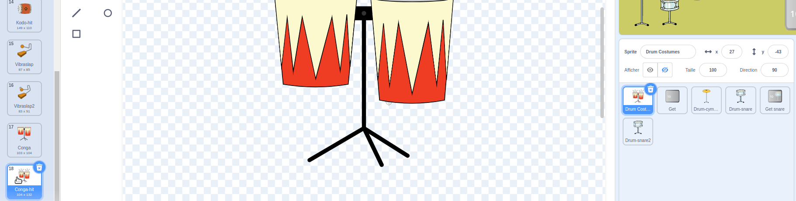
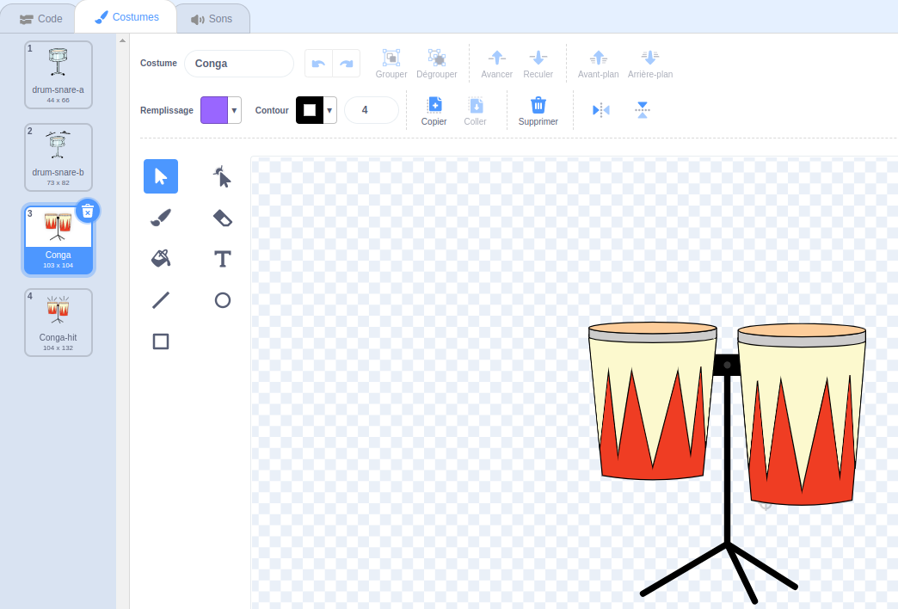
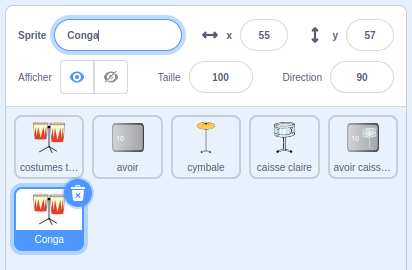
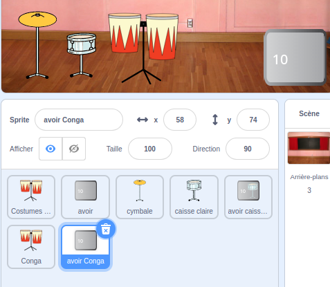
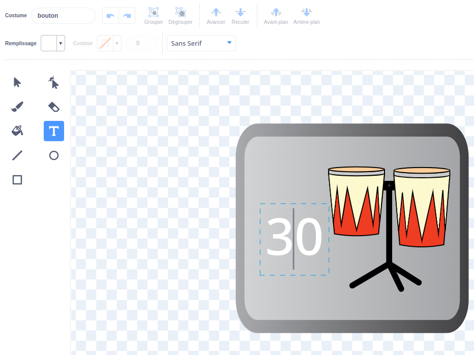
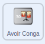

## More drums!

<div style="display: flex; flex-wrap: wrap">
<div style="flex-basis: 200px; flex-grow: 1; margin-right: 15px;">
Dans cette étape, tu choisiras le tambour à ajouter.
</div>
<div>
{:width="300px"}
</div>
</div>

--- task ---

Duplique le sprite **caisse claire** :



--- /task ---

--- task ---

Clique sur le sprite **Tambour** et sélectionne l'onglet **Costumes**.

**Choose:** which drum to unlock next. Nous avons choisi **Conga**.


--- /task ---

--- task ---

Fais glisser les costumes "frappé" et "non frappé" du tambour de ton choix vers ton nouveau sprite **Caisse-claire2** :





--- /task ---

--- task ---

Name the new drum to match the costumes you chose.



--- /task ---

--- task ---

Clique sur l'onglet **Code**. Modifie le code pour utiliser les bons costumes et choisis un son pour ton nouveau tambour.

Modifie le nombre de battements que tu gagnes en cliquant sur le nouveau tambour à `5` :


```blocks3
when this sprite clicked
+change [beats v] by [5] //5 beats per click
+switch costume to [ v] //your hit costume
+play drum [ v] for [0.25] beats //your drum sound
+switch costume to [ v] //your not hit costume
```

--- /task ---

--- task ---

Fais glisser ton nouveau tambour en position sur la scène :


--- /task ---

Add a button so that players can unlock the new drum.

--- task ---

Duplicate the **Get snare** sprite and position it in the bottom-right corner of the Stage.

--- /task ---

--- task ---

Change its name (for example `Get conga`):



--- /task ---

--- task ---

Delete the **snare drum** from the new 'Get' button costume.

--- /task ---

--- task ---

Copy the 'not hit' costume for your new drum and paste it to the new 'Get' button costume.

--- /task ---

--- task ---

Clique sur l'outil **Texte** et change le nombre en `30` pour afficher le coût du nouveau tambour.



--- /task ---

Your new 'Get' button should `hide`{:class="block3looks"} at the start.

--- task ---



```blocks3
when flag clicked
+ hide
```

--- /task ---

--- task ---

Add a `when I receive`{:class="block3events"} script that your new 'Get' button will `show`{:class="block3looks"} when the player unlocks the snare drum.

```blocks3
when I receive [snare v] // appear when previous drum is unlocked
show // show button to get the new drum
```

--- /task ---

--- task ---

Change:
- The number of beats needed to unlock this drum
- The number of beats that are removed when the player unlocks this drum.
- The message that is `broadcast`{:class="block3events"} when the player gets the new drum.

```blocks3
when this sprite clicked
if <(beats)>  [29]> then // change to 29
hide
change [beats v] by [-30] // change to -30
broadcast (conga v) // change to your drum name
else
say [More beats needed!] for [2] seconds 
end
```

--- /task ---

--- task ---

Click your new drum sprite and change the `when I receive snare`{:class="block3events"} script to show it when your new drum is unlocked:

```blocks3
when I receive [conga v] // change to your drum name
show
```

--- /task ---

--- task ---

Ajoute l'arrière-plan **Fête**.

--- /task ---

--- task ---

Ajoute un script à la scène pour changer l'arrière-plan lorsque le joueur passe au nouveau tambour :


```blocks3
when I receive [conga v] // change to your drum name
switch backdrop to (Party v)
```

--- /task ---

--- task ---

**Test:** Click the green flag to start the game.

You should get unlock your new drum if you earn enough beats.

What happens if you click the button before you have earned enough beats?

--- /task ---

--- save ---
