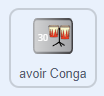

## Plus de tambours !

<div style="display: flex; flex-wrap: wrap">
<div style="flex-basis: 200px; flex-grow: 1; margin-right: 15px;">
Dans cette étape, tu choisiras le tambour à ajouter.
</div>
<div>
{:width="300px"}
</div>
</div>

--- task ---

Duplique le sprite **caisse claire** :


--- /task ---

--- task ---

Clique sur le sprite **Tambour** et sélectionne l'onglet **Costumes**.

**Choisis :** quel tambour déverrouiller ensuite. Nous avons choisi **Conga**.


--- /task ---

--- task ---

Fais glisser les costumes « frappé » et « non frappé » du tambour de ton choix vers ton nouveau sprite **caisse claire 2** :


--- /task ---

--- task ---

Nomme ton tambour en fonction des costumes que tu as choisis.


--- /task ---

--- task ---

Clique sur l'onglet **Code**. Modifie le code pour utiliser les bons costumes et choisis un son pour ton nouveau tambour.

Modifie le nombre de battements que tu gagnes en cliquant sur le nouveau tambour à `5` :


```blocks3
when this sprite clicked
+change [beats v] by [5] //5 beats per click
+switch costume to [ v] //your hit costume
+play drum [ v] for [0.25] beats //your drum sound
+switch costume to [ v] //your not hit costume
```

--- /task ---

--- task ---

Fais glisser ton nouveau tambour en position sur la scène :


--- /task ---

Ajoute un bouton permettant aux joueurs de débloquer le nouveau tambour.

--- task ---

Duplique le sprite **avoir caisse claire** et positionne-le dans le coin inférieur droit de la scène.

--- /task ---

--- task ---

Modifie son nom (par exemple `avoir la conga`) :


--- /task ---

--- task ---

Supprime la **caisse claire** du nouveau costume du bouton « avoir ».

--- /task ---

--- task ---

Copie le costume « non frappé » pour ton nouveau tambour et colle-le sur le costume du nouveau bouton « avoir ».

--- /task ---

--- task ---

Clique sur l'outil **Texte** et change le nombre en `30` pour afficher le coût du nouveau tambour.


--- /task ---

Ton nouveau bouton « avoir » doit `cacher`{:class="block3looks"} au début.

--- task ---



```blocks3
when flag clicked
+ hide
```

--- /task ---

--- task ---

Ajoute un script `quand je reçois`{:class="block3events"} que ton nouveau bouton « avoir » `affichera`{:class="block3looks"} lorsque le joueur déverrouille la caisse claire.

```blocks3
when I receive [snare v] // appear when previous drum is unlocked
show // show button to get the new drum
```

--- /task ---

--- task ---

Modifie :
- Le nombre de battements nécessaires pour débloquer ce tambour
- Le nombre de battements supprimés lorsque le joueur déverrouille ce tambour.
- Le message qui est `diffusé`{:class="block3events"} lorsque le joueur obtient le nouveau tambour.

```blocks3
when this sprite clicked
if <(beats)>  [29]> then // change to 29
hide
change [beats v] by [-30] // change to -30
broadcast (conga v) // change to your drum name
else
say [More beats needed!] for [2] seconds 
end
```

--- /task ---

--- task ---

Clique sur ton nouveau sprite de tambour et modifie le script `quand je reçois caisse claire`{:class="block3events"} pour qu'il s'affiche lorsque ton nouveau tambour est déverrouillé :

```blocks3
when I receive [conga v] // change to your drum name
show
```

--- /task ---

--- task ---

Ajoute l'arrière-plan **Fête**.

--- /task ---

--- task ---

Ajoute un script à la scène pour changer l'arrière-plan lorsque le joueur passe au nouveau tambour :


```blocks3
when I receive [conga v] // change to your drum name
switch backdrop to (Party v)
```

--- /task ---

--- task ---

**Test :** clique sur le drapeau vert pour démarrer la partie.

Tu devrais débloquer ton nouveau tambour si tu gagnes suffisamment de battements.

Que se passe-t-il si tu cliques sur le bouton avant d'avoir gagné suffisamment de battements ?

--- /task ---

--- save ---
