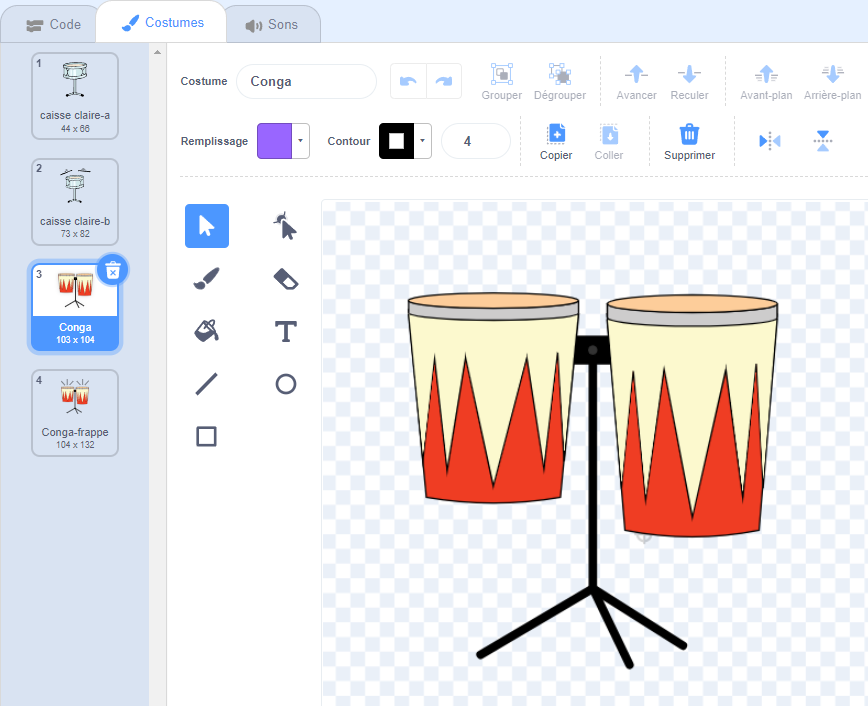

## Deuxième amélioration

<div style="display: flex; flex-wrap: wrap">
<div style="flex-basis: 200px; flex-grow: 1; margin-right: 15px;">
Tes compétences de batteur s'améliorent. Il est temps pour une deuxième amélioration ! Dans cette étape, tu choisiras le tambour à ajouter.
</div>
<div>
{:width="300px"}
</div>
</div>

--- task ---

Duplique le sprite **caisse claire** :


--- /task ---

Le sprite **Tambour** propose de nombreux costumes de tambour.

--- task ---

Clique sur le sprite **Tambour** et sélectionne l'onglet **Costumes**.

**Choisir :** un tambour pour la prochaine amélioration. Nous avons choisi **Conga**.

Fais glisser les costumes "frappé" et "non frappé" du tambour de ton choix vers ton nouveau sprite **Caisse-claire2** :




--- /task ---

--- task ---

Nomme ton tambour en fonction des costumes que tu as choisis.


--- /task ---

--- task ---

Clique sur l'onglet **Code**. Modifie le code pour utiliser les bons costumes et choisis un son pour ton nouveau tambour.

Modifie le nombre de battements que tu gagnes en cliquant sur le nouveau tambour à `5` :


```blocks3
when this sprite clicked
+change [beats v] by [5] //5 beats per click
+switch costume to [ v] //your hit costume
+play drum [ v] for [0.25] beats //your drum sound
+switch costume to [ v] //your not hit costume
```

--- /task ---

--- task ---

Fais glisser ton nouveau tambour en position sur la scène :


--- /task ---

Ensuite, tu as besoin d'un bouton pour que les joueurs puissent passer à ce nouveau tambour.

--- task ---

Duplique le sprite **avoir caisse claire**.

Positionne-le dans le coin inférieur droit de la scène. Change son nom en `Avoir` puis le nom de ton nouveau tambour :


--- /task ---

--- task ---

Supprime la **caisse claire** du costume de bouton. Copie et colle le costume "non frappé" de ton nouveau tambour sur le costume du bouton.

Clique sur l'outil **Texte** et change le nombre en `30` pour afficher le coût du nouveau tambour.

Ton bouton devrait ressembler à ceci :


--- /task ---


Ce bouton sera `caché`{:class="block3looks"} au début, puis `affiché`{:class="block3looks"} lorsque le joueur passe à la caisse claire, afin qu'il sache vers quel tambour il travaille.

--- task ---


```blocks3
when flag clicked
- show
+ hide
```

**Astuce :** Pour supprimer un bloc, fais-le glisser vers le menu Blocs ou clique avec le bouton droit et choisis **Supprimer le bloc**. Sur un ordinateur, tu peux également cliquer sur un bloc, puis appuyer sur <kbd>Supprimer</kbd> pour supprimer un bloc.

--- /task ---

--- task ---

Add a `when I receive`{:class="block3events"} script that your new drum button will show as the next upgrade when the player gets the **Drum-snare** drum:


```blocks3
when I receive [snare v] // appear when previous drum is bought
show // show button for next available drum
```

--- /task ---

--- task ---

Modifie le nombre de battements nécessaires pour acheter ce tambour et le nombre de battements qui sont supprimés lorsque le joueur obtient ce tambour.

Modifie également le message qui est `envoyé à tous`{:class="block3events"} lorsque le joueur reçoit le nouveau tambour. Crée un nouveau message avec le nom de ton nouveau tambour :


```blocks3
when this sprite clicked
if <(beats)>  [29]> then // change to 29
hide
change [beats v] by [-30] // change to 30
broadcast [conga v] // change to your drum name
else
say (join ((30) - (beats)) [beats needed!]) for [2] seconds
end
```

--- /task ---

--- task ---

Change le script `quand je reçois caisse claire`{:class="block3events"} en `envoyant à tous`{:class="block3events"} le nom de ton nouveau tambour. Le tambour `montrera`{:class="block3looks"} lorsque le joueur passera au nouveau tambour :


```blocks3
when I receive [conga v] // change to your drum name
show
```

--- /task ---

--- task ---

Ajoute l'arrière-plan **Fête**.

Ajoute un script à la scène pour changer l'arrière-plan lorsque le joueur passe au nouveau tambour :


```blocks3
when I receive [conga v] // change to your drum name
switch backdrop to (Party v)
```

--- /task ---

--- task ---

**Test :** Clique sur le drapeau vert pour démarrer le jeu et teste que tu peux gagner suffisamment de battements pour obtenir ton nouveau tambour.

Que se passe-t-il si tu cliques sur le bouton avant d'avoir gagné suffisamment de battements ?

--- /task ---

--- save ---
