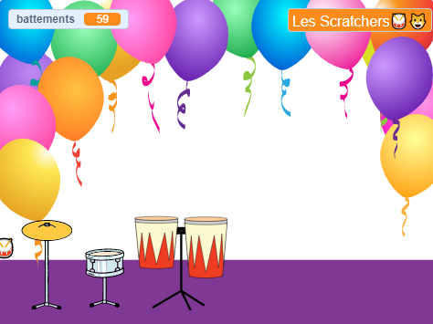

## Jouer

Il est temps de faire fonctionner ton jeu comme tu le souhaites.

{:width="300px"}

--- task ---

Si tu as séparé le bloc `demander`{:class="block3sensing"} sur la scène, remets-le en place.

**Test :** clique sur le drapeau vert et définis ton nom de rockstar !

Note que le nom affiché sur la scène change.

--- /task ---

--- save ---
