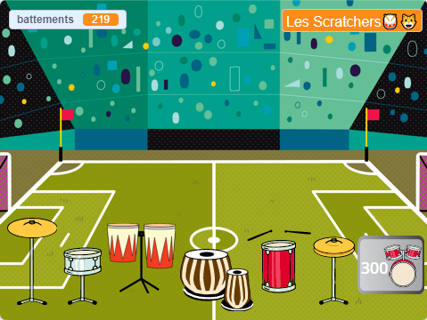

## Challenge

<div style="display: flex; flex-wrap: wrap">
<div style="flex-basis: 200px; flex-grow: 1; margin-right: 15px;">
Améliore ton projet avec plus de tambours et plus de décors à mesure que tu joues dans des salles plus prestigieuses. 
</div>
<div>
{:width="300px"}
</div>
</div>

### Add more drums

To add another drum to unlock, look back at the earlier steps of the project.

Here are some reminders if you need them.

--- collapse ---

---
title: For the drum
---

--- task ---

Dupliquer le précédent sprite **tambour** et ajouter deux costumes.

--- /task ---

--- task ---

Modifier le `costume`{:class="block3looks"} et le `son`{:class="block3sound"} utilisés dans le script `Quand ce sprite est cliqué`{:class="block3events"}.

--- /task ---

--- task ---

Modifier le nombre de `battements`{:class="block3variables"} gagnés dans le script `quand ce sprite est cliqué`{:class="block3events"}.

--- /task ---

--- task ---

Changer le `message`{:class="block3events"} qui fait que le tambour `montre`{:class="block3looks"} un message pour le **nouveau tambour**.

--- /task ---

--- /collapse ---

--- collapse ---

---
title: For the 'Get' button
---

--- task ---

Dupliquer le précédent sprite **avoir**.

--- /task ---

--- task ---

Changer le `message`{:class="block3events"} qui fait apparaître le bouton au `message`{:class="block3events"} `diffusé`{:class="block3events"} par le **tambour précédent**.

--- /task ---

--- task ---

Changer le `costume`{:class="block3looks"} ainsi que le coût du nouveau tambour.

--- /task ---

--- task ---

Change the number of `beats`{:class="block3variables"} you must have to unlock this drum in the `if`{:class="block3events"} condition. Change the negative number of `beats`{:class="block3variables"} you `change by`{:class="block3variables"} when you unlock this drum. Change the number that `beats`{:class="block3variables"} needs to be subtracted from in the `join`{:class="block3operators"} block. Change the message that is `broadcast`{:class="block3events"} to the name of the **new drum**.

--- /task ---

--- /collapse ---

--- collapse ---

---
title: For the venue
---

--- task ---

Ajouter un nouvel arrière-plan.

--- /task ---

--- task ---

Add a script to the Stage to `switch backdrop to`{:class="block3looks"} the new backdrop when the `message`{:class="block3events"} for this drum is received.

--- /task ---

Tu constateras peut-être que tes tambours doivent être dans une nouvelle position sur un arrière-plan différent.

--- task ---

Add a script starting with `when backdrop changes to`{:class="block3events"} to each **drum** sprite with a `go to`{:class="block3motion"} block to make them change position.

Tu devras également définir leur position de départ `quand le drapeau est cliqué`{:class="block3events"}.

--- /task ---

--- /collapse ---

### Improve feedback to the player

Tell the player exactly **how many more** beats are needed to unlock the next drum.

--- task ---

Add this code to `join`{:class="block3operators"} the number of beats needed with the text you have used to tell the player they need more beats if they do not have enough to unlock the next drum:

```blocks3
when this sprite clicked
if <(beats)>  [9]> then //if 10 or more beats
hide
change [beats v] by [-10] //take away the cost of upgrade
else
+ say (join ((10) - (beats)) [beats needed!]) for [2] seconds
end
```

**Note**: Update the numbers to match those needed to unlock each drum.

--- /task ---

### Tidy your code

--- task ---

**Tidy:** If you have time, then it's a good idea to make sure the sprites in the sprite list are in a sensible order, starting with the drums in their locked order and then the buttons in order.

--- /task ---

--- task ---

### Stuck?

**Débogage :** Assure-toi d'abord que tu comprends vraiment quand le tambour et les boutons doivent s'afficher et comment la variable `battements`{:class="block3variables"} doit changer. Il est beaucoup plus facile de déboguer un projet si tu sais clairement ce qu'il est censé faire.

--- collapse ---
---
title: Mon tambour ne s'affiche/se cache pas correctement
---

À moins qu'il ne s'agisse du premier tambour, ton tambour doit avoir un script `quand le drapeau est cliqué`{:class="block3events"} pour `cacher`{:class="block3looks"}.

It should have a `when I receive`{:class="block3events"} `this drum` script to `show`{:class="block3looks"}.

Vérifie que le bouton **Avoir** de ce tambour `envoyer à tous`{:class="block3events"} le même message.

--- /collapse ---

--- collapse ---
---
title: Mon bouton Avoir ne s'affiche/ne se cache pas correctement
---

À moins que le bouton ne soit destiné au tout premier tambour, il doit être `caché`{:class="block3looks"} `quand le drapeau est cliqué`{:class="block3events"}.

It should `show`{:class="block3looks"} `when I receive`{:class="block3events"} the message for the **previous drum**.

The **Get** button should `show`{:class="block3looks"} to let the player know about the next drum they can unlock.

--- /collapse ---

--- collapse ---
---
title: I can unlock a drum when I don't have enough beats
---

Vérifie que tu as modifié le nombre de `battements`{:class="block3variables"} nécessaires `quand ce sprite est cliqué`{:class="block3events"} dans le script pour le bouton **avoir** le tambour.

--- /collapse ---

--- collapse ---
---
title: The number of beats doesn't change correctly when I unlock a new drum
---

Vérifie que tu as `ajouter à battements`{:class="block3variables"} un nombre négatif `quand ce sprite est cliqué`{:class="block3events"} dans le script pour le bouton **avoir** le tambour.

Assure-toi que cela correspond au numéro sur le costume de bouton de tambour.

--- /collapse ---

--- /task ---

**Astuce :** Si tu t'embrouilles vraiment, tu peux supprimer le nouveau tambour et son bouton, puis recommencer. Parfois, il est difficile de repérer un bug.

--- save ---
